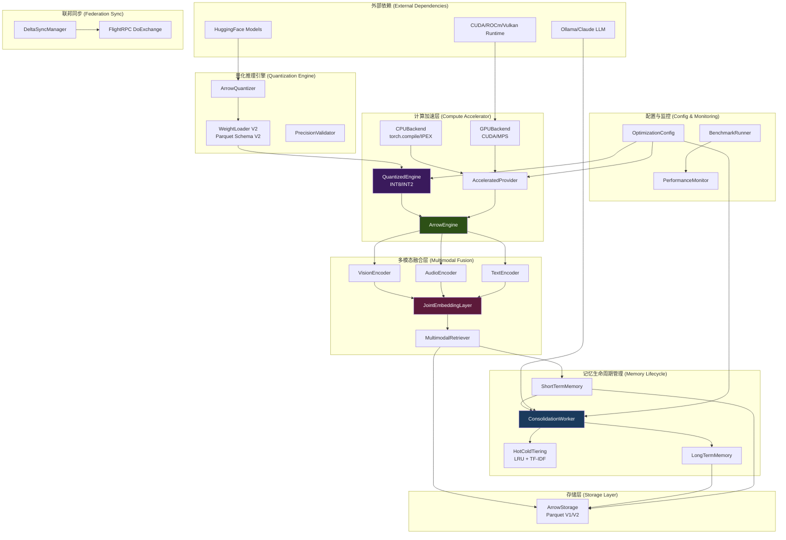

# AI-OS 内存优化系统设计文档 (Design Document)

## Overview

本设计文档定义了 AI-OS 内存优化系统的技术架构，旨在将现有的零拷贝（Zero-Copy）ArrowEngine 从静态检索引擎转化为高性能、多模态的动态认知核心。系统通过计算加速、模型量化、多模态融合和记忆生命周期管理等优化手段，实现 2-3 倍的推理性能提升、75% 的内存占用降低，以及真正的跨模态语义理解能力。

### Core Value Proposition

- **2-3x CPU 推理加速**: 通过 MKL-DNN/IPEX 和 torch.compile 优化，将 Whisper-tiny 编码从 300ms 降至 <150ms
- **75% 内存占用降低**: INT8 量化将模型内存从 380MB 降至 95MB，同时保持 >0.95 余弦相似度
- **90%+ GPU 性能**: 在 CUDA/ROCm/Vulkan/MPS 设备上达到 HuggingFace 模型 90% 以上的推理速度
- **统一多模态空间**: 实现视觉、听觉、文本的联合嵌入和跨模态检索
- **智能记忆管理**: 自动浓缩短期记忆为长期核心原则，优化存储和检索质量
- **80% 联邦同步带宽节省**: 增量 LoRA 权重同步减少网络传输

### Design Philosophy

1. **性能优先，质量保证**: 所有优化必须通过精度验证（余弦相似度 >0.95，PPL 增幅 <15%）
2. **渐进式降级**: GPU → CPU，量化 → 浮点，优化 → 标准，确保服务连续性
3. **配置驱动**: 通过 YAML 配置灵活控制优化策略，适应不同部署环境
4. **向下兼容**: 保持与现有 Parquet Schema V1 和 API 的完全兼容
5. **可观测性**: 记录所有性能指标、优化决策和降级事件

## Architecture

### System Context



### Component Layers

**Layer 1: 计算加速层 (Compute Accelerator)**
- AcceleratedProvider: 设备抽象层，统一 CPU/GPU 接口
- CPUBackend: Intel/AMD CPU 优化（MKL-DNN, IPEX, torch.compile）
- GPUBackend: CUDA/ROCm/Vulkan/MPS GPU 加速
- QuantizedEngine: 量化推理引擎（INT8/INT2）

**Layer 2: 量化推理引擎 (Quantization Engine)**
- ArrowQuantizer: PTQ/GPTQ 量化转换器
- WeightLoader V2: 支持 Parquet Schema V2（量化格式）
- PrecisionValidator: 精度验证器（余弦相似度、PPL）

**Layer 3: 多模态融合层 (Multimodal Fusion)**
- JointEmbeddingLayer: 联合嵌入层（融合 MLP）
- VisionEncoder/AudioEncoder/TextEncoder: 模态编码器
- MultimodalRetriever: 混合检索算法（向量 + 关联图）

**Layer 4: 记忆生命周期管理 (Memory Lifecycle)**
- ConsolidationWorker: 异步记忆浓缩器
- HotColdTiering: 冷热记忆分层（LRU + TF-IDF）
- LongTermMemory/ShortTermMemory: 长短期记忆存储

**Layer 5: 联邦同步 (Federation Sync)**
- DeltaSyncManager: 增量权重同步管理器
- FlightRPC DoExchange: 双向流式传输

**Layer 6: 配置与监控 (Config & Monitoring)**
- OptimizationConfig: YAML 配置管理
- BenchmarkRunner: 性能基准测试
- PerformanceMonitor: 实时性能监控

## Components and Interfaces

### 2.1 ArrowEngine 计算加速层 (Compute Accelerator)

#### 2.1.1 AcceleratedProvider 抽象层

`AcceleratedProvider` 是设备无关的推理接口，支持动态设备切换和自动降级。

```python
from abc import ABC, abstractmethod
from typing import Optional, Dict, Any
import torch
import numpy as np

class AcceleratedProvider(ABC):
    """
    设备无关的推理提供者抽象基类。
    
    支持的设备类型:
    - 'auto': 自动检测（优先级: cuda > rocm > vulkan > mps > cpu）
    - 'cuda': NVIDIA GPU
    - 'rocm': AMD GPU
    - 'vulkan': Vulkan 通用 GPU
    - 'mps': Apple Metal Performance Shaders
    - 'cpu': CPU（Intel/AMD）
    - 'arm': ARM CPU
    """
    
    def __init__(
        self,
        device: str = 'auto',
        dtype: torch.dtype = torch.float16,
        config: Optional[Dict[str, Any]] = None
    ):
        self.device = self._resolve_device(device)
        self.dtype = dtype
        self.config = config or {}
        self._initialize_backend()
    
    @abstractmethod
    def _initialize_backend(self):
        """初始化后端特定的优化"""
        pass
    
    @abstractmethod
    def forward(
        self,
        input_ids: torch.Tensor,
        attention_mask: torch.Tensor
    ) -> torch.Tensor:
        """
        前向推理。
        
        Args:
            input_ids: Token IDs, shape (batch, seq_len)
            attention_mask: Attention mask, shape (batch, seq_len)
            
        Returns:
            Embeddings, shape (batch, hidden_size)
        """
        pass
    
    def _resolve_device(self, device: str) -> str:
        """解析设备类型"""
        if device == 'auto':
            if torch.cuda.is_available():
                return 'cuda'
            elif hasattr(torch.backends, 'mps') and torch.backends.mps.is_available():
                return 'mps'
            else:
                return 'cpu'
        return device
    
    def get_device_info(self) -> Dict[str, Any]:
        """获取设备信息"""
        return {
            'device': self.device,
            'dtype': str(self.dtype),
            'backend': self.__class__.__name__
        }
```

#### 2.1.2 CPUBackend 实现

```python
import intel_extension_for_pytorch as ipex
from typing import Optional

class CPUBackend(AcceleratedProvider):
    """
    CPU 优化后端。
    
    优化策略:
    1. torch.compile (Inductor): 图优化和算子融合
    2. Intel Extension for PyTorch (IPEX): AVX-512/AMX 指令集
    3. MKL-DNN: 优化的数学运算库
    
    配置参数:
    - use_compile: 是否使用 torch.compile (默认: True)
    - use_ipex: 是否使用 IPEX (默认: True if available)
    - compile_mode: torch.compile 模式 ('default', 'reduce-overhead', 'max-autotune')
    """
    
    def __init__(
        self,
        device: str = 'cpu',
        dtype: torch.dtype = torch.float32,
        config: Optional[Dict[str, Any]] = None
    ):
        super().__init__(device, dtype, config)
    
    def _initialize_backend(self):
        """初始化 CPU 优化"""
        from llm_compression.logger import logger
        
        self.use_compile = self.config.get('use_compile', True)
        self.use_ipex = self.config.get('use_ipex', True)
        self.compile_mode = self.config.get('compile_mode', 'default')
        
        # 检测 AVX-512 和 AMX 支持
        self.has_avx512 = self._check_avx512()
        self.has_amx = self._check_amx()
        
        logger.info(f"CPU Backend initialized: AVX-512={self.has_avx512}, AMX={self.has_amx}")
        
        if self.use_ipex:
            try:
                # IPEX 优化
                self.ipex_available = True
                logger.info("IPEX optimization enabled")
            except ImportError:
                self.ipex_available = False
                logger.warning("IPEX not available, falling back to standard PyTorch")
    
    def _check_avx512(self) -> bool:
        """检测 AVX-512 指令集支持"""
        try:
            import cpuinfo
            info = cpuinfo.get_cpu_info()
            return 'avx512' in info.get('flags', [])
        except:
            return False
    
    def _check_amx(self) -> bool:
        """检测 AMX 指令集支持"""
        try:
            import cpuinfo
            info = cpuinfo.get_cpu_info()
            return 'amx' in info.get('flags', [])
        except:
            return False
    
    def optimize_model(self, model: torch.nn.Module) -> torch.nn.Module:
        """
        优化模型。
        
        Args:
            model: 原始 PyTorch 模型
            
        Returns:
            优化后的模型
        """
        from llm_compression.logger import logger
        
        # IPEX 优化
        if self.use_ipex and self.ipex_available:
            model = ipex.optimize(model, dtype=self.dtype)
            logger.info("Applied IPEX optimization")
        
        # torch.compile 优化
        if self.use_compile:
            try:
                model = torch.compile(model, mode=self.compile_mode)
                logger.info(f"Applied torch.compile with mode={self.compile_mode}")
            except Exception as e:
                logger.warning(f"torch.compile failed: {e}, using uncompiled model")
        
        return model
    
    def forward(
        self,
        input_ids: torch.Tensor,
        attention_mask: torch.Tensor
    ) -> torch.Tensor:
        """CPU 优化的前向推理"""
        # 确保数据在 CPU 上
        input_ids = input_ids.to('cpu')
        attention_mask = attention_mask.to('cpu')
        
        # 使用优化后的模型进行推理
        with torch.no_grad():
            if self.use_ipex and self.ipex_available:
                with ipex.optimize_context():
                    outputs = self.model(input_ids, attention_mask)
            else:
                outputs = self.model(input_ids, attention_mask)
        
        return outputs
```

#### 2.1.3 GPUBackend 实现

```python
class GPUBackend(AcceleratedProvider):
    """
    GPU 优化后端。
    
    支持的 GPU 类型:
    - CUDA: NVIDIA GPU
    - ROCm: AMD GPU
    - Vulkan: 通用 GPU
    - MPS: Apple Metal
    
    优化策略:
    1. 自动混合精度 (AMP): torch.cuda.amp
    2. VRAM 监控和自动降级
    3. 零拷贝数据传输: GPU VRAM ↔ Arrow Memory
    
    配置参数:
    - use_amp: 是否使用自动混合精度 (默认: True)
    - vram_threshold: VRAM 占用阈值 (默认: 0.9)
    - fallback_to_cpu: VRAM 不足时是否降级到 CPU (默认: True)
    """
    
    def __init__(
        self,
        device: str = 'cuda',
        dtype: torch.dtype = torch.float16,
        config: Optional[Dict[str, Any]] = None
    ):
        super().__init__(device, dtype, config)
    
    def _initialize_backend(self):
        """初始化 GPU 优化"""
        from llm_compression.logger import logger
        
        self.use_amp = self.config.get('use_amp', True)
        self.vram_threshold = self.config.get('vram_threshold', 0.9)
        self.fallback_to_cpu = self.config.get('fallback_to_cpu', True)
        
        # 检测 GPU 可用性
        if self.device == 'cuda':
            if not torch.cuda.is_available():
                raise RuntimeError("CUDA not available")
            self.device_index = 0
            self.device_name = torch.cuda.get_device_name(0)
            self.total_vram = torch.cuda.get_device_properties(0).total_memory
            logger.info(f"CUDA device: {self.device_name}, VRAM: {self.total_vram / 1e9:.2f} GB")
        
        elif self.device == 'mps':
            if not (hasattr(torch.backends, 'mps') and torch.backends.mps.is_available()):
                raise RuntimeError("MPS not available")
            logger.info("MPS device initialized")
        
        elif self.device in ['rocm', 'vulkan']:
            logger.warning(f"{self.device} support is experimental")
        
        # 初始化 AMP scaler
        if self.use_amp and self.device == 'cuda':
            self.scaler = torch.cuda.amp.GradScaler()
            logger.info("AMP enabled")
    
    def check_vram_usage(self) -> float:
        """
        检查 VRAM 使用率。
        
        Returns:
            VRAM 使用率 (0.0-1.0)
        """
        if self.device == 'cuda':
            allocated = torch.cuda.memory_allocated(self.device_index)
            return allocated / self.total_vram
        return 0.0
    
    def should_fallback_to_cpu(self) -> bool:
        """判断是否应该降级到 CPU"""
        if not self.fallback_to_cpu:
            return False
        
        vram_usage = self.check_vram_usage()
        return vram_usage > self.vram_threshold
    
    def optimize_model(self, model: torch.nn.Module) -> torch.nn.Module:
        """
        优化模型并移动到 GPU。
        
        Args:
            model: 原始 PyTorch 模型
            
        Returns:
            优化后的模型
        """
        from llm_compression.logger import logger
        
        # 移动到 GPU
        model = model.to(self.device)
        
        # 设置为评估模式
        model.eval()
        
        logger.info(f"Model moved to {self.device}")
        
        return model
    
    def forward(
        self,
        input_ids: torch.Tensor,
        attention_mask: torch.Tensor
    ) -> torch.Tensor:
        """GPU 优化的前向推理"""
        from llm_compression.logger import logger
        
        # 检查 VRAM 使用率
        if self.should_fallback_to_cpu():
            logger.warning(
                f"VRAM usage {self.check_vram_usage():.2%} exceeds threshold "
                f"{self.vram_threshold:.2%}, falling back to CPU"
            )
            # 降级到 CPU
            return self._fallback_cpu_forward(input_ids, attention_mask)
        
        # 移动数据到 GPU
        input_ids = input_ids.to(self.device)
        attention_mask = attention_mask.to(self.device)
        
        # 使用 AMP 进行推理
        with torch.no_grad():
            if self.use_amp and self.device == 'cuda':
                with torch.cuda.amp.autocast():
                    outputs = self.model(input_ids, attention_mask)
            else:
                outputs = self.model(input_ids, attention_mask)
        
        return outputs
    
    def _fallback_cpu_forward(
        self,
        input_ids: torch.Tensor,
        attention_mask: torch.Tensor
    ) -> torch.Tensor:
        """降级到 CPU 的前向推理"""
        # 移动模型到 CPU
        self.model = self.model.to('cpu')
        
        # CPU 推理
        input_ids = input_ids.to('cpu')
        attention_mask = attention_mask.to('cpu')
        
        with torch.no_grad():
            outputs = self.model(input_ids, attention_mask)
        
        return outputs
    
    def zero_copy_transfer(self, arrow_buffer: 'pa.Buffer') -> torch.Tensor:
        """
        零拷贝数据传输: Arrow Buffer → GPU VRAM。
        
        Args:
            arrow_buffer: Arrow Buffer
            
        Returns:
            GPU Tensor
        """
        # 从 Arrow Buffer 创建 NumPy 数组（零拷贝）
        np_array = np.frombuffer(arrow_buffer, dtype=np.float16)
        
        # 从 NumPy 数组创建 Tensor（零拷贝）
        cpu_tensor = torch.from_numpy(np_array)
        
        # 移动到 GPU（需要拷贝）
        gpu_tensor = cpu_tensor.to(self.device)
        
        return gpu_tensor
```


### 2.2 量化推理引擎 (Quantized Inference Engine)

#### 2.2.1 Parquet Schema V2 设计

为支持量化权重，扩展 Parquet Schema 增加量化元数据列。

```python
# Schema V1 (现有格式)
V1_SCHEMA = pa.schema([
    ('layer_name', pa.string()),
    ('weight_name', pa.string()),
    ('weight_data', pa.list_(pa.float16())),
    ('shape', pa.list_(pa.int32())),
])

# Schema V2 (量化格式)
V2_SCHEMA = pa.schema([
    ('layer_name', pa.string()),
    ('weight_name', pa.string()),
    ('weight_data', pa.list_(pa.int8())),  # 量化权重
    ('shape', pa.list_(pa.int32())),
    ('quant_type', pa.string()),  # 'int8', 'int2', 'fp16'
    ('scales', pa.list_(pa.float32())),  # 缩放因子
    ('zero_points', pa.list_(pa.int8())),  # 零点
    ('quant_axis', pa.int32()),  # 量化轴 (-1 表示 per-tensor)
])
```

**向下兼容策略**:
- WeightLoader 自动检测 Schema 版本（通过检查 `quant_type` 列是否存在）
- V1 文件使用浮点数加载路径
- V2 文件使用量化感知加载路径

#### 2.2.2 ArrowQuantizer 核心实现

```python
from dataclasses import dataclass
from typing import Literal, Optional, List
import torch
import numpy as np
import pyarrow as pa
import pyarrow.parquet as pq

@dataclass
class QuantizationConfig:
    """量化配置"""
    quant_type: Literal['int8', 'int2', 'fp16']
    calibration_method: Literal['ptq', 'gptq']
    per_channel: bool = True  # True: per-channel, False: per-tensor
    symmetric: bool = True  # 对称量化 vs 非对称量化
    mixed_precision_layers: Optional[List[str]] = None  # 保持 FP16 的敏感层

class ArrowQuantizer:
    """
    Arrow 权重量化器。
    
    支持的量化方法:
    1. PTQ (Post-Training Quantization): 简单的最小-最大量化
    2. GPTQ: 基于 Hessian 矩阵的校准量化
    
    量化公式:
    - 对称量化: q = round(x / scale)
    - 非对称量化: q = round(x / scale) + zero_point
    - 反量化: x = (q - zero_point) * scale
    """
    
    def __init__(self, config: QuantizationConfig):
        self.config = config
    
    def quantize_model(
        self,
        input_parquet: str,
        output_parquet: str,
        calibration_data: Optional[torch.Tensor] = None
    ):
        """
        量化模型权重。
        
        Args:
            input_parquet: 输入 Parquet 文件 (V1 格式)
            output_parquet: 输出 Parquet 文件 (V2 格式)
            calibration_data: 校准数据 (GPTQ 需要)
        """
        from llm_compression.logger import logger
        
        logger.info(f"Quantizing model: {input_parquet} -> {output_parquet}")
        logger.info(f"Config: {self.config}")
        
        # 读取原始权重
        table = pq.read_table(input_parquet)
        
        # 量化每一层
        quantized_rows = []
        for i in range(len(table)):
            row = table.slice(i, 1).to_pydict()
            layer_name = row['layer_name'][0]
            weight_name = row['weight_name'][0]
            weight_data = np.array(row['weight_data'][0], dtype=np.float32)
            shape = row['shape'][0]
            
            # 检查是否是混合精度保留层
            if self._should_skip_quantization(layer_name):
                logger.info(f"Skipping quantization for {layer_name} (mixed precision)")
                quantized_rows.append({
                    'layer_name': layer_name,
                    'weight_name': weight_name,
                    'weight_data': weight_data.astype(np.float16).tolist(),
                    'shape': shape,
                    'quant_type': 'fp16',
                    'scales': [],
                    'zero_points': [],
                    'quant_axis': -1,
                })
                continue
            
            # 量化权重
            if self.config.calibration_method == 'ptq':
                quant_result = self._quantize_ptq(weight_data, shape)
            elif self.config.calibration_method == 'gptq':
                quant_result = self._quantize_gptq(weight_data, shape, calibration_data)
            else:
                raise ValueError(f"Unknown calibration method: {self.config.calibration_method}")
            
            quantized_rows.append({
                'layer_name': layer_name,
                'weight_name': weight_name,
                'weight_data': quant_result['quantized'].tolist(),
                'shape': shape,
                'quant_type': self.config.quant_type,
                'scales': quant_result['scales'].tolist(),
                'zero_points': quant_result['zero_points'].tolist(),
                'quant_axis': quant_result['quant_axis'],
            })
            
            logger.debug(f"Quantized {layer_name}.{weight_name}: {shape}")
        
        # 写入 V2 格式
        quantized_table = pa.Table.from_pylist(quantized_rows, schema=V2_SCHEMA)
        pq.write_table(quantized_table, output_parquet)
        
        logger.info(f"Quantization complete: {output_parquet}")
    
    def _should_skip_quantization(self, layer_name: str) -> bool:
        """判断是否跳过量化（混合精度）"""
        if self.config.mixed_precision_layers is None:
            return False
        return any(pattern in layer_name for pattern in self.config.mixed_precision_layers)
    
    def _quantize_ptq(
        self,
        weight: np.ndarray,
        shape: List[int]
    ) -> Dict[str, np.ndarray]:
        """
        PTQ 量化。
        
        Args:
            weight: 原始权重
            shape: 权重形状
            
        Returns:
            量化结果字典
        """
        weight = weight.reshape(shape)
        
        if self.config.per_channel:
            # Per-channel 量化（沿第 0 轴）
            quant_axis = 0
            num_channels = shape[0]
            
            # 计算每个通道的 scale 和 zero_point
            scales = []
            zero_points = []
            quantized_channels = []
            
            for i in range(num_channels):
                channel = weight[i]
                scale, zero_point = self._compute_quantization_params(channel)
                scales.append(scale)
                zero_points.append(zero_point)
                
                # 量化
                quantized = self._quantize_tensor(channel, scale, zero_point)
                quantized_channels.append(quantized)
            
            quantized = np.stack(quantized_channels, axis=0)
            scales = np.array(scales, dtype=np.float32)
            zero_points = np.array(zero_points, dtype=np.int8)
        
        else:
            # Per-tensor 量化
            quant_axis = -1
            scale, zero_point = self._compute_quantization_params(weight)
            quantized = self._quantize_tensor(weight, scale, zero_point)
            scales = np.array([scale], dtype=np.float32)
            zero_points = np.array([zero_point], dtype=np.int8)
        
        return {
            'quantized': quantized.flatten(),
            'scales': scales,
            'zero_points': zero_points,
            'quant_axis': quant_axis,
        }
    
    def _compute_quantization_params(
        self,
        tensor: np.ndarray
    ) -> tuple[float, int]:
        """
        计算量化参数。
        
        Args:
            tensor: 输入张量
            
        Returns:
            (scale, zero_point)
        """
        if self.config.quant_type == 'int8':
            qmin, qmax = -128, 127
        elif self.config.quant_type == 'int2':
            qmin, qmax = -2, 1
        else:
            raise ValueError(f"Unsupported quant_type: {self.config.quant_type}")
        
        if self.config.symmetric:
            # 对称量化
            max_val = np.abs(tensor).max()
            scale = max_val / qmax
            zero_point = 0
        else:
            # 非对称量化
            min_val = tensor.min()
            max_val = tensor.max()
            scale = (max_val - min_val) / (qmax - qmin)
            zero_point = qmin - int(min_val / scale)
        
        return scale, zero_point
    
    def _quantize_tensor(
        self,
        tensor: np.ndarray,
        scale: float,
        zero_point: int
    ) -> np.ndarray:
        """
        量化张量。
        
        Args:
            tensor: 输入张量
            scale: 缩放因子
            zero_point: 零点
            
        Returns:
            量化后的张量
        """
        if self.config.quant_type == 'int8':
            qmin, qmax = -128, 127
        elif self.config.quant_type == 'int2':
            qmin, qmax = -2, 1
        else:
            raise ValueError(f"Unsupported quant_type: {self.config.quant_type}")
        
        # 量化
        quantized = np.round(tensor / scale) + zero_point
        
        # 裁剪到有效范围
        quantized = np.clip(quantized, qmin, qmax)
        
        return quantized.astype(np.int8)
    
    def _quantize_gptq(
        self,
        weight: np.ndarray,
        shape: List[int],
        calibration_data: Optional[torch.Tensor]
    ) -> Dict[str, np.ndarray]:
        """
        GPTQ 量化（基于 Hessian 矩阵校准）。
        
        Args:
            weight: 原始权重
            shape: 权重形状
            calibration_data: 校准数据
            
        Returns:
            量化结果字典
        """
        # GPTQ 实现较复杂，这里提供简化版本
        # 实际实现需要计算 Hessian 矩阵并进行逐层校准
        
        from llm_compression.logger import logger
        logger.warning("GPTQ quantization is simplified, using PTQ as fallback")
        
        # 回退到 PTQ
        return self._quantize_ptq(weight, shape)
```

#### 2.2.3 WeightLoader V2 实现

```python
class WeightLoaderV2:
    """
    支持 Parquet Schema V1/V2 的权重加载器。
    
    特性:
    - 自动检测 Schema 版本
    - 零拷贝加载（V1）
    - 量化感知加载（V2）
    - 懒加载支持
    """
    
    def __init__(self, parquet_path: str):
        self.parquet_path = parquet_path
        self.schema_version = self._detect_schema_version()
        self._weights_cache = {}
    
    def _detect_schema_version(self) -> int:
        """检测 Parquet Schema 版本"""
        table = pq.read_table(self.parquet_path)
        
        # 检查是否有 quant_type 列
        if 'quant_type' in table.column_names:
            return 2
        else:
            return 1
    
    def load_weight(
        self,
        layer_name: str,
        weight_name: str,
        device: str = 'cpu'
    ) -> torch.Tensor:
        """
        加载权重。
        
        Args:
            layer_name: 层名称
            weight_name: 权重名称
            device: 目标设备
            
        Returns:
            权重 Tensor
        """
        cache_key = f"{layer_name}.{weight_name}"
        
        # 检查缓存
        if cache_key in self._weights_cache:
            return self._weights_cache[cache_key].to(device)
        
        # 从 Parquet 加载
        if self.schema_version == 1:
            weight = self._load_v1(layer_name, weight_name)
        else:
            weight = self._load_v2(layer_name, weight_name)
        
        # 移动到目标设备
        weight = weight.to(device)
        
        # 缓存
        self._weights_cache[cache_key] = weight
        
        return weight
    
    def _load_v1(self, layer_name: str, weight_name: str) -> torch.Tensor:
        """加载 V1 格式权重（浮点数）"""
        table = pq.read_table(self.parquet_path)
        
        # 过滤行
        mask = (table['layer_name'] == layer_name) & (table['weight_name'] == weight_name)
        filtered = table.filter(mask)
        
        if len(filtered) == 0:
            raise KeyError(f"Weight not found: {layer_name}.{weight_name}")
        
        row = filtered.to_pydict()
        weight_data = np.array(row['weight_data'][0], dtype=np.float16)
        shape = row['shape'][0]
        
        # 零拷贝转换为 Tensor
        weight = torch.from_numpy(weight_data).reshape(shape)
        
        return weight
    
    def _load_v2(self, layer_name: str, weight_name: str) -> torch.Tensor:
        """加载 V2 格式权重（量化）"""
        table = pq.read_table(self.parquet_path)
        
        # 过滤行
        mask = (table['layer_name'] == layer_name) & (table['weight_name'] == weight_name)
        filtered = table.filter(mask)
        
        if len(filtered) == 0:
            raise KeyError(f"Weight not found: {layer_name}.{weight_name}")
        
        row = filtered.to_pydict()
        quant_type = row['quant_type'][0]
        
        # 如果是 FP16，直接加载
        if quant_type == 'fp16':
            weight_data = np.array(row['weight_data'][0], dtype=np.float16)
            shape = row['shape'][0]
            return torch.from_numpy(weight_data).reshape(shape)
        
        # 量化权重，需要反量化
        quantized = np.array(row['weight_data'][0], dtype=np.int8)
        shape = row['shape'][0]
        scales = np.array(row['scales'][0], dtype=np.float32)
        zero_points = np.array(row['zero_points'][0], dtype=np.int8)
        quant_axis = row['quant_axis'][0]
        
        # 反量化
        weight = self._dequantize(quantized, shape, scales, zero_points, quant_axis)
        
        return weight
    
    def _dequantize(
        self,
        quantized: np.ndarray,
        shape: List[int],
        scales: np.ndarray,
        zero_points: np.ndarray,
        quant_axis: int
    ) -> torch.Tensor:
        """
        反量化。
        
        Args:
            quantized: 量化权重
            shape: 原始形状
            scales: 缩放因子
            zero_points: 零点
            quant_axis: 量化轴
            
        Returns:
            反量化后的权重
        """
        quantized = quantized.reshape(shape)
        
        if quant_axis == -1:
            # Per-tensor 反量化
            dequantized = (quantized - zero_points[0]) * scales[0]
        else:
            # Per-channel 反量化
            dequantized = np.zeros_like(quantized, dtype=np.float32)
            for i in range(shape[quant_axis]):
                if quant_axis == 0:
                    dequantized[i] = (quantized[i] - zero_points[i]) * scales[i]
                else:
                    raise NotImplementedError(f"quant_axis={quant_axis} not supported")
        
        return torch.from_numpy(dequantized)
```

#### 2.2.4 PrecisionValidator 实现

```python
@dataclass
class ValidationResult:
    """精度验证结果"""
    passed: bool
    cosine_similarity: float
    ppl_increase: Optional[float]
    error_message: Optional[str]

class PrecisionValidator:
    """
    精度验证器。
    
    验证指标:
    1. 余弦相似度 (Cosine Similarity): 量化前后嵌入的相似度
    2. 困惑度 (PPL): 语言模型的困惑度增幅
    
    验收标准:
    - 余弦相似度 >= 0.95 (INT8), >= 0.98 (GPTQ)
    - PPL 增幅 <= 15%
    """
    
    def __init__(
        self,
        cosine_threshold: float = 0.95,
        ppl_threshold: float = 0.15
    ):
        self.cosine_threshold = cosine_threshold
        self.ppl_threshold = ppl_threshold
    
    def validate(
        self,
        original_model_path: str,
        quantized_model_path: str,
        test_texts: List[str]
    ) -> ValidationResult:
        """
        验证量化模型精度。
        
        Args:
            original_model_path: 原始模型路径
            quantized_model_path: 量化模型路径
            test_texts: 测试文本列表
            
        Returns:
            验证结果
        """
        from llm_compression.logger import logger
        from llm_compression.inference.arrow_engine import ArrowEngine
        
        logger.info("Starting precision validation")
        
        # 加载模型
        original_engine = ArrowEngine(original_model_path)
        quantized_engine = ArrowEngine(quantized_model_path)
        
        # 编码测试文本
        original_embeddings = original_engine.encode(test_texts, normalize=True)
        quantized_embeddings = quantized_engine.encode(test_texts, normalize=True)
        
        # 计算余弦相似度
        cosine_similarities = []
        for i in range(len(test_texts)):
            sim = np.dot(original_embeddings[i], quantized_embeddings[i])
            cosine_similarities.append(sim)
        
        avg_cosine = np.mean(cosine_similarities)
        min_cosine = np.min(cosine_similarities)
        
        logger.info(f"Cosine similarity: avg={avg_cosine:.4f}, min={min_cosine:.4f}")
        
        # 检查余弦相似度
        if min_cosine < self.cosine_threshold:
            return ValidationResult(
                passed=False,
                cosine_similarity=avg_cosine,
                ppl_increase=None,
                error_message=f"Cosine similarity {min_cosine:.4f} < {self.cosine_threshold}"
            )
        
        # TODO: 计算 PPL（需要语言模型）
        ppl_increase = None
        
        logger.info("Precision validation passed")
        
        return ValidationResult(
            passed=True,
            cosine_similarity=avg_cosine,
            ppl_increase=ppl_increase,
            error_message=None
        )
```


### 2.3 统一多模态关联空间 (Unified Multimodal Embedding Space)

#### 2.3.1 JointEmbeddingLayer 设计

```python
import torch
import torch.nn as nn
from typing import Dict, Optional

class JointEmbeddingLayer(nn.Module):
    """
    联合嵌入层，融合多模态信息到统一语义空间。
    
    架构:
        Vision Embedding (512D)  ─┐
        Audio Embedding (384D)   ─┼─> Fusion MLP ─> Joint Embedding (768D)
        Text Embedding (384D)    ─┘
    
    融合策略:
    1. 投影层: 将不同维度的模态嵌入投影到统一维度
    2. 融合 MLP: 多层感知机融合多模态特征
    3. 注意力权重: 动态调整不同模态的贡献
    """
    
    def __init__(
        self,
        vision_dim: int = 512,
        audio_dim: int = 384,
        text_dim: int = 384,
        joint_dim: int = 768,
        fusion_hidden_dim: int = 1024,
        use_attention: bool = True
    ):
        super().__init__()
        
        self.vision_dim = vision_dim
        self.audio_dim = audio_dim
        self.text_dim = text_dim
        self.joint_dim = joint_dim
        self.use_attention = use_attention
        
        # 投影层：将不同模态投影到统一维度
        self.vision_proj = nn.Linear(vision_dim, joint_dim)
        self.audio_proj = nn.Linear(audio_dim, joint_dim)
        self.text_proj = nn.Linear(text_dim, joint_dim)
        
        # 融合 MLP
        self.fusion_mlp = nn.Sequential(
            nn.Linear(joint_dim * 3, fusion_hidden_dim),
            nn.ReLU(),
            nn.Dropout(0.1),
            nn.Linear(fusion_hidden_dim, joint_dim),
            nn.LayerNorm(joint_dim)
        )
        
        # 注意力权重（可选）
        if use_attention:
            self.attention = nn.MultiheadAttention(
                embed_dim=joint_dim,
                num_heads=8,
                batch_first=True
            )
    
    def forward(
        self,
        vision_emb: Optional[torch.Tensor] = None,
        audio_emb: Optional[torch.Tensor] = None,
        text_emb: Optional[torch.Tensor] = None
    ) -> torch.Tensor:
        """
        前向传播。
        
        Args:
            vision_emb: 视觉嵌入, shape (batch, vision_dim)
            audio_emb: 听觉嵌入, shape (batch, audio_dim)
            text_emb: 文本嵌入, shape (batch, text_dim)
            
        Returns:
            联合嵌入, shape (batch, joint_dim)
        """
        batch_size = (vision_emb or audio_emb or text_emb).shape[0]
        device = (vision_emb or audio_emb or text_emb).device
        
        # 投影到统一维度
        projected = []
        
        if vision_emb is not None:
            projected.append(self.vision_proj(vision_emb))
        else:
            projected.append(torch.zeros(batch_size, self.joint_dim, device=device))
        
        if audio_emb is not None:
            projected.append(self.audio_proj(audio_emb))
        else:
            projected.append(torch.zeros(batch_size, self.joint_dim, device=device))
        
        if text_emb is not None:
            projected.append(self.text_proj(text_emb))
        else:
            projected.append(torch.zeros(batch_size, self.joint_dim, device=device))
        
        # 拼接
        concatenated = torch.cat(projected, dim=-1)  # (batch, joint_dim * 3)
        
        # 融合 MLP
        joint_emb = self.fusion_mlp(concatenated)  # (batch, joint_dim)
        
        # 注意力融合（可选）
        if self.use_attention:
            # 将投影后的模态作为序列
            modality_seq = torch.stack(projected, dim=1)  # (batch, 3, joint_dim)
            
            # 自注意力
            attn_output, _ = self.attention(
                modality_seq, modality_seq, modality_seq
            )
            
            # 平均池化
            joint_emb = joint_emb + attn_output.mean(dim=1)
        
        # L2 归一化
        joint_emb = torch.nn.functional.normalize(joint_emb, p=2, dim=-1)
        
        return joint_emb
```

#### 2.3.2 MultimodalRetriever 设计

```python
from dataclasses import dataclass
from typing import List, Dict, Optional, Tuple
import numpy as np
import pyarrow as pa
import pyarrow.parquet as pq

@dataclass
class MultimodalMemory:
    """多模态记忆"""
    memory_id: str
    text: Optional[str]
    vision_data: Optional[bytes]
    audio_data: Optional[bytes]
    joint_embedding: np.ndarray
    association_links: List[str]  # 关联的其他记忆 ID
    timestamp: datetime

@dataclass
class RetrievalResult:
    """检索结果"""
    memory: MultimodalMemory
    similarity: float
    association_score: float
    final_score: float

class MultimodalRetriever:
    """
    多模态混合检索器。
    
    检索策略:
    1. 向量相似度: 基于联合嵌入的余弦相似度
    2. 关联图权重: 基于跨模态关联链接的图遍历
    3. 混合排序: final_score = α * similarity + β * association_score
    
    关联图结构:
    - 节点: 记忆 ID
    - 边: 跨模态关联（vision ↔ audio ↔ text）
    - 权重: 关联强度（基于共现频率）
    """
    
    def __init__(
        self,
        storage_path: str,
        joint_embedding_layer: JointEmbeddingLayer,
        alpha: float = 0.7,  # 向量相似度权重
        beta: float = 0.3    # 关联图权重
    ):
        self.storage_path = storage_path
        self.joint_embedding_layer = joint_embedding_layer
        self.alpha = alpha
        self.beta = beta
        
        # 加载关联图
        self.association_graph = self._load_association_graph()
    
    def _load_association_graph(self) -> Dict[str, List[Tuple[str, float]]]:
        """
        加载关联图。
        
        Returns:
            {memory_id: [(linked_id, weight), ...]}
        """
        graph_path = Path(self.storage_path) / "association_graph.parquet"
        
        if not graph_path.exists():
            return {}
        
        table = pq.read_table(graph_path)
        graph = {}
        
        for i in range(len(table)):
            memory_id = table['memory_id'][i].as_py()
            links = table['links'][i].as_py()  # [(linked_id, weight), ...]
            graph[memory_id] = links
        
        return graph
    
    def retrieve(
        self,
        query_vision: Optional[np.ndarray] = None,
        query_audio: Optional[np.ndarray] = None,
        query_text: Optional[str] = None,
        top_k: int = 10,
        enable_association: bool = True
    ) -> List[RetrievalResult]:
        """
        多模态检索。
        
        Args:
            query_vision: 视觉查询嵌入
            query_audio: 听觉查询嵌入
            query_text: 文本查询
            top_k: 返回结果数量
            enable_association: 是否启用关联图增强
            
        Returns:
            检索结果列表
        """
        from llm_compression.logger import logger
        
        # 生成联合嵌入
        query_joint_emb = self._generate_joint_embedding(
            query_vision, query_audio, query_text
        )
        
        # 向量相似度检索
        vector_results = self._vector_search(query_joint_emb, top_k * 2)
        
        # 关联图增强
        if enable_association:
            enhanced_results = self._enhance_with_associations(vector_results)
        else:
            enhanced_results = [
                RetrievalResult(
                    memory=r['memory'],
                    similarity=r['similarity'],
                    association_score=0.0,
                    final_score=r['similarity']
                )
                for r in vector_results
            ]
        
        # 混合排序
        enhanced_results.sort(key=lambda x: x.final_score, reverse=True)
        
        logger.info(f"Retrieved {len(enhanced_results[:top_k])} multimodal memories")
        
        return enhanced_results[:top_k]
    
    def _generate_joint_embedding(
        self,
        vision_emb: Optional[np.ndarray],
        audio_emb: Optional[np.ndarray],
        text: Optional[str]
    ) -> np.ndarray:
        """生成联合嵌入"""
        # 转换为 Tensor
        vision_tensor = torch.from_numpy(vision_emb).unsqueeze(0) if vision_emb is not None else None
        audio_tensor = torch.from_numpy(audio_emb).unsqueeze(0) if audio_emb is not None else None
        
        # 编码文本
        if text is not None:
            from llm_compression.inference.arrow_engine import ArrowEngine
            text_engine = ArrowEngine("./models/minilm")
            text_emb = text_engine.encode(text, normalize=True)
            text_tensor = torch.from_numpy(text_emb).unsqueeze(0)
        else:
            text_tensor = None
        
        # 融合
        with torch.no_grad():
            joint_emb = self.joint_embedding_layer(
                vision_emb=vision_tensor,
                audio_emb=audio_tensor,
                text_emb=text_tensor
            )
        
        return joint_emb.squeeze(0).numpy()
    
    def _vector_search(
        self,
        query_emb: np.ndarray,
        top_k: int
    ) -> List[Dict]:
        """向量相似度搜索"""
        # 加载记忆索引
        index_path = Path(self.storage_path) / "multimodal_index.parquet"
        table = pq.read_table(index_path)
        
        # 计算相似度
        embeddings = np.array([
            e.as_py() for e in table['joint_embedding']
        ], dtype=np.float32)
        
        similarities = embeddings @ query_emb
        
        # Top-K
        top_indices = np.argsort(similarities)[-top_k:][::-1]
        
        results = []
        for idx in top_indices:
            memory = self._load_memory(table['memory_id'][idx].as_py())
            results.append({
                'memory': memory,
                'similarity': float(similarities[idx])
            })
        
        return results
    
    def _enhance_with_associations(
        self,
        vector_results: List[Dict]
    ) -> List[RetrievalResult]:
        """使用关联图增强检索结果"""
        enhanced = []
        
        for result in vector_results:
            memory_id = result['memory'].memory_id
            similarity = result['similarity']
            
            # 计算关联分数
            association_score = self._compute_association_score(
                memory_id,
                [r['memory'].memory_id for r in vector_results]
            )
            
            # 混合分数
            final_score = self.alpha * similarity + self.beta * association_score
            
            enhanced.append(RetrievalResult(
                memory=result['memory'],
                similarity=similarity,
                association_score=association_score,
                final_score=final_score
            ))
        
        return enhanced
    
    def _compute_association_score(
        self,
        memory_id: str,
        candidate_ids: List[str]
    ) -> float:
        """
        计算关联分数。
        
        Args:
            memory_id: 当前记忆 ID
            candidate_ids: 候选记忆 ID 列表
            
        Returns:
            关联分数 (0.0-1.0)
        """
        if memory_id not in self.association_graph:
            return 0.0
        
        links = self.association_graph[memory_id]
        linked_ids = {link[0] for link in links}
        
        # 计算与候选集的重叠度
        overlap = len(linked_ids.intersection(set(candidate_ids)))
        
        if overlap == 0:
            return 0.0
        
        # 归一化
        return overlap / len(candidate_ids)
    
    def _load_memory(self, memory_id: str) -> MultimodalMemory:
        """加载记忆"""
        # 从存储加载记忆详情
        memory_path = Path(self.storage_path) / "memories" / f"{memory_id}.parquet"
        table = pq.read_table(memory_path)
        row = table.to_pydict()
        
        return MultimodalMemory(
            memory_id=memory_id,
            text=row['text'][0],
            vision_data=row['vision_data'][0],
            audio_data=row['audio_data'][0],
            joint_embedding=np.array(row['joint_embedding'][0]),
            association_links=row['association_links'][0],
            timestamp=row['timestamp'][0]
        )
    
    def build_association_graph(self):
        """
        构建关联图。
        
        策略:
        1. 扫描所有记忆
        2. 基于时间窗口和语义相似度建立关联
        3. 计算关联权重（共现频率）
        """
        from llm_compression.logger import logger
        
        logger.info("Building association graph")
        
        # 加载所有记忆
        memories = self._load_all_memories()
        
        # 构建关联
        graph = {}
        for i, memory in enumerate(memories):
            links = []
            
            # 查找时间窗口内的相关记忆
            for j, other in enumerate(memories):
                if i == j:
                    continue
                
                # 时间窗口（5分钟内）
                time_diff = abs((memory.timestamp - other.timestamp).total_seconds())
                if time_diff > 300:
                    continue
                
                # 语义相似度
                similarity = np.dot(memory.joint_embedding, other.joint_embedding)
                
                if similarity > 0.7:
                    links.append((other.memory_id, float(similarity)))
            
            graph[memory.memory_id] = links
        
        # 保存关联图
        self._save_association_graph(graph)
        
        logger.info(f"Built association graph: {len(graph)} nodes")
    
    def _load_all_memories(self) -> List[MultimodalMemory]:
        """加载所有记忆"""
        memories_dir = Path(self.storage_path) / "memories"
        memories = []
        
        for memory_file in memories_dir.glob("*.parquet"):
            memory_id = memory_file.stem
            memory = self._load_memory(memory_id)
            memories.append(memory)
        
        return memories
    
    def _save_association_graph(self, graph: Dict[str, List[Tuple[str, float]]]):
        """保存关联图"""
        graph_path = Path(self.storage_path) / "association_graph.parquet"
        
        rows = []
        for memory_id, links in graph.items():
            rows.append({
                'memory_id': memory_id,
                'links': links
            })
        
        schema = pa.schema([
            ('memory_id', pa.string()),
            ('links', pa.list_(pa.struct([
                ('linked_id', pa.string()),
                ('weight', pa.float32())
            ])))
        ])
        
        table = pa.Table.from_pylist(rows, schema=schema)
        pq.write_table(table, graph_path)
```


### 2.4 异步记忆浓缩器 (Asynchronous Memory Consolidator)

#### 2.4.1 ConsolidationWorker 架构

```python
import asyncio
from dataclasses import dataclass
from typing import List, Optional, Dict, Any
from datetime import datetime, timedelta
from pathlib import Path

from llm_compression.logger import logger
from llm_compression.errors import CompressionError

@dataclass
class ConsolidationConfig:
    """记忆浓缩配置"""
    # 触发条件
    time_based_enabled: bool = True
    time_based_schedule: str = "0 2 * * *"  # Cron 表达式（每天凌晨2点）
    pressure_based_enabled: bool = True
    pressure_threshold_mb: float = 1000.0  # 存储压力阈值（MB）
    
    # 浓缩策略
    hot_memory_threshold: int = 10  # 访问次数阈值
    cold_memory_age_days: int = 30  # 冷记忆年龄阈值（天）
    batch_size: int = 50  # 批量处理大小
    
    # LLM 配置
    llm_provider: str = "ollama"  # 'ollama' or 'claude'
    llm_model: str = "llama3.2:3b"
    llm_endpoint: str = "http://localhost:11434"
    
    # 输出配置
    summary_max_length: int = 500
    keep_original: bool = False  # 是否保留原始短期记忆

@dataclass
class MemoryStats:
    """记忆统计信息"""
    memory_id: str
    access_count: int
    last_access: datetime
    created_at: datetime
    size_bytes: int
    category: str

class ConsolidationWorker:
    """
    异步记忆浓缩器。
    
    工作流程:
    1. Scan: 扫描短期记忆，识别热点和冷记忆
    2. Summarize: 批量调用 LLM 生成核心摘要
    3. Merge: 更新长期记忆，标记/删除原始短期记忆
    
    触发机制:
    - 时间触发: 定时任务（Nightly Batch）
    - 压力触发: 存储空间超过阈值
    """
    
    def __init__(
        self,
        config: ConsolidationConfig,
        storage_path: str
    ):
        self.config = config
        self.storage_path = Path(storage_path)
        self.running = False
        self._task: Optional[asyncio.Task] = None
    
    async def start(self):
        """启动浓缩器"""
        if self.running:
            logger.warning("ConsolidationWorker already running")
            return
        
        self.running = True
        logger.info("ConsolidationWorker started")
        
        # 启动后台任务
        self._task = asyncio.create_task(self._run_loop())
    
    async def stop(self):
        """停止浓缩器"""
        if not self.running:
            return
        
        self.running = False
        
        if self._task:
            self._task.cancel()
            try:
                await self._task
            except asyncio.CancelledError:
                pass
        
        logger.info("ConsolidationWorker stopped")
    
    async def _run_loop(self):
        """主循环"""
        while self.running:
            try:
                # 检查触发条件
                should_consolidate = await self._check_triggers()
                
                if should_consolidate:
                    await self.consolidate()
                
                # 休眠
                await asyncio.sleep(60)  # 每分钟检查一次
            
            except Exception as e:
                logger.error(f"ConsolidationWorker error: {e}", exc_info=True)
                await asyncio.sleep(300)  # 错误后休眠5分钟
    
    async def _check_triggers(self) -> bool:
        """检查是否应该触发浓缩"""
        # 时间触发
        if self.config.time_based_enabled:
            if self._should_run_scheduled():
                logger.info("Time-based consolidation triggered")
                return True
        
        # 压力触发
        if self.config.pressure_based_enabled:
            storage_size = self._get_storage_size_mb()
            if storage_size > self.config.pressure_threshold_mb:
                logger.info(f"Pressure-based consolidation triggered: {storage_size:.2f} MB")
                return True
        
        return False
    
    def _should_run_scheduled(self) -> bool:
        """判断是否应该运行定时任务"""
        # 简化实现：检查是否在凌晨2-3点之间
        now = datetime.now()
        return now.hour == 2
    
    def _get_storage_size_mb(self) -> float:
        """获取存储大小（MB）"""
        total_size = 0
        for file in self.storage_path.rglob("*.parquet"):
            total_size += file.stat().st_size
        return total_size / (1024 * 1024)
    
    async def consolidate(self):
        """
        执行记忆浓缩。
        
        流程:
        1. Scan: 扫描短期记忆
        2. Classify: 分类为热记忆和冷记忆
        3. Summarize: 批量生成摘要
        4. Merge: 合并到长期记忆
        5. Cleanup: 清理原始记忆
        """
        logger.info("Starting memory consolidation")
        
        try:
            # 1. 扫描短期记忆
            short_term_memories = await self._scan_short_term_memories()
            logger.info(f"Found {len(short_term_memories)} short-term memories")
            
            if len(short_term_memories) == 0:
                return
            
            # 2. 分类
            hot_memories, cold_memories = self._classify_memories(short_term_memories)
            logger.info(f"Classified: {len(hot_memories)} hot, {len(cold_memories)} cold")
            
            # 3. 浓缩热记忆
            if hot_memories:
                await self._consolidate_hot_memories(hot_memories)
            
            # 4. 归档冷记忆
            if cold_memories:
                await self._archive_cold_memories(cold_memories)
            
            logger.info("Memory consolidation completed")
        
        except Exception as e:
            logger.error(f"Consolidation failed: {e}", exc_info=True)
            raise CompressionError(f"Consolidation failed: {e}")
    
    async def _scan_short_term_memories(self) -> List[MemoryStats]:
        """扫描短期记忆"""
        short_term_path = self.storage_path / "short_term"
        
        if not short_term_path.exists():
            return []
        
        memories = []
        for memory_file in short_term_path.glob("*.parquet"):
            stats = self._get_memory_stats(memory_file)
            memories.append(stats)
        
        return memories
    
    def _get_memory_stats(self, memory_file: Path) -> MemoryStats:
        """获取记忆统计信息"""
        import pyarrow.parquet as pq
        
        table = pq.read_table(memory_file)
        row = table.to_pydict()
        
        return MemoryStats(
            memory_id=memory_file.stem,
            access_count=row.get('access_count', [0])[0],
            last_access=row.get('last_access', [datetime.now()])[0],
            created_at=row.get('created_at', [datetime.now()])[0],
            size_bytes=memory_file.stat().st_size,
            category=row.get('category', ['general'])[0]
        )
    
    def _classify_memories(
        self,
        memories: List[MemoryStats]
    ) -> tuple[List[MemoryStats], List[MemoryStats]]:
        """
        分类记忆为热记忆和冷记忆。
        
        热记忆: 访问次数 >= threshold
        冷记忆: 年龄 >= threshold 且访问次数低
        """
        hot_memories = []
        cold_memories = []
        
        now = datetime.now()
        cold_threshold = timedelta(days=self.config.cold_memory_age_days)
        
        for memory in memories:
            # 热记忆判断
            if memory.access_count >= self.config.hot_memory_threshold:
                hot_memories.append(memory)
            
            # 冷记忆判断
            elif (now - memory.created_at) > cold_threshold:
                cold_memories.append(memory)
        
        return hot_memories, cold_memories
    
    async def _consolidate_hot_memories(self, hot_memories: List[MemoryStats]):
        """
        浓缩热记忆。
        
        策略:
        1. 按类别分组
        2. 批量调用 LLM 生成核心摘要
        3. 存入长期记忆
        """
        logger.info(f"Consolidating {len(hot_memories)} hot memories")
        
        # 按类别分组
        by_category: Dict[str, List[MemoryStats]] = {}
        for memory in hot_memories:
            if memory.category not in by_category:
                by_category[memory.category] = []
            by_category[memory.category].append(memory)
        
        # 批量处理每个类别
        for category, memories in by_category.items():
            await self._consolidate_category(category, memories)
    
    async def _consolidate_category(
        self,
        category: str,
        memories: List[MemoryStats]
    ):
        """浓缩单个类别的记忆"""
        logger.info(f"Consolidating category: {category}, {len(memories)} memories")
        
        # 分批处理
        for i in range(0, len(memories), self.config.batch_size):
            batch = memories[i:i + self.config.batch_size]
            
            # 加载记忆内容
            memory_contents = []
            for stats in batch:
                content = self._load_memory_content(stats.memory_id)
                memory_contents.append(content)
            
            # 调用 LLM 生成摘要
            summary = await self._generate_summary(category, memory_contents)
            
            # 存入长期记忆
            await self._save_to_long_term(category, summary, batch)
            
            # 清理原始记忆
            if not self.config.keep_original:
                for stats in batch:
                    self._delete_memory(stats.memory_id)
    
    def _load_memory_content(self, memory_id: str) -> str:
        """加载记忆内容"""
        import pyarrow.parquet as pq
        
        memory_file = self.storage_path / "short_term" / f"{memory_id}.parquet"
        table = pq.read_table(memory_file)
        row = table.to_pydict()
        
        return row.get('content', [''])[0]
    
    async def _generate_summary(
        self,
        category: str,
        memory_contents: List[str]
    ) -> str:
        """
        调用 LLM 生成摘要。
        
        Args:
            category: 记忆类别
            memory_contents: 记忆内容列表
            
        Returns:
            核心摘要
        """
        from llm_compression.llm_client import LLMClient
        
        # 构建提示
        prompt = self._build_consolidation_prompt(category, memory_contents)
        
        # 调用 LLM
        client = LLMClient(
            provider=self.config.llm_provider,
            model=self.config.llm_model,
            endpoint=self.config.llm_endpoint
        )
        
        response = await client.generate_async(
            prompt=prompt,
            max_tokens=self.config.summary_max_length
        )
        
        return response.strip()
    
    def _build_consolidation_prompt(
        self,
        category: str,
        memory_contents: List[str]
    ) -> str:
        """构建浓缩提示"""
        memories_text = "\n\n".join([
            f"Memory {i+1}:\n{content}"
            for i, content in enumerate(memory_contents)
        ])
        
        prompt = f"""You are a memory consolidation system. Your task is to analyze multiple related memories and extract the core principles and key insights.

Category: {category}

Memories to consolidate:
{memories_text}

Please provide a concise summary that captures:
1. Core principles and patterns
2. Key insights and learnings
3. Important facts and relationships

Summary (max {self.config.summary_max_length} words):"""
        
        return prompt
    
    async def _save_to_long_term(
        self,
        category: str,
        summary: str,
        source_memories: List[MemoryStats]
    ):
        """保存到长期记忆"""
        import pyarrow as pa
        import pyarrow.parquet as pq
        
        long_term_path = self.storage_path / "long_term"
        long_term_path.mkdir(parents=True, exist_ok=True)
        
        # 生成长期记忆 ID
        memory_id = f"consolidated_{category}_{datetime.now().strftime('%Y%m%d_%H%M%S')}"
        
        # 创建记录
        record = {
            'memory_id': memory_id,
            'category': category,
            'summary': summary,
            'source_memory_ids': [m.memory_id for m in source_memories],
            'consolidated_at': datetime.now(),
            'source_count': len(source_memories)
        }
        
        schema = pa.schema([
            ('memory_id', pa.string()),
            ('category', pa.string()),
            ('summary', pa.string()),
            ('source_memory_ids', pa.list_(pa.string())),
            ('consolidated_at', pa.timestamp('us')),
            ('source_count', pa.int32())
        ])
        
        table = pa.Table.from_pylist([record], schema=schema)
        
        # 保存
        output_file = long_term_path / f"{memory_id}.parquet"
        pq.write_table(table, output_file)
        
        logger.info(f"Saved long-term memory: {memory_id}")
    
    def _delete_memory(self, memory_id: str):
        """删除短期记忆"""
        memory_file = self.storage_path / "short_term" / f"{memory_id}.parquet"
        
        if memory_file.exists():
            memory_file.unlink()
            logger.debug(f"Deleted short-term memory: {memory_id}")
    
    async def _archive_cold_memories(self, cold_memories: List[MemoryStats]):
        """
        归档冷记忆。
        
        策略: 标记为 archived，不生成摘要
        """
        logger.info(f"Archiving {len(cold_memories)} cold memories")
        
        archive_path = self.storage_path / "archived"
        archive_path.mkdir(parents=True, exist_ok=True)
        
        for memory in cold_memories:
            source = self.storage_path / "short_term" / f"{memory.memory_id}.parquet"
            dest = archive_path / f"{memory.memory_id}.parquet"
            
            if source.exists():
                source.rename(dest)
                logger.debug(f"Archived memory: {memory.memory_id}")
```

#### 2.4.2 HotColdTiering 实现

```python
from typing import List, Tuple
import numpy as np

class HotColdTiering:
    """
    冷热记忆分层逻辑。
    
    策略:
    1. LRU (Least Recently Used): 基于访问时间
    2. TF-IDF: 基于内容重要性
    3. 混合评分: score = α * lru_score + β * tfidf_score
    """
    
    def __init__(
        self,
        alpha: float = 0.6,  # LRU 权重
        beta: float = 0.4    # TF-IDF 权重
    ):
        self.alpha = alpha
        self.beta = beta
    
    def rank_memories(
        self,
        memories: List[MemoryStats],
        memory_contents: Dict[str, str]
    ) -> List[Tuple[MemoryStats, float]]:
        """
        对记忆进行排序。
        
        Args:
            memories: 记忆统计列表
            memory_contents: {memory_id: content}
            
        Returns:
            [(memory, score), ...] 按分数降序排列
        """
        # 计算 LRU 分数
        lru_scores = self._compute_lru_scores(memories)
        
        # 计算 TF-IDF 分数
        tfidf_scores = self._compute_tfidf_scores(memory_contents)
        
        # 混合评分
        ranked = []
        for i, memory in enumerate(memories):
            lru_score = lru_scores[i]
            tfidf_score = tfidf_scores.get(memory.memory_id, 0.0)
            
            final_score = self.alpha * lru_score + self.beta * tfidf_score
            ranked.append((memory, final_score))
        
        # 排序
        ranked.sort(key=lambda x: x[1], reverse=True)
        
        return ranked
    
    def _compute_lru_scores(self, memories: List[MemoryStats]) -> List[float]:
        """
        计算 LRU 分数。
        
        分数 = 归一化的访问时间（越近越高）
        """
        now = datetime.now()
        
        # 计算时间差（秒）
        time_diffs = [
            (now - memory.last_access).total_seconds()
            for memory in memories
        ]
        
        # 归一化到 [0, 1]
        max_diff = max(time_diffs) if time_diffs else 1
        scores = [1.0 - (diff / max_diff) for diff in time_diffs]
        
        return scores
    
    def _compute_tfidf_scores(
        self,
        memory_contents: Dict[str, str]
    ) -> Dict[str, float]:
        """
        计算 TF-IDF 分数。
        
        分数 = 文档的平均 TF-IDF 值
        """
        from sklearn.feature_extraction.text import TfidfVectorizer
        
        if not memory_contents:
            return {}
        
        # 准备文档
        memory_ids = list(memory_contents.keys())
        documents = [memory_contents[mid] for mid in memory_ids]
        
        # 计算 TF-IDF
        vectorizer = TfidfVectorizer(max_features=1000)
        tfidf_matrix = vectorizer.fit_transform(documents)
        
        # 计算每个文档的平均 TF-IDF
        scores = {}
        for i, memory_id in enumerate(memory_ids):
            avg_tfidf = tfidf_matrix[i].mean()
            scores[memory_id] = float(avg_tfidf)
        
        return scores
```


### 2.5 增量联邦同步 (Incremental Federation Sync)

#### 2.5.1 DeltaSyncManager 设计

```python
from dataclasses import dataclass
from typing import Dict, Optional, List
import numpy as np
import pyarrow as pa
import pyarrow.flight as flight

from llm_compression.logger import logger
from llm_compression.errors import CompressionError

@dataclass
class DeltaSyncConfig:
    """增量同步配置"""
    enable_delta_sync: bool = True
    delta_threshold: float = 0.01  # 权重变化阈值（低于此值不同步）
    compression_enabled: bool = True
    max_retries: int = 3
    timeout_seconds: int = 30

@dataclass
class SyncMetrics:
    """同步指标"""
    sync_id: str
    sync_type: str  # 'full' or 'delta'
    data_size_bytes: int
    transfer_time_ms: float
    compression_ratio: Optional[float]
    success: bool

class DeltaSyncManager:
    """
    增量 LoRA 权重同步管理器。
    
    特性:
    1. 计算权重差异（Delta）
    2. 压缩传输数据
    3. Flight RPC DoExchange 双向流式传输
    4. 自动降级到全量同步
    
    数据格式:
    - Delta: {layer_name: {weight_name: delta_array}}
    - 仅传输变化超过阈值的权重
    """
    
    def __init__(
        self,
        config: DeltaSyncConfig,
        flight_endpoint: str = "grpc://localhost:8815"
    ):
        self.config = config
        self.flight_endpoint = flight_endpoint
        self._last_weights: Optional[Dict[str, np.ndarray]] = None
        self._sync_history: List[SyncMetrics] = []
    
    async def sync_weights(
        self,
        current_weights: Dict[str, np.ndarray],
        target_node: str
    ) -> SyncMetrics:
        """
        同步权重到目标节点。
        
        Args:
            current_weights: 当前权重 {layer.weight_name: array}
            target_node: 目标节点标识
            
        Returns:
            同步指标
        """
        import time
        
        sync_id = f"sync_{int(time.time())}"
        start_time = time.time()
        
        try:
            # 判断是否使用增量同步
            if self.config.enable_delta_sync and self._last_weights is not None:
                # 计算 Delta
                delta = self._compute_delta(current_weights)
                
                # 检查 Delta 大小
                delta_size = self._estimate_size(delta)
                full_size = self._estimate_size(current_weights)
                
                if delta_size < full_size * 0.5:
                    # 增量同步
                    logger.info(f"Using delta sync: {delta_size / 1e6:.2f} MB vs {full_size / 1e6:.2f} MB")
                    data_size = await self._sync_delta(delta, target_node)
                    sync_type = 'delta'
                else:
                    # 降级到全量同步
                    logger.info("Delta too large, falling back to full sync")
                    data_size = await self._sync_full(current_weights, target_node)
                    sync_type = 'full'
            else:
                # 全量同步
                logger.info("Using full sync")
                data_size = await self._sync_full(current_weights, target_node)
                sync_type = 'full'
            
            # 更新最后权重
            self._last_weights = current_weights.copy()
            
            # 记录指标
            elapsed_ms = (time.time() - start_time) * 1000
            metrics = SyncMetrics(
                sync_id=sync_id,
                sync_type=sync_type,
                data_size_bytes=data_size,
                transfer_time_ms=elapsed_ms,
                compression_ratio=None,
                success=True
            )
            
            self._sync_history.append(metrics)
            logger.info(f"Sync completed: {metrics}")
            
            return metrics
        
        except Exception as e:
            logger.error(f"Sync failed: {e}", exc_info=True)
            
            metrics = SyncMetrics(
                sync_id=sync_id,
                sync_type='unknown',
                data_size_bytes=0,
                transfer_time_ms=(time.time() - start_time) * 1000,
                compression_ratio=None,
                success=False
            )
            
            self._sync_history.append(metrics)
            raise CompressionError(f"Sync failed: {e}")
    
    def _compute_delta(
        self,
        current_weights: Dict[str, np.ndarray]
    ) -> Dict[str, np.ndarray]:
        """
        计算权重差异。
        
        Args:
            current_weights: 当前权重
            
        Returns:
            Delta 权重（仅包含变化超过阈值的权重）
        """
        delta = {}
        
        for key, current in current_weights.items():
            if key not in self._last_weights:
                # 新增权重，全量传输
                delta[key] = current
                continue
            
            last = self._last_weights[key]
            
            # 计算差异
            diff = current - last
            
            # 检查变化幅度
            change_ratio = np.abs(diff).mean() / (np.abs(current).mean() + 1e-8)
            
            if change_ratio > self.config.delta_threshold:
                delta[key] = diff
                logger.debug(f"Delta for {key}: change_ratio={change_ratio:.4f}")
        
        logger.info(f"Delta contains {len(delta)}/{len(current_weights)} weights")
        
        return delta
    
    def _estimate_size(self, weights: Dict[str, np.ndarray]) -> int:
        """估算权重大小（字节）"""
        total_size = 0
        for array in weights.values():
            total_size += array.nbytes
        return total_size
    
    async def _sync_delta(
        self,
        delta: Dict[str, np.ndarray],
        target_node: str
    ) -> int:
        """
        增量同步。
        
        Args:
            delta: Delta 权重
            target_node: 目标节点
            
        Returns:
            传输数据大小（字节）
        """
        # 序列化 Delta
        serialized = self._serialize_weights(delta, is_delta=True)
        
        # 压缩
        if self.config.compression_enabled:
            serialized = self._compress(serialized)
        
        # Flight RPC 传输
        await self._flight_transfer(serialized, target_node, sync_type='delta')
        
        return len(serialized)
    
    async def _sync_full(
        self,
        weights: Dict[str, np.ndarray],
        target_node: str
    ) -> int:
        """
        全量同步。
        
        Args:
            weights: 完整权重
            target_node: 目标节点
            
        Returns:
            传输数据大小（字节）
        """
        # 序列化
        serialized = self._serialize_weights(weights, is_delta=False)
        
        # 压缩
        if self.config.compression_enabled:
            serialized = self._compress(serialized)
        
        # Flight RPC 传输
        await self._flight_transfer(serialized, target_node, sync_type='full')
        
        return len(serialized)
    
    def _serialize_weights(
        self,
        weights: Dict[str, np.ndarray],
        is_delta: bool
    ) -> bytes:
        """
        序列化权重为 Arrow IPC 格式。
        
        Args:
            weights: 权重字典
            is_delta: 是否为 Delta
            
        Returns:
            序列化字节
        """
        import pyarrow as pa
        
        # 构建 Arrow 表
        rows = []
        for key, array in weights.items():
            rows.append({
                'weight_name': key,
                'weight_data': array.flatten().tolist(),
                'shape': list(array.shape),
                'is_delta': is_delta
            })
        
        schema = pa.schema([
            ('weight_name', pa.string()),
            ('weight_data', pa.list_(pa.float32())),
            ('shape', pa.list_(pa.int32())),
            ('is_delta', pa.bool_())
        ])
        
        table = pa.Table.from_pylist(rows, schema=schema)
        
        # 序列化为 IPC
        sink = pa.BufferOutputStream()
        writer = pa.ipc.new_stream(sink, table.schema)
        writer.write_table(table)
        writer.close()
        
        return sink.getvalue().to_pybytes()
    
    def _compress(self, data: bytes) -> bytes:
        """压缩数据"""
        import zstandard as zstd
        
        compressor = zstd.ZstdCompressor(level=3)
        compressed = compressor.compress(data)
        
        compression_ratio = len(data) / len(compressed)
        logger.debug(f"Compressed: {len(data)} -> {len(compressed)} bytes (ratio: {compression_ratio:.2f}x)")
        
        return compressed
    
    async def _flight_transfer(
        self,
        data: bytes,
        target_node: str,
        sync_type: str
    ):
        """
        使用 Flight RPC DoExchange 传输数据。
        
        Args:
            data: 序列化数据
            target_node: 目标节点
            sync_type: 同步类型
        """
        # 连接 Flight 服务器
        client = flight.FlightClient(self.flight_endpoint)
        
        # 创建 FlightDescriptor
        descriptor = flight.FlightDescriptor.for_command(
            f"sync:{sync_type}:{target_node}".encode()
        )
        
        # DoExchange 双向流式传输
        writer, reader = client.do_exchange(descriptor)
        
        # 发送数据
        chunk_size = 1024 * 1024  # 1 MB chunks
        for i in range(0, len(data), chunk_size):
            chunk = data[i:i + chunk_size]
            writer.write(pa.py_buffer(chunk))
        
        writer.done_writing()
        
        # 接收确认
        for chunk in reader:
            response = chunk.to_pybytes().decode()
            if response == "ACK":
                logger.debug("Sync acknowledged by target node")
                break
        
        writer.close()
```

### 2.6 配置管理系统 (Configuration Management)

#### 2.6.1 OptimizationConfig 设计

```python
from dataclasses import dataclass, field
from typing import Optional, Dict, Any, Literal
from pathlib import Path
import yaml

from llm_compression.logger import logger
from llm_compression.errors import ConfigurationError

@dataclass
class OptimizationConfig:
    """
    优化配置。
    
    配置文件示例 (optimization_config.yaml):
    ```yaml
    device:
      target: auto  # auto, cuda, rocm, vulkan, mps, cpu, arm
      fallback_enabled: true
      vram_threshold: 0.9
    
    cpu:
      use_compile: true
      use_ipex: true
      compile_mode: default  # default, reduce-overhead, max-autotune
    
    gpu:
      use_amp: true
      vram_threshold: 0.9
      fallback_to_cpu: true
    
    quantization:
      enabled: false
      quant_type: int8  # int8, int2, fp16
      calibration_method: ptq  # ptq, gptq
      per_channel: true
      symmetric: true
      mixed_precision_layers: []
      cosine_threshold: 0.95
      ppl_threshold: 0.15
    
    consolidation:
      time_based_enabled: true
      time_based_schedule: "0 2 * * *"
      pressure_based_enabled: true
      pressure_threshold_mb: 1000.0
      hot_memory_threshold: 10
      cold_memory_age_days: 30
      batch_size: 50
      llm_provider: ollama
      llm_model: llama3.2:3b
      llm_endpoint: http://localhost:11434
      summary_max_length: 500
      keep_original: false
    
    federation:
      enable_delta_sync: true
      delta_threshold: 0.01
      compression_enabled: true
      max_retries: 3
      timeout_seconds: 30
    ```
    """
    
    # 设备配置
    device_target: str = 'auto'
    device_fallback_enabled: bool = True
    device_vram_threshold: float = 0.9
    
    # CPU 配置
    cpu_use_compile: bool = True
    cpu_use_ipex: bool = True
    cpu_compile_mode: Literal['default', 'reduce-overhead', 'max-autotune'] = 'default'
    
    # GPU 配置
    gpu_use_amp: bool = True
    gpu_vram_threshold: float = 0.9
    gpu_fallback_to_cpu: bool = True
    
    # 量化配置
    quantization_enabled: bool = False
    quantization_quant_type: Literal['int8', 'int2', 'fp16'] = 'int8'
    quantization_calibration_method: Literal['ptq', 'gptq'] = 'ptq'
    quantization_per_channel: bool = True
    quantization_symmetric: bool = True
    quantization_mixed_precision_layers: List[str] = field(default_factory=list)
    quantization_cosine_threshold: float = 0.95
    quantization_ppl_threshold: float = 0.15
    
    # 记忆浓缩配置
    consolidation_time_based_enabled: bool = True
    consolidation_time_based_schedule: str = "0 2 * * *"
    consolidation_pressure_based_enabled: bool = True
    consolidation_pressure_threshold_mb: float = 1000.0
    consolidation_hot_memory_threshold: int = 10
    consolidation_cold_memory_age_days: int = 30
    consolidation_batch_size: int = 50
    consolidation_llm_provider: str = "ollama"
    consolidation_llm_model: str = "llama3.2:3b"
    consolidation_llm_endpoint: str = "http://localhost:11434"
    consolidation_summary_max_length: int = 500
    consolidation_keep_original: bool = False
    
    # 联邦同步配置
    federation_enable_delta_sync: bool = True
    federation_delta_threshold: float = 0.01
    federation_compression_enabled: bool = True
    federation_max_retries: int = 3
    federation_timeout_seconds: int = 30
    
    @classmethod
    def from_yaml(cls, config_path: str) -> 'OptimizationConfig':
        """
        从 YAML 文件加载配置。
        
        Args:
            config_path: 配置文件路径
            
        Returns:
            配置对象
        """
        path = Path(config_path)
        
        if not path.exists():
            logger.warning(f"Config file not found: {config_path}, using defaults")
            return cls()
        
        with open(path, 'r') as f:
            config_dict = yaml.safe_load(f)
        
        # 展平嵌套配置
        flat_config = cls._flatten_config(config_dict)
        
        # 创建配置对象
        return cls(**flat_config)
    
    @staticmethod
    def _flatten_config(config_dict: Dict[str, Any]) -> Dict[str, Any]:
        """展平嵌套配置"""
        flat = {}
        
        for section, values in config_dict.items():
            if isinstance(values, dict):
                for key, value in values.items():
                    flat_key = f"{section}_{key}"
                    flat[flat_key] = value
            else:
                flat[section] = values
        
        return flat
    
    def apply_env_overrides(self):
        """应用环境变量覆盖"""
        import os
        
        # 设备配置
        if 'OPTIMIZATION_DEVICE' in os.environ:
            self.device_target = os.environ['OPTIMIZATION_DEVICE']
            logger.info(f"Device override from env: {self.device_target}")
        
        # 量化配置
        if 'OPTIMIZATION_QUANTIZATION_ENABLED' in os.environ:
            self.quantization_enabled = os.environ['OPTIMIZATION_QUANTIZATION_ENABLED'].lower() == 'true'
            logger.info(f"Quantization override from env: {self.quantization_enabled}")
    
    def validate(self):
        """验证配置"""
        # 验证设备
        valid_devices = ['auto', 'cuda', 'rocm', 'vulkan', 'mps', 'cpu', 'arm']
        if self.device_target not in valid_devices:
            raise ConfigurationError(
                f"Invalid device: {self.device_target}, must be one of {valid_devices}"
            )
        
        # 验证阈值
        if not 0.0 <= self.device_vram_threshold <= 1.0:
            raise ConfigurationError(
                f"Invalid vram_threshold: {self.device_vram_threshold}, must be in [0.0, 1.0]"
            )
        
        if not 0.0 <= self.quantization_cosine_threshold <= 1.0:
            raise ConfigurationError(
                f"Invalid cosine_threshold: {self.quantization_cosine_threshold}, must be in [0.0, 1.0]"
            )
        
        logger.info("Configuration validated successfully")
    
    def to_dict(self) -> Dict[str, Any]:
        """转换为字典"""
        from dataclasses import asdict
        return asdict(self)
    
    def save(self, config_path: str):
        """保存配置到 YAML 文件"""
        # 重新组织为嵌套结构
        nested = self._nest_config(self.to_dict())
        
        with open(config_path, 'w') as f:
            yaml.dump(nested, f, default_flow_style=False)
        
        logger.info(f"Configuration saved to {config_path}")
    
    @staticmethod
    def _nest_config(flat_config: Dict[str, Any]) -> Dict[str, Any]:
        """将展平的配置转换为嵌套结构"""
        nested = {}
        
        for key, value in flat_config.items():
            if '_' in key:
                section, subkey = key.split('_', 1)
                if section not in nested:
                    nested[section] = {}
                nested[section][subkey] = value
            else:
                nested[key] = value
        
        return nested
```


### 2.7 性能监控与基准测试 (Performance Monitoring & Benchmarking)

#### 2.7.1 BenchmarkRunner 设计

```python
from dataclasses import dataclass
from typing import List, Dict, Any, Optional
import time
import json
from pathlib import Path

from llm_compression.logger import logger

@dataclass
class BenchmarkMetrics:
    """基准测试指标"""
    model_name: str
    optimization_strategy: str
    device: str
    
    # 延迟指标
    model_load_time_ms: float
    single_inference_latency_ms: float
    p50_latency_ms: float
    p95_latency_ms: float
    p99_latency_ms: float
    
    # 吞吐率指标
    batch_throughput_rps: float  # requests per second
    
    # 资源占用指标
    memory_usage_mb: float
    vram_usage_mb: Optional[float]
    
    # 质量指标
    cosine_similarity: Optional[float]
    ppl: Optional[float]
    
    # 环境信息
    hardware_info: Dict[str, Any]
    timestamp: datetime

class BenchmarkRunner:
    """
    性能基准测试运行器。
    
    测试维度:
    1. 算子级别延迟
    2. 端到端吞吐率
    3. 内存/VRAM 占用
    4. 精度指标
    """
    
    def __init__(self, output_dir: str = "./benchmark_results"):
        self.output_dir = Path(output_dir)
        self.output_dir.mkdir(parents=True, exist_ok=True)
    
    def run_benchmark(
        self,
        model_path: str,
        test_texts: List[str],
        optimization_config: OptimizationConfig
    ) -> BenchmarkMetrics:
        """
        运行完整基准测试。
        
        Args:
            model_path: 模型路径
            test_texts: 测试文本列表
            optimization_config: 优化配置
            
        Returns:
            基准测试指标
        """
        logger.info(f"Running benchmark for {model_path}")
        
        # 1. 测量模型加载时间
        load_time = self._benchmark_model_loading(model_path, optimization_config)
        
        # 2. 测量单次推理延迟
        latencies = self._benchmark_single_inference(model_path, test_texts, optimization_config)
        
        # 3. 测量批量吞吐率
        throughput = self._benchmark_batch_throughput(model_path, test_texts, optimization_config)
        
        # 4. 测量资源占用
        memory_usage, vram_usage = self._benchmark_resource_usage(model_path, optimization_config)
        
        # 5. 测量精度
        cosine_sim, ppl = self._benchmark_quality(model_path, test_texts, optimization_config)
        
        # 6. 收集硬件信息
        hardware_info = self._collect_hardware_info()
        
        # 构建指标
        metrics = BenchmarkMetrics(
            model_name=Path(model_path).name,
            optimization_strategy=self._get_strategy_name(optimization_config),
            device=optimization_config.device_target,
            model_load_time_ms=load_time,
            single_inference_latency_ms=np.median(latencies),
            p50_latency_ms=np.percentile(latencies, 50),
            p95_latency_ms=np.percentile(latencies, 95),
            p99_latency_ms=np.percentile(latencies, 99),
            batch_throughput_rps=throughput,
            memory_usage_mb=memory_usage,
            vram_usage_mb=vram_usage,
            cosine_similarity=cosine_sim,
            ppl=ppl,
            hardware_info=hardware_info,
            timestamp=datetime.now()
        )
        
        # 保存结果
        self._save_metrics(metrics)
        
        logger.info(f"Benchmark completed: {metrics}")
        
        return metrics
    
    def _benchmark_model_loading(
        self,
        model_path: str,
        config: OptimizationConfig
    ) -> float:
        """测量模型加载时间"""
        from llm_compression.inference.arrow_engine import ArrowEngine
        
        start = time.time()
        engine = ArrowEngine(model_path, device=config.device_target)
        load_time = (time.time() - start) * 1000
        
        logger.info(f"Model load time: {load_time:.2f} ms")
        
        return load_time
    
    def _benchmark_single_inference(
        self,
        model_path: str,
        test_texts: List[str],
        config: OptimizationConfig
    ) -> List[float]:
        """测量单次推理延迟"""
        from llm_compression.inference.arrow_engine import ArrowEngine
        
        engine = ArrowEngine(model_path, device=config.device_target)
        
        latencies = []
        for text in test_texts[:100]:  # 测试前100个
            start = time.time()
            engine.encode(text)
            latency = (time.time() - start) * 1000
            latencies.append(latency)
        
        logger.info(f"Single inference latency: median={np.median(latencies):.2f} ms")
        
        return latencies
    
    def _benchmark_batch_throughput(
        self,
        model_path: str,
        test_texts: List[str],
        config: OptimizationConfig
    ) -> float:
        """测量批量吞吐率"""
        from llm_compression.inference.arrow_engine import ArrowEngine
        
        engine = ArrowEngine(model_path, device=config.device_target)
        
        batch_size = 32
        num_batches = 100
        
        start = time.time()
        for i in range(num_batches):
            batch = test_texts[i * batch_size:(i + 1) * batch_size]
            engine.encode(batch)
        elapsed = time.time() - start
        
        throughput = (batch_size * num_batches) / elapsed
        
        logger.info(f"Batch throughput: {throughput:.2f} rps")
        
        return throughput
    
    def _benchmark_resource_usage(
        self,
        model_path: str,
        config: OptimizationConfig
    ) -> tuple[float, Optional[float]]:
        """测量资源占用"""
        import psutil
        import torch
        from llm_compression.inference.arrow_engine import ArrowEngine
        
        # 加载模型
        engine = ArrowEngine(model_path, device=config.device_target)
        
        # 测量内存
        process = psutil.Process()
        memory_mb = process.memory_info().rss / (1024 * 1024)
        
        # 测量 VRAM
        vram_mb = None
        if config.device_target == 'cuda' and torch.cuda.is_available():
            vram_mb = torch.cuda.memory_allocated() / (1024 * 1024)
        
        logger.info(f"Resource usage: memory={memory_mb:.2f} MB, vram={vram_mb}")
        
        return memory_mb, vram_mb
    
    def _benchmark_quality(
        self,
        model_path: str,
        test_texts: List[str],
        config: OptimizationConfig
    ) -> tuple[Optional[float], Optional[float]]:
        """测量精度指标"""
        # TODO: 实现精度测量
        return None, None
    
    def _collect_hardware_info(self) -> Dict[str, Any]:
        """收集硬件信息"""
        import platform
        import torch
        
        info = {
            'platform': platform.platform(),
            'processor': platform.processor(),
            'python_version': platform.python_version(),
            'torch_version': torch.__version__,
        }
        
        if torch.cuda.is_available():
            info['cuda_version'] = torch.version.cuda
            info['gpu_name'] = torch.cuda.get_device_name(0)
            info['gpu_memory_gb'] = torch.cuda.get_device_properties(0).total_memory / 1e9
        
        return info
    
    def _get_strategy_name(self, config: OptimizationConfig) -> str:
        """获取优化策略名称"""
        parts = []
        
        if config.quantization_enabled:
            parts.append(f"quant_{config.quantization_quant_type}")
        
        if config.cpu_use_compile:
            parts.append("compile")
        
        if config.cpu_use_ipex:
            parts.append("ipex")
        
        if config.gpu_use_amp:
            parts.append("amp")
        
        return "_".join(parts) if parts else "baseline"
    
    def _save_metrics(self, metrics: BenchmarkMetrics):
        """保存指标到文件"""
        from dataclasses import asdict
        
        # 转换为字典
        metrics_dict = asdict(metrics)
        metrics_dict['timestamp'] = metrics.timestamp.isoformat()
        
        # 保存为 JSON
        output_file = self.output_dir / f"benchmark_{metrics.model_name}_{int(time.time())}.json"
        with open(output_file, 'w') as f:
            json.dump(metrics_dict, f, indent=2)
        
        logger.info(f"Metrics saved to {output_file}")
```

## Data Models

### 核心数据结构

#### 1. Parquet Schema V2 (量化权重)

```python
V2_SCHEMA = pa.schema([
    ('layer_name', pa.string()),
    ('weight_name', pa.string()),
    ('weight_data', pa.list_(pa.int8())),  # 量化权重
    ('shape', pa.list_(pa.int32())),
    ('quant_type', pa.string()),  # 'int8', 'int2', 'fp16'
    ('scales', pa.list_(pa.float32())),  # 缩放因子
    ('zero_points', pa.list_(pa.int8())),  # 零点
    ('quant_axis', pa.int32()),  # 量化轴
])
```

#### 2. 多模态记忆 Schema

```python
MULTIMODAL_MEMORY_SCHEMA = pa.schema([
    ('memory_id', pa.string()),
    ('text', pa.string()),
    ('vision_data', pa.binary()),
    ('audio_data', pa.binary()),
    ('joint_embedding', pa.list_(pa.float16())),
    ('association_links', pa.list_(pa.string())),
    ('timestamp', pa.timestamp('us')),
    ('access_count', pa.int32()),
    ('category', pa.string())
])
```

#### 3. 关联图 Schema

```python
ASSOCIATION_GRAPH_SCHEMA = pa.schema([
    ('memory_id', pa.string()),
    ('links', pa.list_(pa.struct([
        ('linked_id', pa.string()),
        ('weight', pa.float32())
    ])))
])
```

#### 4. 长期记忆 Schema

```python
LONG_TERM_MEMORY_SCHEMA = pa.schema([
    ('memory_id', pa.string()),
    ('category', pa.string()),
    ('summary', pa.string()),
    ('source_memory_ids', pa.list_(pa.string())),
    ('consolidated_at', pa.timestamp('us')),
    ('source_count', pa.int32())
])
```

## Correctness Properties

*A property is a characteristic or behavior that should hold true across all valid executions of a system-essentially, a formal statement about what the system should do. Properties serve as the bridge between human-readable specifications and machine-verifiable correctness guarantees.*

### Property 1: CPU 优化精度保持

*For any* text input, when encoded using CPU-optimized ArrowEngine, the resulting embedding should have cosine similarity > 0.99 with the original unoptimized model's embedding.

**Validates: Requirements 1.5**

### Property 2: 量化权重自动检测和反量化

*For any* quantized model file (V2 schema), the ArrowEngine should automatically detect the quantization format and correctly dequantize weights to produce valid tensors.

**Validates: Requirements 2.9**

### Property 3: 跨模态检索一致性（视觉→听觉/文本）

*For any* visual input that has associated audio or text memories, the multimodal retriever should return at least one related memory from the other modalities.

**Validates: Requirements 4.6**

### Property 4: 跨模态检索一致性（听觉→视觉/文本）

*For any* audio input that has associated vision or text memories, the multimodal retriever should return at least one related memory from the other modalities.

**Validates: Requirements 4.7**

### Property 5: 增量同步往返一致性

*For any* set of LoRA weights, computing the delta, transmitting it, and applying it at the receiver should produce weights equivalent to the original updated weights.

**Validates: Requirements 5.5**

### Property 6: Schema 版本自动检测

*For any* Parquet weight file (V1 or V2), the WeightLoader should correctly detect the schema version and use the appropriate loading path.

**Validates: Requirements 7.3**

## Error Handling

### 错误类型层次

```python
from llm_compression.errors import CompressionError

class OptimizationError(CompressionError):
    """优化相关错误基类"""
    pass

class QuantizationError(OptimizationError):
    """量化错误"""
    pass

class DeviceError(OptimizationError):
    """设备相关错误"""
    pass

class ConsolidationError(OptimizationError):
    """记忆浓缩错误"""
    pass

class SyncError(OptimizationError):
    """同步错误"""
    pass
```

### 降级策略

#### 1. GPU → CPU 降级

```python
try:
    # 尝试 GPU 推理
    output = gpu_backend.forward(input_ids, attention_mask)
except (DeviceError, RuntimeError) as e:
    logger.warning(f"GPU inference failed: {e}, falling back to CPU")
    output = cpu_backend.forward(input_ids, attention_mask)
```

#### 2. 量化 → 浮点降级

```python
try:
    # 尝试加载量化模型
    engine = ArrowEngine(quantized_model_path)
except QuantizationError as e:
    logger.warning(f"Quantized model failed: {e}, falling back to FP16")
    engine = ArrowEngine(fp16_model_path)
```

#### 3. 增量同步 → 全量同步降级

```python
try:
    # 尝试增量同步
    await sync_manager.sync_delta(delta, target_node)
except SyncError as e:
    logger.warning(f"Delta sync failed: {e}, falling back to full sync")
    await sync_manager.sync_full(weights, target_node)
```

#### 4. 优化库 → 标准库降级

```python
try:
    # 尝试使用 IPEX
    import intel_extension_for_pytorch as ipex
    model = ipex.optimize(model)
except ImportError:
    logger.warning("IPEX not available, using standard PyTorch")
    # 继续使用标准 PyTorch
```

### 错误恢复机制

#### 1. VRAM 溢出恢复

```python
def handle_vram_overflow():
    """处理 VRAM 溢出"""
    logger.warning("VRAM overflow detected")
    
    # 1. 清理缓存
    torch.cuda.empty_cache()
    
    # 2. 卸载未使用的权重
    weight_loader.unload_unused_weights()
    
    # 3. 降级到 CPU
    if still_overflow():
        logger.warning("Falling back to CPU mode")
        switch_to_cpu_mode()
```

#### 2. 记忆浓缩失败恢复

```python
async def handle_consolidation_failure(error: Exception):
    """处理记忆浓缩失败"""
    logger.error(f"Consolidation failed: {error}")
    
    # 1. 回滚事务
    await rollback_consolidation()
    
    # 2. 保留原始记忆
    await restore_short_term_memories()
    
    # 3. 记录失败
    await log_consolidation_failure(error)
    
    # 4. 延迟下次尝试
    await schedule_retry(delay=3600)  # 1小时后重试
```

## Testing Strategy

### 测试层次

#### 1. 单元测试 (Unit Tests)

测试单个组件的功能正确性。

**测试覆盖**:
- `CPUBackend`: torch.compile 和 IPEX 初始化
- `GPUBackend`: 设备检测、VRAM 监控、降级逻辑
- `ArrowQuantizer`: PTQ/GPTQ 量化算法
- `WeightLoaderV2`: Schema 检测、V1/V2 加载
- `PrecisionValidator`: 余弦相似度、PPL 计算
- `JointEmbeddingLayer`: 多模态融合
- `MultimodalRetriever`: 向量检索、关联图增强
- `ConsolidationWorker`: 热点识别、LLM 调用、记忆归档
- `DeltaSyncManager`: Delta 计算、压缩、Flight RPC
- `OptimizationConfig`: YAML 加载、环境变量覆盖、验证

**示例测试**:

```python
import pytest
from llm_compression.inference.cpu_backend import CPUBackend

class TestCPUBackend:
    def test_avx512_detection(self):
        """测试 AVX-512 指令集检测"""
        backend = CPUBackend()
        assert isinstance(backend.has_avx512, bool)
    
    def test_ipex_fallback(self):
        """测试 IPEX 不可用时的降级"""
        config = {'use_ipex': True}
        backend = CPUBackend(config=config)
        # 应该能够初始化，即使 IPEX 不可用
        assert backend is not None
    
    def test_compile_mode_configuration(self):
        """测试 torch.compile 模式配置"""
        for mode in ['default', 'reduce-overhead', 'max-autotune']:
            config = {'compile_mode': mode}
            backend = CPUBackend(config=config)
            assert backend.compile_mode == mode
```

#### 2. 属性测试 (Property-Based Tests)

使用 Hypothesis 库测试通用属性。

**测试覆盖**:
- Property 1: CPU 优化精度保持
- Property 2: 量化权重自动检测和反量化
- Property 3-4: 跨模态检索一致性
- Property 5: 增量同步往返一致性
- Property 6: Schema 版本自动检测

**示例测试**:

```python
from hypothesis import given, strategies as st
import numpy as np

@given(st.text(min_size=10, max_size=500))
def test_cpu_optimization_precision(text: str):
    """
    Property 1: CPU 优化精度保持
    
    Feature: ai-os-memory-optimization, Property 1: 
    For any text input, CPU-optimized embeddings should have >0.99 cosine similarity
    """
    # 加载原始模型和优化模型
    original_engine = ArrowEngine("./models/minilm", device='cpu', optimize=False)
    optimized_engine = ArrowEngine("./models/minilm", device='cpu', optimize=True)
    
    # 编码
    original_emb = original_engine.encode(text, normalize=True)
    optimized_emb = optimized_engine.encode(text, normalize=True)
    
    # 计算余弦相似度
    similarity = np.dot(original_emb, optimized_emb)
    
    # 断言
    assert similarity > 0.99, f"Cosine similarity {similarity:.4f} < 0.99 for text: {text[:50]}"

@given(
    st.lists(st.floats(min_value=-10, max_value=10), min_size=100, max_size=1000)
)
def test_quantization_dequantization_roundtrip(weights: List[float]):
    """
    Property 2: 量化反量化往返
    
    Feature: ai-os-memory-optimization, Property 2:
    For any weights, quantizing then dequantizing should preserve values within tolerance
    """
    weights_array = np.array(weights, dtype=np.float32)
    
    # 量化
    quantizer = ArrowQuantizer(QuantizationConfig(quant_type='int8', calibration_method='ptq'))
    quantized = quantizer._quantize_ptq(weights_array, weights_array.shape)
    
    # 反量化
    dequantized = quantizer._dequantize(
        quantized['quantized'],
        weights_array.shape,
        quantized['scales'],
        quantized['zero_points'],
        quantized['quant_axis']
    )
    
    # 计算误差
    max_error = np.abs(weights_array - dequantized.numpy()).max()
    
    # INT8 量化误差应该在合理范围内
    assert max_error < 0.1, f"Max quantization error {max_error} too large"
```

#### 3. 集成测试 (Integration Tests)

测试多个组件的协同工作。

**测试场景**:
- 端到端量化流程: 模型转换 → 量化 → 精度验证 → 加载推理
- 多模态检索流程: 编码 → 融合 → 存储 → 检索
- 记忆浓缩流程: 扫描 → 分类 → LLM 摘要 → 长期存储
- 联邦同步流程: Delta 计算 → 压缩 → Flight 传输 → 应用更新

**示例测试**:

```python
@pytest.mark.integration
class TestQuantizationPipeline:
    def test_end_to_end_quantization(self):
        """测试端到端量化流程"""
        # 1. 加载原始模型
        original_path = "./models/minilm/weights.parquet"
        
        # 2. 量化
        config = QuantizationConfig(quant_type='int8', calibration_method='ptq')
        quantizer = ArrowQuantizer(config)
        quantized_path = "./models/minilm/weights_int8.parquet"
        quantizer.quantize_model(original_path, quantized_path)
        
        # 3. 精度验证
        validator = PrecisionValidator(cosine_threshold=0.95)
        result = validator.validate(original_path, quantized_path, TEST_TEXTS)
        assert result.passed
        assert result.cosine_similarity >= 0.95
        
        # 4. 加载推理
        engine = ArrowEngine(quantized_path)
        embeddings = engine.encode(TEST_TEXTS)
        assert embeddings.shape == (len(TEST_TEXTS), 384)

@pytest.mark.integration
class TestMultimodalRetrieval:
    async def test_cross_modal_retrieval(self):
        """测试跨模态检索"""
        # 1. 创建多模态记忆
        vision_emb = np.random.randn(512).astype(np.float32)
        audio_emb = np.random.randn(384).astype(np.float32)
        text = "A cat is playing with a ball"
        
        # 2. 存储记忆
        retriever = MultimodalRetriever("./storage", joint_embedding_layer)
        memory_id = await retriever.store_memory(
            vision_emb=vision_emb,
            audio_emb=audio_emb,
            text=text
        )
        
        # 3. 视觉检索
        results = retriever.retrieve(query_vision=vision_emb, top_k=5)
        assert len(results) > 0
        assert any(r.memory.memory_id == memory_id for r in results)
        
        # 4. 听觉检索
        results = retriever.retrieve(query_audio=audio_emb, top_k=5)
        assert len(results) > 0
        assert any(r.memory.memory_id == memory_id for r in results)
```

#### 4. 性能测试 (Performance Tests)

验证性能目标达成。

**测试目标**:
- CPU 推理吞吐率提升 2x
- GPU 推理速度达到 HF 模型 90%
- INT8 量化内存降低 75%
- 增量同步带宽减少 80%

**示例测试**:

```python
@pytest.mark.performance
class TestPerformanceTargets:
    def test_cpu_throughput_improvement(self):
        """测试 CPU 吞吐率提升"""
        # 基准
        baseline_engine = ArrowEngine("./models/minilm", device='cpu', optimize=False)
        baseline_throughput = measure_throughput(baseline_engine, TEST_TEXTS)
        
        # 优化
        optimized_engine = ArrowEngine("./models/minilm", device='cpu', optimize=True)
        optimized_throughput = measure_throughput(optimized_engine, TEST_TEXTS)
        
        # 验证
        improvement = optimized_throughput / baseline_throughput
        assert improvement >= 2.0, f"Throughput improvement {improvement:.2f}x < 2.0x"
    
    def test_quantization_memory_reduction(self):
        """测试量化内存降低"""
        import psutil
        
        # FP16 模型
        process = psutil.Process()
        baseline_memory = process.memory_info().rss / (1024 * 1024)
        fp16_engine = ArrowEngine("./models/minilm/weights.parquet")
        fp16_memory = process.memory_info().rss / (1024 * 1024) - baseline_memory
        
        # INT8 模型
        int8_engine = ArrowEngine("./models/minilm/weights_int8.parquet")
        int8_memory = process.memory_info().rss / (1024 * 1024) - baseline_memory
        
        # 验证
        reduction = 1 - (int8_memory / fp16_memory)
        assert reduction >= 0.75, f"Memory reduction {reduction:.2%} < 75%"
```

### 测试配置

**pytest 配置 (pytest.ini)**:

```ini
[pytest]
markers =
    unit: Unit tests
    property: Property-based tests
    integration: Integration tests
    performance: Performance tests
    slow: Slow tests (skip by default)

testpaths = tests
python_files = test_*.py
python_classes = Test*
python_functions = test_*

# Property-based testing
addopts = 
    --hypothesis-show-statistics
    --hypothesis-seed=42

# Coverage
addopts = 
    --cov=llm_compression
    --cov-report=html
    --cov-report=term-missing
```

**Hypothesis 配置**:

```python
from hypothesis import settings, Verbosity

# 默认配置
settings.register_profile("default", max_examples=100, deadline=None)

# CI 配置
settings.register_profile("ci", max_examples=1000, deadline=None)

# 快速配置
settings.register_profile("fast", max_examples=10, deadline=None)

# 加载配置
settings.load_profile("default")
```

### 测试数据

**测试文本集**:

```python
TEST_TEXTS = [
    "The quick brown fox jumps over the lazy dog.",
    "Machine learning is transforming artificial intelligence.",
    "Python is a versatile programming language.",
    "Climate change requires immediate global action.",
    "The Eiffel Tower stands tall in Paris.",
    # ... 更多多样化文本
]
```

**测试模型**:

- `all-MiniLM-L6-v2`: 文本编码器（384维）
- `openai/clip-vit-base-patch32`: 视觉编码器（512维）
- `openai/whisper-tiny`: 音频编码器（384维）


## Implementation Phases

### Phase 1: 计算加速层 (Weeks 1-2)

**目标**: 实现 CPU/GPU 加速后端

**任务**:
1. 实现 `AcceleratedProvider` 抽象层
2. 实现 `CPUBackend` (torch.compile, IPEX)
3. 实现 `GPUBackend` (CUDA, MPS, AMP)
4. 实现设备自动检测和降级逻辑
5. 编写单元测试和性能基准测试

**验收标准**:
- CPU 吞吐率提升 2x
- GPU 性能达到 HF 模型 90%
- 所有单元测试通过

### Phase 2: 量化推理引擎 (Weeks 3-4)

**目标**: 实现模型量化和精度验证

**任务**:
1. 设计 Parquet Schema V2
2. 实现 `ArrowQuantizer` (PTQ, GPTQ)
3. 实现 `WeightLoaderV2` (V1/V2 兼容)
4. 实现 `PrecisionValidator`
5. 编写量化转换工具
6. 编写单元测试和集成测试

**验收标准**:
- INT8 量化内存降低 75%
- 余弦相似度 > 0.95
- Schema V1/V2 完全兼容

### Phase 3: 多模态融合层 (Weeks 5-6)

**目标**: 实现统一多模态嵌入空间

**任务**:
1. 实现 `JointEmbeddingLayer`
2. 实现 `MultimodalRetriever`
3. 构建关联图索引
4. 实现混合检索算法
5. 编写单元测试和集成测试

**验收标准**:
- 跨模态检索成功率 > 90%
- 检索延迟 < 50ms
- 所有属性测试通过

### Phase 4: 记忆生命周期管理 (Weeks 7-8)

**目标**: 实现异步记忆浓缩

**任务**:
1. 实现 `ConsolidationWorker`
2. 实现 `HotColdTiering`
3. 集成 LLM 摘要生成
4. 实现触发机制（时间、压力）
5. 编写单元测试和集成测试

**验收标准**:
- 浓缩不阻塞实时推理
- LLM 摘要质量人工评估 > 4/5
- 存储空间节省 > 50%

### Phase 5: 联邦同步 (Week 9)

**目标**: 实现增量 LoRA 权重同步

**任务**:
1. 实现 `DeltaSyncManager`
2. 实现 Delta 计算和压缩
3. 集成 Flight RPC DoExchange
4. 实现降级逻辑
5. 编写单元测试和集成测试

**验收标准**:
- 增量同步带宽减少 80%
- 同步成功率 > 99%
- 往返一致性测试通过

### Phase 6: 配置与监控 (Week 10)

**目标**: 实现配置管理和性能监控

**任务**:
1. 实现 `OptimizationConfig`
2. 实现 `BenchmarkRunner`
3. 实现 `PerformanceMonitor`
4. 编写配置文档
5. 编写性能测试

**验收标准**:
- 所有配置项可通过 YAML 和环境变量控制
- 基准测试覆盖所有优化策略
- 性能监控实时可观测

### Phase 7: 集成与优化 (Weeks 11-12)

**目标**: 系统集成和端到端优化

**任务**:
1. 集成所有组件
2. 端到端性能优化
3. 完善错误处理和降级逻辑
4. 编写集成测试和性能测试
5. 编写用户文档

**验收标准**:
- 所有功能需求满足
- 所有非功能需求满足
- 测试覆盖率 > 90%
- 所有测试通过

## Migration Strategy

### 向下兼容保证

1. **Parquet Schema 兼容**: WeightLoaderV2 自动检测 V1/V2 格式
2. **API 兼容**: 保持现有 ArrowEngine API 不变
3. **配置兼容**: 新增配置项使用合理默认值
4. **存储兼容**: 新旧存储格式可共存

### 渐进式迁移路径

#### Step 1: 部署优化后端（不影响现有系统）

```python
# 现有代码继续工作
engine = ArrowEngine("./models/minilm")

# 新代码可选择优化
optimized_engine = ArrowEngine(
    "./models/minilm",
    device='cuda',
    optimize=True
)
```

#### Step 2: 量化模型转换（可选）

```bash
# 转换模型为量化格式
python -m llm_compression.tools.quantize \
    --input ./models/minilm/weights.parquet \
    --output ./models/minilm/weights_int8.parquet \
    --quant-type int8 \
    --calibration ptq
```

#### Step 3: 启用多模态融合（渐进式）

```python
# 阶段1: 单模态继续工作
text_results = retriever.retrieve(query_text="example")

# 阶段2: 逐步添加多模态
multimodal_results = retriever.retrieve(
    query_text="example",
    query_vision=vision_emb
)
```

#### Step 4: 启用记忆浓缩（后台运行）

```python
# 启动浓缩器（不影响现有系统）
consolidator = ConsolidationWorker(config, storage_path)
await consolidator.start()

# 现有系统继续正常工作
# 浓缩在后台异步执行
```

## Monitoring and Observability

### 关键指标

#### 1. 性能指标

- **推理延迟**: P50, P95, P99 延迟（ms）
- **吞吐率**: 每秒请求数（RPS）
- **资源占用**: 内存、VRAM 使用率（%）
- **模型加载时间**: 冷启动延迟（ms）

#### 2. 质量指标

- **余弦相似度**: 优化前后嵌入相似度
- **困惑度（PPL）**: 语言模型质量
- **检索准确率**: 多模态检索成功率

#### 3. 系统指标

- **降级事件**: GPU→CPU, 量化→浮点降级次数
- **错误率**: 各组件错误率
- **浓缩效率**: 记忆浓缩比率、LLM 调用成功率
- **同步效率**: 增量同步带宽节省比率

### 日志记录

```python
# 性能日志
logger.info(
    "Inference completed",
    extra={
        'latency_ms': 12.5,
        'device': 'cuda',
        'batch_size': 32,
        'optimization': 'int8_amp'
    }
)

# 降级日志
logger.warning(
    "GPU fallback triggered",
    extra={
        'reason': 'vram_overflow',
        'vram_usage': 0.95,
        'threshold': 0.90
    }
)

# 浓缩日志
logger.info(
    "Memory consolidation completed",
    extra={
        'hot_memories': 150,
        'cold_memories': 50,
        'consolidated_memories': 10,
        'storage_saved_mb': 250
    }
)
```

### 监控仪表板

推荐使用 Prometheus + Grafana 监控：

```python
from prometheus_client import Counter, Histogram, Gauge

# 推理指标
inference_latency = Histogram(
    'inference_latency_seconds',
    'Inference latency in seconds',
    ['device', 'optimization']
)

inference_throughput = Counter(
    'inference_requests_total',
    'Total inference requests',
    ['device', 'optimization']
)

# 资源指标
memory_usage = Gauge(
    'memory_usage_bytes',
    'Memory usage in bytes',
    ['component']
)

vram_usage = Gauge(
    'vram_usage_bytes',
    'VRAM usage in bytes',
    ['device']
)

# 降级指标
fallback_events = Counter(
    'fallback_events_total',
    'Total fallback events',
    ['from_mode', 'to_mode', 'reason']
)
```

## Security Considerations

### 1. 模型权重安全

- **加密存储**: 敏感模型权重使用 AES-256 加密
- **访问控制**: 基于角色的权重文件访问控制
- **完整性校验**: SHA-256 哈希验证权重文件完整性

### 2. LLM 调用安全

- **API 密钥管理**: 使用环境变量或密钥管理服务
- **请求限流**: 防止 LLM API 滥用
- **内容过滤**: 过滤敏感信息避免泄露

### 3. 联邦同步安全

- **TLS 加密**: Flight RPC 使用 TLS 1.3 加密传输
- **身份认证**: 基于证书的节点身份认证
- **权重签名**: 数字签名验证权重来源

### 4. 记忆隐私

- **数据脱敏**: 敏感记忆内容脱敏处理
- **访问日志**: 记录所有记忆访问操作
- **自动过期**: 配置记忆自动过期策略

## Performance Optimization Tips

### 1. CPU 优化

```python
# 启用所有 CPU 优化
config = OptimizationConfig(
    device_target='cpu',
    cpu_use_compile=True,
    cpu_use_ipex=True,
    cpu_compile_mode='max-autotune'
)
```

### 2. GPU 优化

```python
# 启用 AMP 和 VRAM 管理
config = OptimizationConfig(
    device_target='cuda',
    gpu_use_amp=True,
    gpu_vram_threshold=0.85,  # 留15% VRAM 余量
    gpu_fallback_to_cpu=True
)
```

### 3. 量化优化

```python
# 混合精度量化
config = QuantizationConfig(
    quant_type='int8',
    calibration_method='gptq',  # 更高精度
    mixed_precision_layers=[
        'embeddings',  # 保持嵌入层 FP16
        'output'       # 保持输出层 FP16
    ]
)
```

### 4. 批处理优化

```python
# 使用批处理提升吞吐率
texts = [...]  # 大量文本
embeddings = engine.encode(
    texts,
    batch_size=64,  # 根据 VRAM 调整
    show_progress=True
)
```

### 5. 记忆浓缩优化

```python
# 调整浓缩策略
config = ConsolidationConfig(
    hot_memory_threshold=20,  # 提高热记忆阈值
    cold_memory_age_days=60,  # 延长冷记忆年龄
    batch_size=100,           # 增大批处理
    llm_model='llama3.2:1b'   # 使用更小的 LLM
)
```

## Conclusion

本设计文档定义了 AI-OS 内存优化系统的完整技术架构，涵盖计算加速、模型量化、多模态融合、记忆生命周期管理、联邦同步等核心功能。系统通过渐进式降级策略确保服务连续性，通过配置驱动实现灵活部署，通过全面测试保证质量。

### 核心优势

1. **性能提升**: CPU 2x, GPU 90%+ HF 性能
2. **内存优化**: INT8 量化降低 75% 内存占用
3. **多模态融合**: 统一语义空间，跨模态检索
4. **智能管理**: 自动记忆浓缩，LLM 驱动摘要
5. **高效同步**: 增量同步节省 80% 带宽
6. **向下兼容**: 完全兼容现有系统

### 下一步

1. 按照实施阶段逐步开发
2. 每个阶段完成后进行验收测试
3. 持续监控性能和质量指标
4. 根据实际使用情况优化配置
5. 收集用户反馈持续改进

---

**文档版本**: 1.0  
**最后更新**: 2024-01-XX  
**维护者**: AI-OS Team
