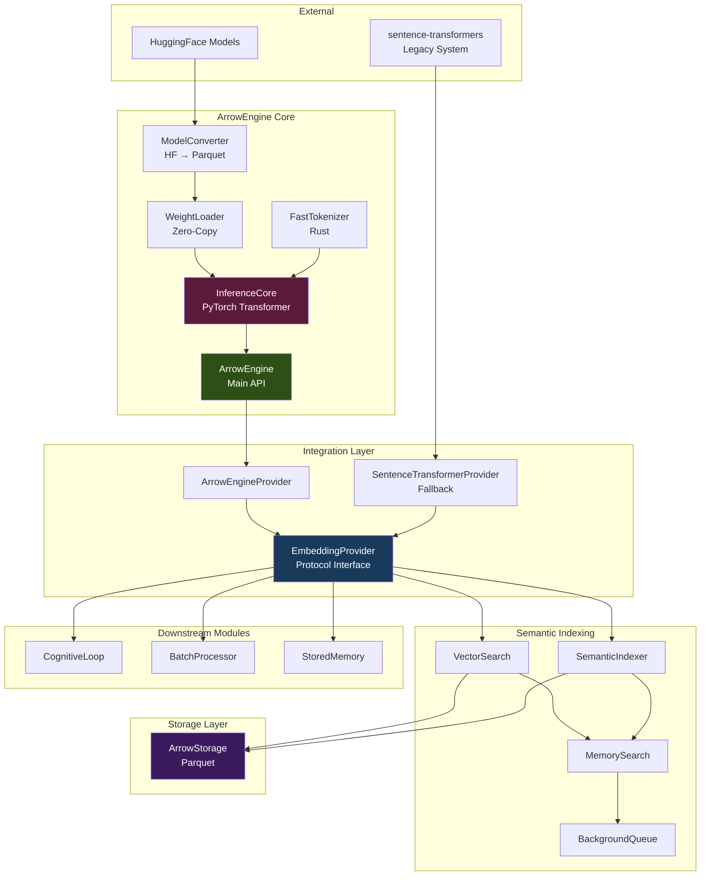

# Design Document: ArrowEngine Core Implementation

## Overview

ArrowEngine is a strategic embedding inference engine that replaces sentence-transformers in the AI-OS memory system. It implements an end-to-end Arrow zero-copy architecture spanning from model weights → embedding inference → memory storage → semantic retrieval, achieving 10-50x performance improvements while maintaining production-grade embedding quality.

### Core Value Proposition

- **10-100x faster model loading**: < 100ms vs 2-5s (memory-mapped Parquet weights)
- **2-4x faster inference**: < 5ms vs 10-20ms per sequence (optimized PyTorch + Rust tokenizer)
- **50% memory reduction**: float16 weights + zero-copy data flow
- **Zero API costs**: Self-hosted inference engine
- **Production-grade quality**: ≥ 0.99 cosine similarity vs sentence-transformers

### Design Philosophy

1. **Zero-copy everywhere**: From Parquet → NumPy → PyTorch → Arrow → Storage
2. **Lazy loading**: Load only what's needed, when it's needed
3. **Protocol-based interfaces**: Swappable implementations, smooth migration
4. **Incremental validation**: Validate at each phase before proceeding
5. **Backward compatibility**: Support parallel operation during migration

## Architecture

### System Context




### Component Layers

**Layer 1: Model Conversion & Storage**
- ModelConverter: HuggingFace → Arrow/Parquet transformation
- WeightLoader: Zero-copy memory-mapped weight loading
- FastTokenizer: Rust tokenizer integration

**Layer 2: Inference Engine**
- InferenceCore: Complete BERT Transformer implementation
- ArrowEngine: High-level API orchestrating all components

**Layer 3: Integration Interface**
- EmbeddingProvider: Protocol defining embedding operations
- ArrowEngineProvider: ArrowEngine implementation
- SentenceTransformerProvider: Legacy fallback

**Layer 4: Semantic Indexing**
- VectorSearch: Semantic similarity search
- SemanticIndexer: Index builder and maintainer
- SemanticIndexDB: Parquet-based index storage
- MemorySearch: Unified search interface
- BackgroundQueue: Async indexing pipeline

**Layer 5: Storage**
- ArrowStorage: Unified Parquet storage for embeddings and memories

## Components and Interfaces

### Phase 0: InferenceCore - Complete Transformer Implementation

#### Current State Analysis

The existing InferenceCore (inference_core.py, 241 lines) is a **simplified stub** that only implements:
- Embedding lookup (word + position + token_type)
- Mean pooling
- L2 normalization

**Critical Gap**: Missing the complete Transformer architecture:
- ❌ Multi-head self-attention
- ❌ Feed-forward networks
- ❌ Layer normalization
- ❌ Residual connections

This means current ArrowEngine embeddings are **not comparable** to sentence-transformers in quality.

#### Design Solution

Implement complete BERT Transformer architecture following the standard design:

```python
class InferenceCore(nn.Module):
    """
    Complete BERT-like inference engine.
    
    Architecture:
        Input IDs
        ↓
        Embedding Layer (word + position + token_type) + LayerNorm
        ↓
        N × TransformerLayer:
            ├─ Multi-Head Self-Attention
            ├─ Add & LayerNorm
            ├─ Feed-Forward Network (Linear → GELU → Linear)
            └─ Add & LayerNorm
        ↓
        Mean Pooling (with attention mask)
        ↓
        L2 Normalization
        ↓
        Sentence Embedding
    """
```

#### TransformerLayer Design

```python
class TransformerLayer(nn.Module):
    """
    Single Transformer layer with:
    - Multi-head self-attention
    - Position-wise feed-forward network
    - Residual connections
    - Layer normalization
    """
    
    def __init__(self, hidden_size, num_heads, intermediate_size, eps):
        # Multi-head attention
        self.attention = MultiHeadAttention(hidden_size, num_heads)
        self.attention_output = nn.Linear(hidden_size, hidden_size)
        self.attention_layernorm = nn.LayerNorm(hidden_size, eps=eps)
        
        # Feed-forward network
        self.intermediate = nn.Linear(hidden_size, intermediate_size)
        self.output_dense = nn.Linear(intermediate_size, hidden_size)
        self.output_layernorm = nn.LayerNorm(hidden_size, eps=eps)
    
    def forward(self, hidden_states, attention_mask):
        # Self-attention + residual + LayerNorm
        attn_output = self.attention(hidden_states, attention_mask)
        attn_output = self.attention_output(attn_output)
        hidden_states = self.attention_layernorm(attn_output + hidden_states)
        
        # FFN + residual + LayerNorm
        ffn_output = self.intermediate(hidden_states)
        ffn_output = F.gelu(ffn_output)
        ffn_output = self.output_dense(ffn_output)
        hidden_states = self.output_layernorm(ffn_output + hidden_states)
        
        return hidden_states
```

#### MultiHeadAttention Design

```python
class MultiHeadAttention(nn.Module):
    """
    Scaled dot-product attention with multiple heads.
    
    Attention(Q, K, V) = softmax(QK^T / sqrt(d_k)) * V
    """
    
    def __init__(self, hidden_size, num_heads):
        self.num_heads = num_heads
        self.head_size = hidden_size // num_heads
        
        self.query = nn.Linear(hidden_size, hidden_size)
        self.key = nn.Linear(hidden_size, hidden_size)
        self.value = nn.Linear(hidden_size, hidden_size)
    
    def forward(self, hidden_states, attention_mask):
        # Project to Q, K, V and reshape for multi-head
        # (batch, seq, hidden) → (batch, heads, seq, head_size)
        q = self._reshape_for_heads(self.query(hidden_states))
        k = self._reshape_for_heads(self.key(hidden_states))
        v = self._reshape_for_heads(self.value(hidden_states))
        
        # Scaled dot-product attention
        scores = torch.matmul(q, k.transpose(-1, -2)) / sqrt(head_size)
        scores = scores + attention_mask  # Apply mask
        probs = F.softmax(scores, dim=-1)
        context = torch.matmul(probs, v)
        
        # Reshape back: (batch, heads, seq, head_size) → (batch, seq, hidden)
        context = self._reshape_from_heads(context)
        return context
```

#### Weight Loading Strategy

Weights are loaded from Parquet with keys following HuggingFace naming:

```
embeddings.word_embeddings.weight
embeddings.position_embeddings.weight
embeddings.token_type_embeddings.weight
embeddings.LayerNorm.weight
embeddings.LayerNorm.bias

encoder.layer.{i}.attention.self.query.weight
encoder.layer.{i}.attention.self.query.bias
encoder.layer.{i}.attention.self.key.weight
encoder.layer.{i}.attention.self.key.bias
encoder.layer.{i}.attention.self.value.weight
encoder.layer.{i}.attention.self.value.bias
encoder.layer.{i}.attention.output.dense.weight
encoder.layer.{i}.attention.output.dense.bias
encoder.layer.{i}.attention.output.LayerNorm.weight
encoder.layer.{i}.attention.output.LayerNorm.bias
encoder.layer.{i}.intermediate.dense.weight
encoder.layer.{i}.intermediate.dense.bias
encoder.layer.{i}.output.dense.weight
encoder.layer.{i}.output.dense.bias
encoder.layer.{i}.output.LayerNorm.weight
encoder.layer.{i}.output.LayerNorm.bias
```

The `_build_and_load()` method iterates through layers and loads weights directly into PyTorch modules.

#### Configuration Auto-Detection

InferenceCore auto-detects configuration from weights when metadata is incomplete:

```python
def _detect_num_layers(weights):
    """Count unique encoder.layer.N indices"""
    layer_indices = set()
    for key in weights:
        if key.startswith("encoder.layer."):
            layer_indices.add(int(key.split(".")[2]))
    return len(layer_indices)

def _detect_intermediate_size(weights):
    """Read from encoder.layer.0.intermediate.dense.weight shape"""
    return weights["encoder.layer.0.intermediate.dense.weight"].shape[0]
```


### Phase 1: End-to-End Validation

#### Precision Validation Strategy

The core validation ensures ArrowEngine produces embeddings equivalent to sentence-transformers:

```python
def validate_precision(model_path: str, test_texts: List[str]):
    """
    Validate ArrowEngine vs sentence-transformers precision.
    
    Success criteria:
    - Per-text cosine similarity ≥ 0.99
    - Average similarity ≥ 0.995
    - No similarity < 0.95 (hard failure)
    """
    # Load both engines
    arrow_engine = ArrowEngine(model_path)
    st_model = SentenceTransformer("all-MiniLM-L6-v2")
    
    # Encode with both
    arrow_embs = arrow_engine.encode(test_texts, normalize=True)
    st_embs = st_model.encode(test_texts, normalize_embeddings=True)
    
    # Compute pairwise similarities
    similarities = []
    for i in range(len(test_texts)):
        sim = np.dot(arrow_embs[i], st_embs[i])
        similarities.append(sim)
        
        if sim < 0.95:
            raise QualityError(f"Text {i}: similarity={sim:.4f} < 0.95")
        elif sim < 0.99:
            logger.warning(f"Text {i}: similarity={sim:.4f} < 0.99")
    
    avg_sim = np.mean(similarities)
    if avg_sim < 0.995:
        raise QualityError(f"Average similarity={avg_sim:.4f} < 0.995")
    
    logger.info(f"Validation passed: avg_similarity={avg_sim:.4f}")
    return similarities
```

#### Test Text Selection

Validation uses diverse texts covering:
- Different lengths (10-500 tokens)
- Different domains (technical, conversational, formal)
- Different languages (primarily English, with some multilingual)
- Edge cases (empty, very short, very long)

Example test set:
```python
TEST_TEXTS = [
    "The quick brown fox jumps over the lazy dog.",
    "Machine learning is a subset of artificial intelligence.",
    "Python is a popular programming language for data science.",
    "Climate change poses significant challenges to global ecosystems.",
    "The Eiffel Tower is located in Paris, France.",
    # ... 15+ more diverse examples
]
```

#### Performance Benchmarking

```python
@dataclass
class BenchmarkResult:
    model_load_time_ms: float
    single_inference_latency_ms: float
    batch_throughput_rps: float  # requests per second
    memory_usage_mb: float
    
def benchmark_arrowengine(model_path: str) -> BenchmarkResult:
    """
    Benchmark ArrowEngine performance.
    
    Targets:
    - Load time: < 100ms
    - Single latency: < 5ms
    - Batch throughput: > 2000 rps
    - Memory: < 100MB
    """
    # Model loading
    start = time.time()
    engine = ArrowEngine(model_path)
    load_time = (time.time() - start) * 1000
    
    # Single inference
    latencies = []
    for _ in range(100):
        start = time.time()
        engine.encode("Test sentence")
        latencies.append((time.time() - start) * 1000)
    single_latency = np.median(latencies)
    
    # Batch throughput
    batch_size = 32
    num_batches = 100
    texts = ["Test sentence"] * batch_size
    start = time.time()
    for _ in range(num_batches):
        engine.encode_batch(texts)
    elapsed = time.time() - start
    throughput = (batch_size * num_batches) / elapsed
    
    # Memory usage
    import psutil
    process = psutil.Process()
    memory_mb = process.memory_info().rss / (1024 * 1024)
    
    return BenchmarkResult(
        model_load_time_ms=load_time,
        single_inference_latency_ms=single_latency,
        batch_throughput_rps=throughput,
        memory_usage_mb=memory_mb
    )
```

### Phase 2: Unified Embedding Interface

#### EmbeddingProvider Protocol

```python
from typing import Protocol, List, Union
import numpy as np

class EmbeddingProvider(Protocol):
    """
    Unified embedding interface for all downstream modules.
    
    This protocol allows swapping between ArrowEngine and
    sentence-transformers without changing downstream code.
    """
    
    def encode(
        self,
        text: Union[str, List[str]],
        normalize: bool = True
    ) -> np.ndarray:
        """
        Encode text(s) to embeddings.
        
        Args:
            text: Single text or list of texts
            normalize: L2-normalize embeddings
            
        Returns:
            Embeddings array, shape (n_texts, embedding_dim)
        """
        ...
    
    def encode_batch(
        self,
        texts: List[str],
        batch_size: int = 32,
        normalize: bool = True
    ) -> np.ndarray:
        """
        Batch encode texts (optimized for throughput).
        
        Args:
            texts: List of texts
            batch_size: Batch size for processing
            normalize: L2-normalize embeddings
            
        Returns:
            Embeddings array, shape (n_texts, embedding_dim)
        """
        ...
    
    def similarity(
        self,
        text1: Union[str, List[str]],
        text2: Union[str, List[str]]
    ) -> np.ndarray:
        """
        Compute cosine similarity between texts.
        
        Args:
            text1: First text(s)
            text2: Second text(s)
            
        Returns:
            Similarity matrix, shape (len(text1), len(text2))
        """
        ...
    
    def get_embedding_dimension(self) -> int:
        """Get embedding dimension."""
        ...
```

#### ArrowEngineProvider Implementation

```python
class ArrowEngineProvider:
    """ArrowEngine implementation of EmbeddingProvider."""
    
    def __init__(
        self,
        model_path: str = "./models/minilm",
        device: Optional[str] = None
    ):
        self.engine = ArrowEngine(model_path, device=device)
    
    def encode(self, text, normalize=True):
        return self.engine.encode(text, normalize=normalize)
    
    def encode_batch(self, texts, batch_size=32, normalize=True):
        return self.engine.encode(
            texts,
            batch_size=batch_size,
            normalize=normalize
        )
    
    def similarity(self, text1, text2):
        return self.engine.similarity(text1, text2)
    
    def get_embedding_dimension(self):
        return self.engine.get_embedding_dimension()
```

#### SentenceTransformerProvider Fallback

```python
class SentenceTransformerProvider:
    """sentence-transformers fallback implementation."""
    
    def __init__(self, model_name: str = "all-MiniLM-L6-v2"):
        from sentence_transformers import SentenceTransformer
        self.model = SentenceTransformer(model_name)
    
    def encode(self, text, normalize=True):
        is_single = isinstance(text, str)
        if is_single:
            text = [text]
        
        embeddings = self.model.encode(
            text,
            convert_to_numpy=True,
            normalize_embeddings=normalize
        )
        
        return embeddings[0:1] if is_single else embeddings
    
    def encode_batch(self, texts, batch_size=32, normalize=True):
        return self.model.encode(
            texts,
            batch_size=batch_size,
            convert_to_numpy=True,
            normalize_embeddings=normalize
        )
    
    def similarity(self, text1, text2):
        emb1 = self.encode(text1, normalize=True)
        emb2 = self.encode(text2, normalize=True)
        return np.dot(emb1, emb2.T)
    
    def get_embedding_dimension(self):
        return self.model.get_sentence_embedding_dimension()
```

#### Default Provider Selection

```python
def get_default_provider() -> EmbeddingProvider:
    """
    Get default embedding provider.
    
    Tries ArrowEngine first, falls back to sentence-transformers.
    """
    try:
        return ArrowEngineProvider()
    except (FileNotFoundError, ImportError) as e:
        logger.warning(
            f"ArrowEngine unavailable ({e}), "
            f"falling back to sentence-transformers"
        )
        return SentenceTransformerProvider()
```


### Phase 3: Semantic Indexing Infrastructure

#### VectorSearch Design

```python
@dataclass
class SearchResult:
    memory_id: str
    similarity: float
    memory: CompressedMemory
    
class VectorSearch:
    """
    Semantic search engine using ArrowEngine embeddings.
    
    Features:
    - Fast similarity search using vectorized NumPy operations
    - Arrow-native data flow (zero-copy)
    - Configurable similarity thresholds
    - Top-k retrieval
    """
    
    def __init__(
        self,
        embedding_provider: EmbeddingProvider,
        storage: ArrowStorage
    ):
        self.embedder = embedding_provider
        self.storage = storage
    
    def search(
        self,
        query: str,
        category: str,
        top_k: int = 10,
        threshold: float = 0.0
    ) -> List[SearchResult]:
        """
        Semantic search for memories.
        
        Args:
            query: Search query text
            category: Memory category to search
            top_k: Number of results to return
            threshold: Minimum similarity threshold
            
        Returns:
            List of search results, sorted by similarity
        """
        # Encode query
        query_embedding = self.embedder.encode(query, normalize=True)
        
        # Query storage (vectorized similarity computation)
        results = self.storage.query_by_similarity(
            category=category,
            query_embedding=query_embedding,
            top_k=top_k,
            threshold=threshold
        )
        
        return [
            SearchResult(
                memory_id=r['memory_id'],
                similarity=r['similarity'],
                memory=self._load_memory(r['memory_id'])
            )
            for r in results
        ]
    
    def batch_search(
        self,
        queries: List[str],
        category: str,
        top_k: int = 10
    ) -> List[List[SearchResult]]:
        """Batch search for multiple queries."""
        query_embeddings = self.embedder.encode_batch(queries, normalize=True)
        
        all_results = []
        for query_emb in query_embeddings:
            results = self.storage.query_by_similarity(
                category=category,
                query_embedding=query_emb,
                top_k=top_k
            )
            all_results.append([
                SearchResult(
                    memory_id=r['memory_id'],
                    similarity=r['similarity'],
                    memory=self._load_memory(r['memory_id'])
                )
                for r in results
            ])
        
        return all_results
```

#### SemanticIndexer Design

```python
class SemanticIndexer:
    """
    Builds and maintains semantic indexes for memories.
    
    Features:
    - Incremental index updates
    - Batch indexing for efficiency
    - Index validation
    - Background processing support
    """
    
    def __init__(
        self,
        embedding_provider: EmbeddingProvider,
        storage: ArrowStorage,
        index_db: 'SemanticIndexDB'
    ):
        self.embedder = embedding_provider
        self.storage = storage
        self.index_db = index_db
    
    def index_memory(self, memory: CompressedMemory):
        """
        Index a single memory.
        
        Args:
            memory: Memory to index
        """
        # Generate embedding if not present
        if memory.embedding is None:
            text = self._extract_indexable_text(memory)
            embedding = self.embedder.encode(text, normalize=True)
            memory.embedding = embedding
        
        # Store in index
        self.index_db.add_entry(
            memory_id=memory.memory_id,
            category=memory.category,
            embedding=memory.embedding,
            timestamp=memory.timestamp
        )
    
    def batch_index(
        self,
        memories: List[CompressedMemory],
        batch_size: int = 32
    ):
        """
        Batch index multiple memories.
        
        Args:
            memories: List of memories to index
            batch_size: Batch size for embedding generation
        """
        # Separate memories with/without embeddings
        needs_embedding = [m for m in memories if m.embedding is None]
        has_embedding = [m for m in memories if m.embedding is not None]
        
        # Generate embeddings in batches
        if needs_embedding:
            texts = [self._extract_indexable_text(m) for m in needs_embedding]
            embeddings = self.embedder.encode_batch(
                texts,
                batch_size=batch_size,
                normalize=True
            )
            
            for memory, embedding in zip(needs_embedding, embeddings):
                memory.embedding = embedding
        
        # Add all to index
        all_memories = needs_embedding + has_embedding
        self.index_db.batch_add(all_memories)
    
    def rebuild_index(self, category: str):
        """
        Rebuild index for a category from scratch.
        
        Args:
            category: Category to rebuild
        """
        logger.info(f"Rebuilding index for category: {category}")
        
        # Load all memories from storage
        memories = self.storage.load_all(category)
        
        # Clear existing index
        self.index_db.clear_category(category)
        
        # Batch index all memories
        self.batch_index(memories)
        
        logger.info(f"Rebuilt index: {len(memories)} memories")
    
    def _extract_indexable_text(self, memory: CompressedMemory) -> str:
        """Extract text for indexing from memory."""
        if memory.is_compressed:
            # Use summary for compressed memories
            return memory.summary
        else:
            # Use full context for uncompressed
            return memory.context
```

#### SemanticIndexDB Design

```python
class SemanticIndexDB:
    """
    Parquet-based semantic index storage.
    
    Schema:
    - memory_id: string
    - category: string
    - embedding: list<float16>
    - timestamp: timestamp
    - indexed_at: timestamp
    """
    
    def __init__(self, index_path: str):
        self.index_path = Path(index_path)
        self.index_path.mkdir(parents=True, exist_ok=True)
        self._schema = self._create_schema()
    
    def _create_schema(self) -> pa.Schema:
        return pa.schema([
            ('memory_id', pa.string()),
            ('category', pa.string()),
            ('embedding', pa.list_(pa.float16())),
            ('timestamp', pa.timestamp('us')),
            ('indexed_at', pa.timestamp('us')),
        ])
    
    def add_entry(
        self,
        memory_id: str,
        category: str,
        embedding: np.ndarray,
        timestamp: datetime
    ):
        """Add single entry to index."""
        self.batch_add([{
            'memory_id': memory_id,
            'category': category,
            'embedding': embedding,
            'timestamp': timestamp,
            'indexed_at': datetime.now()
        }])
    
    def batch_add(self, entries: List[Dict]):
        """Batch add entries to index."""
        # Convert to Arrow table
        table = pa.Table.from_pylist(entries, schema=self._schema)
        
        # Append to category-specific Parquet file
        for category in set(e['category'] for e in entries):
            category_file = self.index_path / f"{category}_index.parquet"
            category_entries = [e for e in entries if e['category'] == category]
            category_table = pa.Table.from_pylist(
                category_entries,
                schema=self._schema
            )
            
            if category_file.exists():
                # Append to existing file
                existing = pq.read_table(category_file)
                combined = pa.concat_tables([existing, category_table])
                pq.write_table(combined, category_file)
            else:
                # Create new file
                pq.write_table(category_table, category_file)
    
    def query(
        self,
        category: str,
        query_embedding: np.ndarray,
        top_k: int = 10
    ) -> List[Dict]:
        """Query index for similar embeddings."""
        category_file = self.index_path / f"{category}_index.parquet"
        
        if not category_file.exists():
            return []
        
        # Load index
        table = pq.read_table(category_file)
        
        # Vectorized similarity computation
        embeddings = np.array([
            e.as_py() for e in table['embedding']
        ], dtype=np.float32)
        
        similarities = embeddings @ query_embedding
        
        # Get top-k
        top_indices = np.argsort(similarities)[-top_k:][::-1]
        
        return [
            {
                'memory_id': table['memory_id'][i].as_py(),
                'similarity': float(similarities[i]),
                'timestamp': table['timestamp'][i].as_py()
            }
            for i in top_indices
        ]
    
    def clear_category(self, category: str):
        """Clear index for a category."""
        category_file = self.index_path / f"{category}_index.parquet"
        if category_file.exists():
            category_file.unlink()
```


#### MemorySearch Design

```python
from enum import Enum

class SearchMode(Enum):
    SEMANTIC = "semantic"
    ENTITY = "entity"
    TIME = "time"
    HYBRID = "hybrid"

class MemorySearch:
    """
    Unified memory search interface.
    
    Supports multiple search modes:
    - Semantic: Vector similarity search
    - Entity: Entity-based filtering
    - Time: Time range queries
    - Hybrid: Combination of above
    """
    
    def __init__(
        self,
        vector_search: VectorSearch,
        storage: ArrowStorage
    ):
        self.vector_search = vector_search
        self.storage = storage
    
    def search(
        self,
        query: str,
        category: str,
        mode: SearchMode = SearchMode.SEMANTIC,
        top_k: int = 10,
        **kwargs
    ) -> List[SearchResult]:
        """
        Unified search interface.
        
        Args:
            query: Search query
            category: Memory category
            mode: Search mode
            top_k: Number of results
            **kwargs: Mode-specific parameters
            
        Returns:
            List of search results
        """
        if mode == SearchMode.SEMANTIC:
            return self.vector_search.search(query, category, top_k)
        
        elif mode == SearchMode.ENTITY:
            entity_type = kwargs.get('entity_type')
            entity_value = kwargs.get('entity_value')
            return self._search_by_entity(
                category, entity_type, entity_value, top_k
            )
        
        elif mode == SearchMode.TIME:
            start_time = kwargs.get('start_time')
            end_time = kwargs.get('end_time')
            return self._search_by_time(
                category, start_time, end_time, top_k
            )
        
        elif mode == SearchMode.HYBRID:
            # Combine semantic + entity/time filtering
            semantic_results = self.vector_search.search(
                query, category, top_k * 2
            )
            
            # Apply additional filters
            filtered = self._apply_filters(semantic_results, **kwargs)
            return filtered[:top_k]
    
    def _search_by_entity(
        self,
        category: str,
        entity_type: str,
        entity_value: str,
        top_k: int
    ) -> List[SearchResult]:
        """Search by entity."""
        results = self.storage.query_by_entity(
            category=category,
            entity_type=entity_type,
            entity_value=entity_value,
            limit=top_k
        )
        return [
            SearchResult(
                memory_id=r['memory_id'],
                similarity=1.0,  # Exact match
                memory=self._load_memory(r['memory_id'])
            )
            for r in results
        ]
    
    def _search_by_time(
        self,
        category: str,
        start_time: datetime,
        end_time: datetime,
        top_k: int
    ) -> List[SearchResult]:
        """Search by time range."""
        results = self.storage.query_by_time_range(
            category=category,
            start_time=start_time,
            end_time=end_time,
            limit=top_k
        )
        return [
            SearchResult(
                memory_id=r['memory_id'],
                similarity=1.0,
                memory=self._load_memory(r['memory_id'])
            )
            for r in results
        ]
```

#### BackgroundQueue Design

```python
import asyncio
from asyncio import Queue
from typing import Callable, Any

class BackgroundQueue:
    """
    Async background processing queue for indexing tasks.
    
    Features:
    - Non-blocking task submission
    - Batch processing optimization
    - Error handling and retry
    - Graceful shutdown
    """
    
    def __init__(
        self,
        indexer: SemanticIndexer,
        batch_size: int = 32,
        max_queue_size: int = 1000
    ):
        self.indexer = indexer
        self.batch_size = batch_size
        self.queue: Queue = Queue(maxsize=max_queue_size)
        self.running = False
        self._worker_task = None
    
    async def start(self):
        """Start background worker."""
        if self.running:
            return
        
        self.running = True
        self._worker_task = asyncio.create_task(self._worker())
        logger.info("BackgroundQueue started")
    
    async def stop(self):
        """Stop background worker gracefully."""
        self.running = False
        
        if self._worker_task:
            await self._worker_task
        
        logger.info("BackgroundQueue stopped")
    
    async def submit(self, memory: CompressedMemory):
        """
        Submit memory for indexing.
        
        Args:
            memory: Memory to index
        """
        await self.queue.put(memory)
    
    async def _worker(self):
        """Background worker that processes queue."""
        batch = []
        
        while self.running or not self.queue.empty():
            try:
                # Wait for item with timeout
                memory = await asyncio.wait_for(
                    self.queue.get(),
                    timeout=1.0
                )
                batch.append(memory)
                
                # Process batch when full or queue empty
                if len(batch) >= self.batch_size or self.queue.empty():
                    await self._process_batch(batch)
                    batch = []
            
            except asyncio.TimeoutError:
                # Process partial batch on timeout
                if batch:
                    await self._process_batch(batch)
                    batch = []
            
            except Exception as e:
                logger.error(f"Worker error: {e}", exc_info=True)
    
    async def _process_batch(self, batch: List[CompressedMemory]):
        """Process a batch of memories."""
        try:
            # Run indexing in thread pool (blocking operation)
            loop = asyncio.get_event_loop()
            await loop.run_in_executor(
                None,
                self.indexer.batch_index,
                batch
            )
            
            logger.debug(f"Indexed batch of {len(batch)} memories")
        
        except Exception as e:
            logger.error(f"Batch indexing failed: {e}", exc_info=True)
```

## Data Models

### CompressedMemory Extension

```python
@dataclass
class CompressedMemory:
    """Extended with embedding field for ArrowEngine integration."""
    
    # Existing fields
    memory_id: str
    timestamp: datetime
    context: str
    summary: str
    is_compressed: bool
    category: str
    
    # New field for ArrowEngine
    embedding: Optional[np.ndarray] = None  # float32, shape (embedding_dim,)
    
    # Compression metadata
    metadata: Optional[CompressionMetadata] = None
    entities: Optional[Dict[str, List[str]]] = None
```

### Arrow Schema Updates

ArrowStorage schema already includes embedding field as `list<float16>`. No schema changes needed, but we optimize the similarity query:

```python
def query_by_similarity(
    self,
    category: str,
    query_embedding: np.ndarray,
    top_k: int = 10,
    threshold: float = 0.0
) -> List[Dict]:
    """
    Optimized vectorized similarity query.
    
    Before: O(n) Python loop
    After: Vectorized NumPy computation
    """
    table = self._load_category_table(category)
    
    # Zero-copy: Arrow → NumPy
    embeddings_column = table.column('embedding')
    embeddings_matrix = np.array(
        [e.as_py() for e in embeddings_column],
        dtype=np.float32
    )
    
    # Vectorized similarity computation (SIMD optimized)
    query_vec = query_embedding.astype(np.float32)
    similarities = embeddings_matrix @ query_vec
    
    # Filter by threshold
    mask = similarities >= threshold
    filtered_indices = np.where(mask)[0]
    filtered_sims = similarities[filtered_indices]
    
    # Get top-k
    if len(filtered_sims) > top_k:
        top_indices = np.argsort(filtered_sims)[-top_k:][::-1]
        result_indices = filtered_indices[top_indices]
    else:
        result_indices = filtered_indices[np.argsort(filtered_sims)[::-1]]
    
    # Build results
    return [
        {
            'memory_id': table['memory_id'][i].as_py(),
            'similarity': float(similarities[i]),
            'timestamp': table['timestamp'][i].as_py()
        }
        for i in result_indices
    ]
```


## Correctness Properties

A property is a characteristic or behavior that should hold true across all valid executions of a system—essentially, a formal statement about what the system should do. Properties serve as the bridge between human-readable specifications and machine-verifiable correctness guarantees.

### Architecture Properties

Property 1: Complete Embedding Computation
*For any* valid input_ids tensor, the embedding layer output should contain contributions from word embeddings, position embeddings, and token type embeddings (verified by checking that the output differs from any single embedding type alone).
**Validates: Requirements 1.1**

Property 2: Transformer Layer Count
*For any* loaded model, the number of encoder layers in InferenceCore should match the configured num_layers, and forward propagation should execute all layers (verified by checking that modifying the last layer's weights affects the final output).
**Validates: Requirements 1.2**

Property 3: Multi-Head Attention Structure
*For any* Transformer layer, the attention mechanism should have the configured number of heads, and the output shape should be (batch_size, seq_len, hidden_size).
**Validates: Requirements 1.3**

Property 4: Feed-Forward Network with GELU
*For any* Transformer layer, the FFN should apply GELU activation between the intermediate and output projections (verified by checking that the activation is non-linear and matches GELU behavior on test inputs).
**Validates: Requirements 1.4**

Property 5: Layer Normalization Placement
*For any* Transformer layer, LayerNorm should be applied after attention and after FFN, and the normalized outputs should have mean ≈ 0 and standard deviation ≈ 1.
**Validates: Requirements 1.5**

Property 6: Mean Pooling with Mask Support
*For any* hidden states and attention mask, mean pooling should compute the average only over non-masked positions (verified by checking that changing masked positions doesn't affect the output).
**Validates: Requirements 1.6**

Property 7: L2 Normalization
*For any* embedding vector, after L2 normalization, the vector should have L2 norm = 1.0 (within floating point tolerance of 1e-6).
**Validates: Requirements 1.7**

Property 8: Weight Loading Correctness
*For any* weight tensor in the Parquet file, it should be loaded into the correct PyTorch module parameter with matching shape and name.
**Validates: Requirements 1.8**

### Quality Properties

Property 9: Embedding Quality vs Sentence-Transformers
*For any* text input, when encoded by both ArrowEngine and sentence-transformers, the cosine similarity between the two embeddings should be ≥ 0.99.
**Validates: Requirements 2.1, 2.2**

Property 10: Batch Processing Consistency
*For any* list of texts, encoding them with different batch sizes (including batch_size=1) should produce identical embeddings for each text.
**Validates: Requirements 2.3, 2.4**

### Zero-Copy Properties

Property 11: Memory-Efficient Weight Loading
*For any* model loaded via WeightLoader, the memory usage increase should be approximately equal to the model size (no significant extra allocations), and loading should complete in < 100ms for models < 200MB.
**Validates: Requirements 3.1, 3.2**

Property 12: Arrow Output Support
*For any* text encoded by ArrowEngine, calling the Arrow output method should return a PyArrow Array directly without intermediate Python list conversion.
**Validates: Requirements 3.3**

Property 13: Arrow Storage Integration
*For any* Arrow array of embeddings, ArrowStorage should accept it directly without conversion (verified by checking no numpy/list conversion occurs).
**Validates: Requirements 3.4**

Property 14: Vectorized Similarity Computation
*For any* similarity query, the computation should use vectorized NumPy operations (verified by checking execution time is O(n) not O(n²) for n embeddings).
**Validates: Requirements 3.5**

### Interface Properties

Property 15: Provider API Compatibility
*For any* EmbeddingProvider implementation (ArrowEngine or SentenceTransformer), all required methods (encode, encode_batch, similarity, get_embedding_dimension) should be callable with the same signatures and return compatible types.
**Validates: Requirements 4.4**

Property 16: Index Persistence Compatibility
*For any* semantic index saved by SemanticIndexDB, it should be loadable by ArrowStorage's Parquet reader without errors.
**Validates: Requirements 5.3**

Property 17: Async Non-Blocking Behavior
*For any* task submitted to BackgroundQueue, the submission should return immediately without blocking the caller (verified by measuring submission time < 1ms).
**Validates: Requirements 5.5**

Property 18: Automatic Index Triggering
*For any* memory stored via the storage interface, if background indexing is enabled, an indexing task should be automatically queued (verified by checking queue size increases).
**Validates: Requirements 5.6**

### Performance Properties

Property 19: Model Load Time
*For any* model < 200MB, ArrowEngine initialization should complete in < 100ms.
**Validates: Requirements 6.1**

Property 20: Single Inference Latency
*For any* single text input, ArrowEngine encoding should complete in < 5ms (median over 100 runs).
**Validates: Requirements 6.2**

Property 21: Batch Throughput
*For any* batch of 32 texts, ArrowEngine should achieve throughput > 2000 requests/second (measured over 100 batches).
**Validates: Requirements 6.3**

Property 22: Memory Usage
*For any* ArrowEngine instance during inference, memory consumption should be < 100MB (measured via process RSS).
**Validates: Requirements 6.4**

Property 23: Comparative Performance
*For any* end-to-end pipeline (load + encode), ArrowEngine should be at least 2x faster than sentence-transformers.
**Validates: Requirements 6.5**

### Conversion Properties

Property 24: Complete Weight Extraction
*For any* HuggingFace model, ModelConverter should extract all weight tensors (verified by comparing tensor count and total parameter count with the original model).
**Validates: Requirements 7.1**

Property 25: Float16 Size Reduction
*For any* model converted with float16 optimization, the output Parquet file size should be approximately 50% of the original model size.
**Validates: Requirements 7.2**

Property 26: Tokenizer Export Validity
*For any* converted model, the exported tokenizer file should be loadable by FastTokenizer without errors.
**Validates: Requirements 7.3**

Property 27: Weight Integrity Validation
*For any* converted model, the checksum of each weight tensor should match between the original and converted versions.
**Validates: Requirements 7.4**

Property 28: Conversion Round-Trip Accuracy
*For any* test input, encoding with the original HuggingFace model and the converted ArrowEngine model should produce embeddings with cosine similarity ≥ 0.99.
**Validates: Requirements 7.5**

### Migration Properties

Property 29: Backend Interchangeability
*For any* downstream module using EmbeddingProvider, swapping between ArrowEngineProvider and SentenceTransformerProvider should not require code changes (verified by duck typing compatibility).
**Validates: Requirements 9.2**

Property 30: API Signature Stability
*For any* public method in a migrated module, the method signature (parameters and return type) should remain identical before and after migration.
**Validates: Requirements 9.3**

### Deployment Properties

Property 31: Environment Configuration
*For any* environment variable (MODEL_PATH, DEVICE, API_KEY), setting it should override the default configuration (verified by checking the running service uses the env var value).
**Validates: Requirements 10.5**

Property 32: Graceful Shutdown
*For any* active request when shutdown signal is received, the request should complete successfully before the service terminates (verified by sending SIGTERM during request processing).
**Validates: Requirements 10.7**

### Observability Properties

Property 33: Structured Logging with Request IDs
*For any* request processed, the logs should contain structured JSON entries with a unique request_id field.
**Validates: Requirements 11.4**

Property 34: Error Context Logging
*For any* error that occurs, the error log should include input shapes, model state, and stack trace.
**Validates: Requirements 11.5**

Property 35: Metrics Exposure
*For any* request processed, Prometheus metrics (request_count, latency, throughput, error_rate) should be updated and queryable via the /metrics endpoint.
**Validates: Requirements 11.6**


## Error Handling

### Exception Hierarchy

ArrowEngine uses the existing `llm_compression.errors` exception hierarchy:

```python
from llm_compression.errors import (
    CompressionError,      # Base exception
    LLMAPIError,           # API-related errors
    QualityError,          # Quality validation failures
    StorageError,          # Storage operation failures
    ConfigurationError,    # Configuration issues
    GPUResourceError       # GPU/device errors
)
```

### ArrowEngine-Specific Errors

```python
class InferenceError(CompressionError):
    """Base exception for inference errors."""
    pass

class ModelLoadError(InferenceError):
    """Failed to load model from Parquet."""
    def __init__(self, model_path: str, reason: str):
        super().__init__(
            f"Failed to load model from {model_path}: {reason}"
        )
        self.model_path = model_path
        self.reason = reason

class WeightIntegrityError(InferenceError):
    """Weight validation failed."""
    def __init__(self, layer_name: str, expected_shape, actual_shape):
        super().__init__(
            f"Weight integrity check failed for {layer_name}: "
            f"expected shape {expected_shape}, got {actual_shape}"
        )
        self.layer_name = layer_name
        self.expected_shape = expected_shape
        self.actual_shape = actual_shape

class TokenizationError(InferenceError):
    """Tokenization failed."""
    def __init__(self, text: str, reason: str):
        super().__init__(f"Tokenization failed: {reason}")
        self.text = text[:100]  # Truncate for logging
        self.reason = reason

class EmbeddingQualityError(QualityError):
    """Embedding quality below threshold."""
    def __init__(self, similarity: float, threshold: float, text: str):
        super().__init__(
            f"Embedding quality {similarity:.4f} below threshold {threshold:.4f}"
        )
        self.similarity = similarity
        self.threshold = threshold
        self.text = text[:100]
```

### Error Handling Patterns

#### Graceful Degradation

```python
def get_default_provider() -> EmbeddingProvider:
    """Try ArrowEngine, fall back to sentence-transformers."""
    try:
        provider = ArrowEngineProvider()
        logger.info("Using ArrowEngine provider")
        return provider
    except (FileNotFoundError, ModelLoadError) as e:
        logger.warning(
            f"ArrowEngine unavailable ({e}), "
            f"falling back to sentence-transformers"
        )
        return SentenceTransformerProvider()
```

#### Validation with Context

```python
def validate_conversion(
    original_model,
    converted_engine,
    test_texts: List[str]
) -> None:
    """Validate conversion quality with detailed error reporting."""
    failures = []
    
    for i, text in enumerate(test_texts):
        try:
            orig_emb = original_model.encode(text)
            conv_emb = converted_engine.encode(text)
            similarity = np.dot(orig_emb, conv_emb)
            
            if similarity < 0.95:
                failures.append({
                    'text_index': i,
                    'text': text[:50],
                    'similarity': similarity
                })
        except Exception as e:
            failures.append({
                'text_index': i,
                'text': text[:50],
                'error': str(e)
            })
    
    if failures:
        raise EmbeddingQualityError(
            f"Conversion validation failed on {len(failures)} texts: "
            f"{failures}"
        )
```

#### Retry Logic for Transient Errors

```python
def load_with_retry(
    model_path: str,
    max_retries: int = 3,
    backoff: float = 1.0
) -> ArrowEngine:
    """Load model with exponential backoff retry."""
    for attempt in range(max_retries):
        try:
            return ArrowEngine(model_path)
        except (IOError, OSError) as e:
            if attempt == max_retries - 1:
                raise ModelLoadError(model_path, str(e))
            
            wait_time = backoff * (2 ** attempt)
            logger.warning(
                f"Load attempt {attempt + 1} failed, "
                f"retrying in {wait_time}s: {e}"
            )
            time.sleep(wait_time)
```

### Logging Strategy

```python
# Structured logging with context
logger.info(
    "ArrowEngine initialized",
    extra={
        'model_path': model_path,
        'device': device,
        'load_time_ms': load_time_ms,
        'embedding_dim': embedding_dim
    }
)

# Error logging with full context
logger.error(
    "Inference failed",
    extra={
        'input_shape': input_ids.shape,
        'device': device,
        'model_state': 'loaded',
        'error': str(e)
    },
    exc_info=True
)
```

## Testing Strategy

### Dual Testing Approach

ArrowEngine uses both unit tests and property-based tests for comprehensive coverage:

- **Unit tests**: Verify specific examples, edge cases, and error conditions
- **Property tests**: Verify universal properties across all inputs

Both are complementary and necessary. Unit tests catch concrete bugs, property tests verify general correctness.

### Unit Testing

#### Test Organization

```
tests/
├── unit/
│   ├── inference/
│   │   ├── test_inference_core.py      # InferenceCore tests
│   │   ├── test_weight_loader.py       # WeightLoader tests
│   │   ├── test_arrow_engine.py        # ArrowEngine tests
│   │   └── test_fast_tokenizer.py      # FastTokenizer tests
│   ├── test_embedding_provider.py      # Provider interface tests
│   ├── test_vector_search.py           # VectorSearch tests
│   ├── test_semantic_indexer.py        # SemanticIndexer tests
│   └── test_background_queue.py        # BackgroundQueue tests
├── integration/
│   ├── test_e2e_precision.py           # End-to-end quality validation
│   ├── test_arrow_integration.py       # ArrowStorage integration
│   └── test_migration.py               # Migration compatibility
└── performance/
    └── test_arrowengine_benchmark.py   # Performance benchmarks
```

#### Example Unit Tests

```python
import pytest
import torch
import numpy as np
from llm_compression.inference import InferenceCore

class TestInferenceCore:
    """Unit tests for InferenceCore."""
    
    @pytest.fixture
    def mock_weights(self):
        """Create mock weights for testing."""
        return {
            'embeddings.word_embeddings.weight': torch.randn(30522, 384),
            'embeddings.position_embeddings.weight': torch.randn(512, 384),
            'embeddings.token_type_embeddings.weight': torch.randn(2, 384),
            'embeddings.LayerNorm.weight': torch.ones(384),
            'embeddings.LayerNorm.bias': torch.zeros(384),
            # ... more weights
        }
    
    @pytest.fixture
    def config(self):
        """Test configuration."""
        return {
            'hidden_size': 384,
            'num_layers': 6,
            'num_attention_heads': 6,
            'intermediate_size': 1536,
            'max_position_embeddings': 512,
            'vocab_size': 30522,
        }
    
    def test_forward_output_shape(self, mock_weights, config):
        """Test forward pass produces correct output shape."""
        core = InferenceCore(mock_weights, config, device='cpu')
        
        batch_size = 4
        seq_len = 32
        input_ids = torch.randint(0, 30522, (batch_size, seq_len))
        attention_mask = torch.ones(batch_size, seq_len)
        
        output = core(input_ids, attention_mask)
        
        assert output.shape == (batch_size, 384)
    
    def test_mean_pooling_with_mask(self, mock_weights, config):
        """Test mean pooling respects attention mask."""
        core = InferenceCore(mock_weights, config, device='cpu')
        
        # Create hidden states and mask
        hidden_states = torch.randn(2, 10, 384)
        
        # Mask out last 5 tokens for first sequence
        attention_mask = torch.ones(2, 10)
        attention_mask[0, 5:] = 0
        
        pooled = core.mean_pooling(hidden_states, attention_mask)
        
        # Manually compute expected pooling for first sequence
        expected_first = hidden_states[0, :5].mean(dim=0)
        
        assert torch.allclose(pooled[0], expected_first, atol=1e-5)
    
    def test_normalize_embeddings(self, mock_weights, config):
        """Test L2 normalization produces unit vectors."""
        core = InferenceCore(mock_weights, config, device='cpu')
        
        embeddings = torch.randn(10, 384)
        normalized = core.normalize_embeddings(embeddings)
        
        # Check all vectors have L2 norm = 1
        norms = torch.norm(normalized, p=2, dim=1)
        assert torch.allclose(norms, torch.ones(10), atol=1e-6)
    
    def test_transformer_layers_affect_output(self, mock_weights, config):
        """Test that transformer layers actually transform the input."""
        core = InferenceCore(mock_weights, config, device='cpu')
        
        input_ids = torch.randint(0, 30522, (2, 10))
        attention_mask = torch.ones(2, 10)
        
        # Get embeddings before transformer layers
        embeddings = core._compute_embeddings(input_ids)
        
        # Get final output
        output = core(input_ids, attention_mask)
        
        # Output should be different from raw embeddings
        # (after mean pooling)
        pooled_embeddings = core.mean_pooling(embeddings, attention_mask)
        
        assert not torch.allclose(output, pooled_embeddings, atol=0.1)
```

### Property-Based Testing

Property tests use `hypothesis` library to generate random inputs and verify properties hold:

```python
from hypothesis import given, strategies as st
import hypothesis.extra.numpy as npst

class TestArrowEngineProperties:
    """Property-based tests for ArrowEngine."""
    
    @given(
        texts=st.lists(
            st.text(min_size=1, max_size=100),
            min_size=1,
            max_size=10
        )
    )
    def test_batch_consistency(self, texts):
        """
        Property: Batch processing consistency.
        
        For any list of texts, encoding with different batch sizes
        should produce identical results.
        
        Feature: arrowengine-core-implementation, Property 10
        """
        engine = ArrowEngine("./models/minilm")
        
        # Encode with batch_size=1
        embs_single = engine.encode(texts, batch_size=1)
        
        # Encode with batch_size=len(texts)
        embs_batch = engine.encode(texts, batch_size=len(texts))
        
        # Should be identical
        assert np.allclose(embs_single, embs_batch, atol=1e-6)
    
    @given(
        embedding=npst.arrays(
            dtype=np.float32,
            shape=384,
            elements=st.floats(
                min_value=-10.0,
                max_value=10.0,
                allow_nan=False,
                allow_infinity=False
            )
        )
    )
    def test_l2_normalization(self, embedding):
        """
        Property: L2 normalization produces unit vectors.
        
        For any embedding vector, after L2 normalization,
        the L2 norm should equal 1.0.
        
        Feature: arrowengine-core-implementation, Property 7
        """
        engine = ArrowEngine("./models/minilm")
        
        # Normalize
        normalized = engine.inference_core.normalize_embeddings(
            torch.from_numpy(embedding.reshape(1, -1))
        ).numpy()[0]
        
        # Check norm
        norm = np.linalg.norm(normalized)
        assert abs(norm - 1.0) < 1e-6
```

### Integration Testing

```python
class TestEndToEndPrecision:
    """Integration tests for precision validation."""
    
    @pytest.fixture(scope="class")
    def test_texts(self):
        """Diverse test texts for validation."""
        return [
            "The quick brown fox jumps over the lazy dog.",
            "Machine learning is transforming technology.",
            "Python is a versatile programming language.",
            # ... 20+ diverse texts
        ]
    
    def test_arrowengine_vs_sentence_transformers(self, test_texts):
        """
        Validate ArrowEngine matches sentence-transformers quality.
        
        Feature: arrowengine-core-implementation, Property 9
        """
        from sentence_transformers import SentenceTransformer
        
        # Load both engines
        arrow_engine = ArrowEngine("./models/minilm")
        st_model = SentenceTransformer("all-MiniLM-L6-v2")
        
        # Encode with both
        arrow_embs = arrow_engine.encode(test_texts, normalize=True)
        st_embs = st_model.encode(
            test_texts,
            normalize_embeddings=True,
            convert_to_numpy=True
        )
        
        # Compute similarities
        similarities = []
        for i in range(len(test_texts)):
            sim = np.dot(arrow_embs[i], st_embs[i])
            similarities.append(sim)
            
            # Per-text validation
            assert sim >= 0.99, (
                f"Text {i} similarity {sim:.4f} < 0.99: "
                f"{test_texts[i][:50]}"
            )
        
        # Average validation
        avg_sim = np.mean(similarities)
        assert avg_sim >= 0.995, (
            f"Average similarity {avg_sim:.4f} < 0.995"
        )
```

### Performance Testing

```python
import pytest
import time
import psutil

class TestArrowEnginePerformance:
    """Performance benchmarks for ArrowEngine."""
    
    @pytest.mark.performance
    def test_model_load_time(self):
        """
        Benchmark: Model load time < 100ms.
        
        Feature: arrowengine-core-implementation, Property 19
        """
        start = time.time()
        engine = ArrowEngine("./models/minilm")
        load_time_ms = (time.time() - start) * 1000
        
        assert load_time_ms < 100, (
            f"Load time {load_time_ms:.2f}ms exceeds 100ms"
        )
    
    @pytest.mark.performance
    def test_single_inference_latency(self):
        """
        Benchmark: Single inference < 5ms.
        
        Feature: arrowengine-core-implementation, Property 20
        """
        engine = ArrowEngine("./models/minilm")
        
        # Warmup
        for _ in range(10):
            engine.encode("warmup")
        
        # Measure
        latencies = []
        for _ in range(100):
            start = time.time()
            engine.encode("Test sentence for latency measurement")
            latencies.append((time.time() - start) * 1000)
        
        median_latency = np.median(latencies)
        
        assert median_latency < 5.0, (
            f"Median latency {median_latency:.2f}ms exceeds 5ms"
        )
    
    @pytest.mark.performance
    def test_batch_throughput(self):
        """
        Benchmark: Batch throughput > 2000 rps.
        
        Feature: arrowengine-core-implementation, Property 21
        """
        engine = ArrowEngine("./models/minilm")
        
        batch_size = 32
        num_batches = 100
        texts = ["Test sentence"] * batch_size
        
        start = time.time()
        for _ in range(num_batches):
            engine.encode_batch(texts)
        elapsed = time.time() - start
        
        throughput = (batch_size * num_batches) / elapsed
        
        assert throughput > 2000, (
            f"Throughput {throughput:.0f} rps < 2000 rps"
        )
```

### Test Configuration

```python
# pytest.ini
[pytest]
markers =
    unit: Unit tests
    integration: Integration tests
    performance: Performance benchmarks
    property: Property-based tests

# Minimum 100 iterations for property tests
addopts = 
    --hypothesis-seed=42
    --hypothesis-show-statistics
    
[hypothesis]
max_examples = 100
deadline = None  # Disable deadline for performance tests
```

### Coverage Requirements

- **Inference module**: > 90% code coverage
- **Integration layer**: > 85% code coverage
- **Semantic indexing**: > 80% code coverage

Run coverage with:
```bash
pytest --cov=llm_compression/inference --cov-report=html tests/unit/inference/
```

