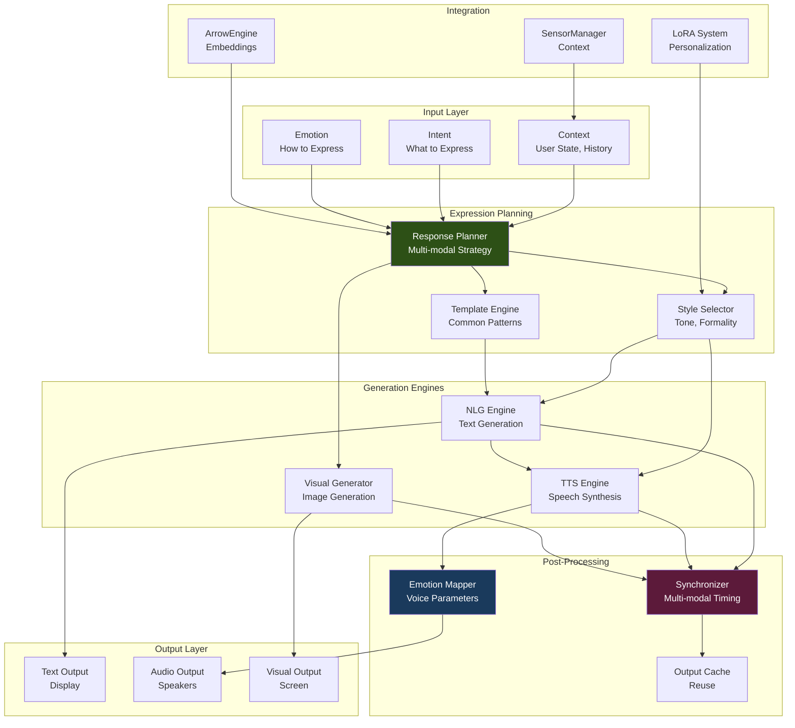

# Design Document: Expression & Presentation Layer

## Overview

The Expression & Presentation Layer completes the AI-OS bidirectional interaction loop by adding sophisticated output capabilities. Building on the perception layer (Phase 11) and action layer (Phase 12), this system enables natural, contextual, and emotionally-aware communication through text, speech, and visual modalities.

### Core Design Principles

1. **Modality Flexibility**: Support multiple output modalities with graceful fallbacks
2. **Context Awareness**: Adapt expression style based on conversation context and user state
3. **Real-time Streaming**: Provide immediate feedback through streaming outputs
4. **Emotional Intelligence**: Express appropriate emotions across modalities
5. **Integration First**: Seamlessly integrate with existing ArrowEngine infrastructure

### Target Performance

| Metric | Target | Rationale |
|--------|--------|-----------|
| Text Generation | < 2s | Real-time conversation |
| Speech Generation (short) | < 500ms | Natural dialogue flow |
| Speech Generation (long) | Streaming | Continuous output |
| Image Generation | < 10s | Acceptable for illustrations |
| Memory Usage | < 2GB | Efficient resource usage |
| MOS Score (Speech) | > 4.0 | High-quality audio |

## Architecture

### System Overview



### Component Hierarchy

**Tier 1: Planning and Coordination**
- ResponsePlanner: Multi-modal response strategy
- StyleSelector: Context-aware style selection
- TemplateEngine: Common response patterns

**Tier 2: Generation Engines**
- NLGEngine: Text generation (LLM integration)
- TTSEngine: Speech synthesis (multiple backends)
- VisualGenerator: Image generation (optional)

**Tier 3: Post-Processing**
- EmotionMapper: Emotion to voice parameters
- Synchronizer: Multi-modal timing coordination
- OutputCache: Caching for efficiency

**Tier 4: Integration**
- ArrowEngine integration
- LoRA personalization
- SensorManager context

## Components and Interfaces

### 0. LanguageDetector - Multi-language Support

```python
from typing import Optional, Dict
import logging

logger = logging.getLogger(__name__)

class LanguageDetector:
    """
    Detects and manages language context for expression.
    
    Responsibilities:
    - Detect input language automatically
    - Maintain language consistency across conversation
    - Provide language-specific expression rules
    - Support code-switching (multilingual conversations)
    """
    
    def __init__(self):
        self.language_rules = self._init_language_rules()
        self.current_language = "en"
        self.language_history = []
    
    def _init_language_rules(self) -> Dict[str, Dict[str, Any]]:
        """Initialize language-specific expression rules."""
        return {
            "en": {
                "formality_default": 0.5,
                "emotion_intensity_multiplier": 1.0,
                "preferred_tts_backend": "piper",
                "voice_id": "en_US-lessac-medium",
            },
            "zh": {
                "formality_default": 0.7,  # Chinese tends to be more formal
                "emotion_intensity_multiplier": 0.8,  # More subtle emotions
                "preferred_tts_backend": "azure",  # Better Chinese support
                "voice_id": "zh-CN-XiaoxiaoNeural",
            },
            "ja": {
                "formality_default": 0.8,  # Japanese is very formal
                "emotion_intensity_multiplier": 0.7,
                "preferred_tts_backend": "azure",
                "voice_id": "ja-JP-NanamiNeural",
            },
            "es": {
                "formality_default": 0.6,
                "emotion_intensity_multiplier": 1.2,  # More expressive
                "preferred_tts_backend": "piper",
                "voice_id": "es_ES-mls_10246-low",
            },
        }
    
    def detect_language(self, text: str) -> str:
        """
        Detect language from input text.
        
        Args:
            text: Input text to analyze
            
        Returns:
            ISO 639-1 language code
        """
        # Simple heuristic-based detection
        # In production, use langdetect or fasttext
        
        # Check for Chinese characters
        if any('\u4e00' <= char <= '\u9fff' for char in text):
            return "zh"
        
        # Check for Japanese characters
        if any('\u3040' <= char <= '\u309f' or '\u30a0' <= char <= '\u30ff' for char in text):
            return "ja"
        
        # Check for Spanish patterns
        spanish_chars = set('áéíóúñ¿¡')
        if any(char in spanish_chars for char in text.lower()):
            return "es"
        
        # Default to English
        return "en"
    
    def update_context(
        self,
        text: str,
        context: ExpressionContext
    ) -> ExpressionContext:
        """
        Update expression context with language information.
        
        Args:
            text: Input text
            context: Current expression context
            
        Returns:
            Updated context with language information
        """
        # Detect language
        detected_lang = self.detect_language(text)
        
        # Update language history
        self.language_history.append(detected_lang)
        if len(self.language_history) > 10:
            self.language_history.pop(0)
        
        # Determine current language (majority vote from recent history)
        from collections import Counter
        lang_counts = Counter(self.language_history)
        self.current_language = lang_counts.most_common(1)[0][0]
        
        # Update context
        context.language = self.current_language
        
        # Apply language-specific rules
        rules = self.language_rules.get(self.current_language, self.language_rules["en"])
        
        # Adjust formality if not explicitly set
        if context.formality_level == 0.5:  # Default value
            context.formality_level = rules["formality_default"]
        
        logger.info(f"Language detected: {self.current_language}, formality: {context.formality_level}")
        
        return context
    
    def get_preferred_tts_backend(self, language: str) -> str:
        """Get preferred TTS backend for language."""
        rules = self.language_rules.get(language, self.language_rules["en"])
        return rules["preferred_tts_backend"]
    
    def get_default_voice(self, language: str) -> str:
        """Get default voice ID for language."""
        rules = self.language_rules.get(language, self.language_rules["en"])
        return rules["voice_id"]
    
    def adjust_emotion_intensity(
        self,
        emotion_intensity: float,
        language: str
    ) -> float:
        """Adjust emotion intensity based on language culture."""
        rules = self.language_rules.get(language, self.language_rules["en"])
        multiplier = rules["emotion_intensity_multiplier"]
        return min(1.0, emotion_intensity * multiplier)
```

### 1. ResponsePlanner - Multi-modal Strategy

```python
from dataclasses import dataclass
from typing import List, Optional, Dict, Any
from enum import Enum

class OutputModality(Enum):
    TEXT = "text"
    SPEECH = "speech"
    VISUAL = "visual"
    MULTIMODAL = "multimodal"

class ExpressionStyle(Enum):
    FORMAL = "formal"
    CASUAL = "casual"
    TECHNICAL = "technical"
    EMPATHETIC = "empathetic"
    PLAYFUL = "playful"

@dataclass
class ExpressionContext:
    """Context for expression generation."""
    user_id: str
    conversation_history: List[Dict[str, Any]]
    current_emotion: str = "neutral"
    formality_level: float = 0.5  # 0=casual, 1=formal
    time_of_day: str = "day"
    language: str = "en"  # ISO 639-1 code (en, zh, ja, es, etc.)
    accent: Optional[str] = None  # Regional accent (e.g., "en-US", "zh-CN")
    user_preferences: Dict[str, Any] = None
    
    def __post_init__(self):
        if self.user_preferences is None:
            self.user_preferences = {}

@dataclass
class ResponsePlan:
    """Plan for multi-modal response."""
    modalities: List[OutputModality]
    primary_modality: OutputModality
    style: ExpressionStyle
    emotion: str
    emotion_intensity: float  # 0.0-1.0
    use_template: bool
    template_name: Optional[str]
    streaming: bool
    estimated_duration_ms: int

class ResponsePlanner:
    """
    Plans multi-modal response strategy.
    
    Responsibilities:
    - Analyze context and intent
    - Select appropriate modalities
    - Determine expression style
    - Coordinate generation engines
    """
    
    def __init__(
        self,
        default_modality: OutputModality = OutputModality.TEXT,
        enable_speech: bool = True,
        enable_visual: bool = False
    ):
        self.default_modality = default_modality
        self.enable_speech = enable_speech
        self.enable_visual = enable_visual
        
        # Style selection rules
        self.style_rules = self._init_style_rules()
    
    def _init_style_rules(self) -> Dict[str, ExpressionStyle]:
        """Initialize context-to-style mapping rules."""
        return {
            "error": ExpressionStyle.EMPATHETIC,
            "technical_query": ExpressionStyle.TECHNICAL,
            "greeting": ExpressionStyle.CASUAL,
            "formal_request": ExpressionStyle.FORMAL,
            "casual_chat": ExpressionStyle.PLAYFUL,
        }
    
    def plan_response(
        self,
        intent: str,
        context: ExpressionContext,
        content_length: int
    ) -> ResponsePlan:
        """
        Plan response strategy based on intent and context.
        
        Args:
            intent: What to express (e.g., "answer_question", "greet")
            context: Expression context
            content_length: Estimated content length in characters
            
        Returns:
            ResponsePlan with modality and style decisions
        """
        # Determine modalities
        modalities = [OutputModality.TEXT]  # Always include text
        
        if self.enable_speech and content_length < 500:
            # Short content suitable for speech
            modalities.append(OutputModality.SPEECH)
        
        if self.enable_visual and self._should_use_visual(intent):
            modalities.append(OutputModality.VISUAL)
        
        # Select primary modality
        primary = self._select_primary_modality(modalities, context)
        
        # Determine style
        style = self._select_style(intent, context)
        
        # Determine emotion
        emotion, intensity = self._select_emotion(intent, context)
        
        # Check if template applicable
        use_template, template_name = self._check_template(intent)
        
        # Streaming decision
        streaming = content_length > 200 or OutputModality.SPEECH in modalities
        
        # Estimate duration
        duration = self._estimate_duration(content_length, modalities)
        
        return ResponsePlan(
            modalities=modalities,
            primary_modality=primary,
            style=style,
            emotion=emotion,
            emotion_intensity=intensity,
            use_template=use_template,
            template_name=template_name,
            streaming=streaming,
            estimated_duration_ms=duration
        )
    
    def _should_use_visual(self, intent: str) -> bool:
        """Determine if visual output is appropriate."""
        visual_intents = [
            "explain_concept",
            "show_diagram",
            "illustrate",
            "visualize_data"
        ]
        return any(vi in intent for vi in visual_intents)
    
    def _select_primary_modality(
        self,
        modalities: List[OutputModality],
        context: ExpressionContext
    ) -> OutputModality:
        """Select primary output modality."""
        # Prefer speech for casual conversations
        if (OutputModality.SPEECH in modalities and 
            context.formality_level < 0.5):
            return OutputModality.SPEECH
        
        return OutputModality.TEXT
    
    def _select_style(
        self,
        intent: str,
        context: ExpressionContext
    ) -> ExpressionStyle:
        """Select expression style based on context."""
        # Check intent-based rules
        for pattern, style in self.style_rules.items():
            if pattern in intent:
                return style
        
        # Fallback to formality-based selection
        if context.formality_level > 0.7:
            return ExpressionStyle.FORMAL
        elif context.formality_level < 0.3:
            return ExpressionStyle.CASUAL
        else:
            return ExpressionStyle.TECHNICAL
    
    def _select_emotion(
        self,
        intent: str,
        context: ExpressionContext
    ) -> tuple[str, float]:
        """Select emotion and intensity."""
        # Default to context emotion
        emotion = context.current_emotion
        intensity = 0.5
        
        # Adjust based on intent
        if "error" in intent or "fail" in intent:
            emotion = "empathetic"
            intensity = 0.7
        elif "success" in intent or "complete" in intent:
            emotion = "joy"
            intensity = 0.6
        elif "greet" in intent:
            emotion = "friendly"
            intensity = 0.5
        
        return emotion, intensity
    
    def _check_template(self, intent: str) -> tuple[bool, Optional[str]]:
        """Check if template should be used."""
        template_intents = {
            "greet": "greeting_template",
            "farewell": "goodbye_template",
            "acknowledge": "acknowledgment_template",
            "error": "error_template"
        }
        
        for pattern, template in template_intents.items():
            if pattern in intent:
                return True, template
        
        return False, None
    
    def _estimate_duration(
        self,
        content_length: int,
        modalities: List[OutputModality]
    ) -> int:
        """Estimate response generation duration in milliseconds."""
        duration = 0
        
        # Text generation: ~50 tokens/sec
        if OutputModality.TEXT in modalities:
            tokens = content_length // 4  # Rough estimate
            duration += (tokens / 50) * 1000
        
        # Speech generation: ~150ms + content_length * 2ms
        if OutputModality.SPEECH in modalities:
            duration += 150 + (content_length * 2)
        
        # Visual generation: ~5-10 seconds
        if OutputModality.VISUAL in modalities:
            duration += 7000
        
        return int(duration)
```

### 2. NLGEngine - Text Generation

```python
from typing import Iterator, Optional
import logging

logger = logging.getLogger(__name__)

class NLGBackend(Enum):
    OPENAI = "openai"
    ANTHROPIC = "anthropic"
    LOCAL = "local"
    TEMPLATE = "template"

@dataclass
class NLGConfig:
    """NLG engine configuration."""
    backend: NLGBackend = NLGBackend.OPENAI
    model: str = "gpt-4"
    temperature: float = 0.7
    max_tokens: int = 500
    streaming: bool = True
    timeout_seconds: int = 30

class NLGEngine:
    """
    Natural Language Generation engine.
    
    Supports multiple backends:
    - OpenAI GPT models
    - Anthropic Claude
    - Local models (via Ollama)
    - Template-based fallback
    """
    
    def __init__(self, config: NLGConfig):
        self.config = config
        self.backend = self._init_backend()
        self.template_engine = TemplateEngine()
    
    def _init_backend(self):
        """Initialize NLG backend."""
        if self.config.backend == NLGBackend.OPENAI:
            from openai import OpenAI
            return OpenAI()
        elif self.config.backend == NLGBackend.ANTHROPIC:
            from anthropic import Anthropic
            return Anthropic()
        elif self.config.backend == NLGBackend.LOCAL:
            # Local model via Ollama
            import ollama
            return ollama
        else:
            return None
    
    def generate(
        self,
        prompt: str,
        style: ExpressionStyle,
        context: ExpressionContext,
        streaming: bool = True
    ) -> Iterator[str]:
        """
        Generate text response.
        
        Args:
            prompt: Input prompt
            style: Expression style
            context: Expression context
            streaming: Enable streaming output
            
        Yields:
            Generated text tokens
        """
        # Build system prompt with style
        system_prompt = self._build_system_prompt(style, context)
        
        try:
            if streaming:
                yield from self._generate_streaming(prompt, system_prompt)
            else:
                yield self._generate_complete(prompt, system_prompt)
        except Exception as e:
            logger.error(f"NLG generation failed: {e}")
            # Fallback to template
            yield self.template_engine.generate(prompt, style)
    
    def _build_system_prompt(
        self,
        style: ExpressionStyle,
        context: ExpressionContext
    ) -> str:
        """Build system prompt with style instructions."""
        base = "You are a helpful AI assistant."
        
        style_instructions = {
            ExpressionStyle.FORMAL: "Respond in a formal, professional manner.",
            ExpressionStyle.CASUAL: "Respond in a casual, friendly manner.",
            ExpressionStyle.TECHNICAL: "Respond with technical precision and detail.",
            ExpressionStyle.EMPATHETIC: "Respond with empathy and understanding.",
            ExpressionStyle.PLAYFUL: "Respond in a playful, lighthearted manner."
        }
        
        instruction = style_instructions.get(style, "")
        return f"{base} {instruction}"
    
    def _generate_streaming(
        self,
        prompt: str,
        system_prompt: str
    ) -> Iterator[str]:
        """Generate streaming response."""
        if self.config.backend == NLGBackend.OPENAI:
            response = self.backend.chat.completions.create(
                model=self.config.model,
                messages=[
                    {"role": "system", "content": system_prompt},
                    {"role": "user", "content": prompt}
                ],
                temperature=self.config.temperature,
                max_tokens=self.config.max_tokens,
                stream=True
            )
            
            for chunk in response:
                if chunk.choices[0].delta.content:
                    yield chunk.choices[0].delta.content
        
        # Add other backends as needed
    
    def _generate_complete(
        self,
        prompt: str,
        system_prompt: str
    ) -> str:
        """Generate complete response."""
        if self.config.backend == NLGBackend.OPENAI:
            response = self.backend.chat.completions.create(
                model=self.config.model,
                messages=[
                    {"role": "system", "content": system_prompt},
                    {"role": "user", "content": prompt}
                ],
                temperature=self.config.temperature,
                max_tokens=self.config.max_tokens
            )
            return response.choices[0].message.content
        
        return ""
```

### 3. TTSEngine - Speech Synthesis

```python
import numpy as np
from pathlib import Path

class TTSBackend(Enum):
    COQUI = "coqui"
    AZURE = "azure"
    OPENAI = "openai"
    PIPER = "piper"  # Local, fast

@dataclass
class VoiceConfig:
    """Voice configuration."""
    voice_id: str
    language: str = "en"  # ISO 639-1 code (en, zh, ja, es, etc.)
    speed: float = 1.0  # 0.5-2.0
    pitch: float = 1.0  # 0.5-2.0
    volume: float = 1.0  # 0.0-1.0
    emotion: str = "neutral"
    emotion_intensity: float = 0.5
    accent: Optional[str] = None  # Regional accent (e.g., "en-US", "en-GB", "zh-CN")

@dataclass
class TTSConfig:
    """TTS engine configuration."""
    backend: TTSBackend = TTSBackend.PIPER
    voice: VoiceConfig = None
    sample_rate: int = 22050
    streaming: bool = True
    cache_enabled: bool = True
    
    def __post_init__(self):
        if self.voice is None:
            self.voice = VoiceConfig(voice_id="default")

class TTSEngine:
    """
    Text-to-Speech engine with multiple backends.
    
    Supports:
    - Coqui TTS (high quality, local)
    - Azure TTS (cloud, many voices)
    - OpenAI TTS (cloud, natural)
    - Piper (fast, local)
    """
    
    def __init__(self, config: TTSConfig):
        self.config = config
        self.backend = self._init_backend()
        self.cache = TTSCache() if config.cache_enabled else None
        self.emotion_mapper = EmotionMapper()
    
    def _init_backend(self):
        """Initialize TTS backend."""
        if self.config.backend == TTSBackend.PIPER:
            # Fast local TTS
            from piper import PiperVoice
            return PiperVoice.load(self.config.voice.voice_id)
        elif self.config.backend == TTSBackend.COQUI:
            from TTS.api import TTS
            return TTS(model_name="tts_models/en/ljspeech/tacotron2-DDC")
        # Add other backends
        
        return None
    
    def synthesize(
        self,
        text: str,
        voice_config: Optional[VoiceConfig] = None,
        streaming: bool = None
    ) -> Iterator[np.ndarray]:
        """
        Synthesize speech from text.
        
        Args:
            text: Input text
            voice_config: Voice configuration (overrides default)
            streaming: Enable streaming (overrides config)
            
        Yields:
            Audio chunks as numpy arrays
        """
        voice = voice_config or self.config.voice
        streaming = streaming if streaming is not None else self.config.streaming
        
        # Check cache
        if self.cache:
            cached = self.cache.get(text, voice)
            if cached is not None:
                yield cached
                return
        
        # Map emotion to voice parameters
        voice = self.emotion_mapper.apply_emotion(voice)
        
        # Generate speech
        try:
            if streaming:
                yield from self._synthesize_streaming(text, voice)
            else:
                audio = self._synthesize_complete(text, voice)
                if self.cache:
                    self.cache.put(text, voice, audio)
                yield audio
        except Exception as e:
            logger.error(f"TTS synthesis failed: {e}")
            # Return silence as fallback
            yield np.zeros(self.config.sample_rate, dtype=np.float32)
    
    def _synthesize_streaming(
        self,
        text: str,
        voice: VoiceConfig
    ) -> Iterator[np.ndarray]:
        """Synthesize speech in streaming mode."""
        # Split text into sentences
        sentences = self._split_sentences(text)
        
        for sentence in sentences:
            audio = self._synthesize_sentence(sentence, voice)
            yield audio
    
    def _synthesize_complete(
        self,
        text: str,
        voice: VoiceConfig
    ) -> np.ndarray:
        """Synthesize complete speech."""
        if self.config.backend == TTSBackend.PIPER:
            audio = self.backend.synthesize(
                text,
                speed=voice.speed,
                speaker_id=voice.voice_id
            )
            return audio
        
        # Add other backends
        return np.array([])
    
    def _synthesize_sentence(
        self,
        sentence: str,
        voice: VoiceConfig
    ) -> np.ndarray:
        """Synthesize single sentence."""
        return self._synthesize_complete(sentence, voice)
    
    def _split_sentences(self, text: str) -> List[str]:
        """Split text into sentences for streaming."""
        import re
        sentences = re.split(r'[.!?]+', text)
        return [s.strip() for s in sentences if s.strip()]

class EmotionMapper:
    """Maps emotions to voice parameters."""
    
    def apply_emotion(self, voice: VoiceConfig) -> VoiceConfig:
        """Apply emotion to voice configuration."""
        emotion_params = {
            "joy": {"speed": 1.1, "pitch": 1.1},
            "sadness": {"speed": 0.9, "pitch": 0.9},
            "anger": {"speed": 1.2, "pitch": 1.15},
            "fear": {"speed": 1.15, "pitch": 1.2},
            "neutral": {"speed": 1.0, "pitch": 1.0},
            "empathetic": {"speed": 0.95, "pitch": 0.98},
            "friendly": {"speed": 1.05, "pitch": 1.05}
        }
        
        params = emotion_params.get(voice.emotion, emotion_params["neutral"])
        
        # Apply with intensity
        intensity = voice.emotion_intensity
        voice.speed = 1.0 + (params["speed"] - 1.0) * intensity
        voice.pitch = 1.0 + (params["pitch"] - 1.0) * intensity
        
        return voice

class TTSCache:
    """Cache for TTS outputs."""
    
    def __init__(self, max_size_mb: int = 100):
        self.cache: Dict[str, np.ndarray] = {}
        self.max_size_mb = max_size_mb
        self.current_size_mb = 0
    
    def get(self, text: str, voice: VoiceConfig) -> Optional[np.ndarray]:
        """Get cached audio."""
        key = self._make_key(text, voice)
        return self.cache.get(key)
    
    def put(self, text: str, voice: VoiceConfig, audio: np.ndarray):
        """Cache audio."""
        key = self._make_key(text, voice)
        size_mb = audio.nbytes / (1024 * 1024)
        
        if self.current_size_mb + size_mb > self.max_size_mb:
            self._evict()
        
        self.cache[key] = audio
        self.current_size_mb += size_mb
    
    def _make_key(self, text: str, voice: VoiceConfig) -> str:
        """Generate cache key."""
        import hashlib
        content = f"{text}_{voice.voice_id}_{voice.speed}_{voice.pitch}"
        return hashlib.md5(content.encode()).hexdigest()
    
    def _evict(self):
        """Evict oldest entries."""
        # Simple FIFO eviction
        if self.cache:
            key = next(iter(self.cache))
            audio = self.cache.pop(key)
            self.current_size_mb -= audio.nbytes / (1024 * 1024)
```

## Correctness Properties

### Property 1: Response Completeness

*For any* valid input, the Expression Layer should generate a complete response in at least one modality (text, speech, or visual).

**Validates: Requirements 1, 2, 4**

### Property 2: Emotional Consistency

*For any* emotion setting, all output modalities should express the same emotion with consistent intensity.

**Validates: Requirements 3, 8**

### Property 3: Streaming Continuity

*For any* streaming output, chunks should be delivered continuously without gaps exceeding 100ms.

**Validates: Requirements 6**

### Property 4: Fallback Reliability

*For any* backend failure, the system should fallback to an alternative method and still produce output.

**Validates: Requirements 11**

### Property 5: Context Adaptation

*For any* context change, expression style should adapt appropriately within the next response.

**Validates: Requirements 8**

## Integration Points

### ArrowEngine Integration
- Use embeddings for semantic response retrieval
- Leverage LoRA for personalized expression styles
- Integrate with existing inference pipeline

### SensorManager Integration
- Receive context updates (time, user state)
- Adapt expression based on environmental context

### ActionManager Integration
- Coordinate speech output with actions
- Synchronize visual displays with actions

## Performance Characteristics

### Latency Targets
- Text generation: <2s (streaming starts <500ms)
- Speech synthesis (short): <500ms
- Speech synthesis (long): Streaming with <200ms first chunk
- Image generation: <10s

### Resource Usage
- Memory: <2GB typical, <4GB peak
- CPU: Moderate (TTS), High (image generation)
- GPU: Optional but recommended for image generation

### Caching Strategy
- TTS cache: 100MB, frequently used phrases
- Template cache: In-memory, unlimited
- Image cache: 500MB, recent generations

## Testing Strategy

1. **Unit Tests**: Individual components (NLG, TTS, Planner)
2. **Integration Tests**: Multi-modal workflows
3. **Quality Tests**: MOS scores, coherence metrics
4. **Performance Tests**: Latency, throughput, resource usage
5. **Emotional Tests**: Emotion expression accuracy

## Future Enhancements

1. **Advanced Voice Cloning**: User-specific voice synthesis
2. **Video Generation**: Animated visual responses
3. **Gesture Synthesis**: Virtual avatar expressions
4. **Multi-language**: Seamless language switching
5. **Adaptive Quality**: Dynamic quality based on resources

## Self-Evolving TTS Selection (Phase 14 Integration)

The Expression Layer is designed to integrate with the existing Self-Evolving Intelligence system (Phase 9) for adaptive TTS backend selection and optimization.

### Architecture for TTS Evolution

```python
from typing import Dict, List, Tuple
import numpy as np

class TTSBackendSelector:
    """
    Self-evolving TTS backend selector.
    
    Integrates with SkillDistiller (Phase 9) to:
    - Monitor TTS quality metrics (MOS scores, latency, user feedback)
    - Detect performance degradation (cognitive dissonance)
    - Automatically switch to better backends
    - Learn user preferences over time
    """
    
    def __init__(self, skill_distiller=None):
        self.skill_distiller = skill_distiller
        self.backend_metrics = {
            "piper": {"mos": 4.0, "latency_ms": 150, "success_rate": 0.98},
            "coqui": {"mos": 4.3, "latency_ms": 300, "success_rate": 0.95},
            "azure": {"mos": 4.5, "latency_ms": 400, "success_rate": 0.99},
            "openai": {"mos": 4.6, "latency_ms": 500, "success_rate": 0.97},
        }
        self.user_feedback_history = []
        self.current_backend = "piper"  # Default
    
    def select_backend(
        self,
        language: str,
        context: ExpressionContext,
        constraints: Dict[str, Any] = None
    ) -> str:
        """
        Select optimal TTS backend based on context and learned preferences.
        
        Args:
            language: Target language
            context: Expression context
            constraints: Resource constraints (latency budget, quality threshold)
            
        Returns:
            Selected backend name
        """
        constraints = constraints or {}
        max_latency = constraints.get("max_latency_ms", 1000)
        min_quality = constraints.get("min_mos", 4.0)
        
        # Filter backends by constraints
        candidates = []
        for backend, metrics in self.backend_metrics.items():
            if (metrics["latency_ms"] <= max_latency and 
                metrics["mos"] >= min_quality):
                # Score = quality * success_rate / (latency / 100)
                score = (metrics["mos"] * metrics["success_rate"]) / (metrics["latency_ms"] / 100)
                candidates.append((backend, score))
        
        if not candidates:
            # Fallback to fastest backend
            return "piper"
        
        # Sort by score
        candidates.sort(key=lambda x: x[1], reverse=True)
        
        # Apply user preference learning
        if self.user_feedback_history:
            # Boost backends with positive feedback
            backend_feedback = self._aggregate_feedback()
            for i, (backend, score) in enumerate(candidates):
                if backend in backend_feedback:
                    feedback_boost = backend_feedback[backend] * 0.2
                    candidates[i] = (backend, score + feedback_boost)
            
            candidates.sort(key=lambda x: x[1], reverse=True)
        
        selected = candidates[0][0]
        
        # Detect cognitive dissonance (performance degradation)
        if self.skill_distiller:
            self._check_cognitive_dissonance(selected)
        
        return selected
    
    def record_feedback(
        self,
        backend: str,
        quality_score: float,
        user_rating: Optional[float] = None
    ):
        """Record feedback for backend performance."""
        self.user_feedback_history.append({
            "backend": backend,
            "quality_score": quality_score,
            "user_rating": user_rating,
            "timestamp": datetime.now()
        })
        
        # Update metrics
        if backend in self.backend_metrics:
            # Exponential moving average
            alpha = 0.1
            current_mos = self.backend_metrics[backend]["mos"]
            self.backend_metrics[backend]["mos"] = (
                alpha * quality_score + (1 - alpha) * current_mos
            )
    
    def _aggregate_feedback(self) -> Dict[str, float]:
        """Aggregate user feedback by backend."""
        from collections import defaultdict
        feedback_sum = defaultdict(float)
        feedback_count = defaultdict(int)
        
        # Only consider recent feedback (last 100 interactions)
        recent = self.user_feedback_history[-100:]
        
        for entry in recent:
            backend = entry["backend"]
            score = entry.get("user_rating") or entry["quality_score"]
            feedback_sum[backend] += score
            feedback_count[backend] += 1
        
        return {
            backend: feedback_sum[backend] / feedback_count[backend]
            for backend in feedback_count
        }
    
    def _check_cognitive_dissonance(self, selected_backend: str):
        """
        Detect cognitive dissonance in TTS performance.
        
        Triggers self-evolution if:
        - Quality drops below threshold
        - User feedback consistently negative
        - Better backend available
        """
        if not self.skill_distiller:
            return
        
        metrics = self.backend_metrics[selected_backend]
        
        # Check for quality degradation
        if metrics["mos"] < 3.5:
            logger.warning(f"TTS quality degradation detected: {selected_backend} MOS={metrics['mos']}")
            
            # Trigger skill distillation
            self.skill_distiller.detect_dissonance(
                task="tts_synthesis",
                expected_quality=4.0,
                actual_quality=metrics["mos"],
                context={"backend": selected_backend}
            )
    
    def evolve_backend(self, language: str) -> str:
        """
        Evolve TTS backend through self-learning.
        
        This method is called by SkillDistiller when cognitive dissonance
        is detected. It can:
        - Fine-tune existing backend
        - Switch to better backend
        - Download new voice models
        - Adjust synthesis parameters
        """
        logger.info(f"Evolving TTS backend for language: {language}")
        
        # Find best performing backend
        best_backend = max(
            self.backend_metrics.items(),
            key=lambda x: x[1]["mos"] * x[1]["success_rate"]
        )[0]
        
        # Switch to best backend
        self.current_backend = best_backend
        
        logger.info(f"Switched to TTS backend: {best_backend}")
        
        return best_backend
```

### Integration with LoRA System

The Expression Layer can use LoRA adapters for personalized expression:

```python
class PersonalizedExpressionEngine:
    """
    Personalized expression using LoRA adapters.
    
    Each user can have:
    - Personalized speaking style LoRA
    - Personalized emotion expression LoRA
    - Personalized vocabulary LoRA
    - Context-aware expression LoRA (formal, casual, emergency, etc.)
    """
    
    def __init__(self, arrow_engine, lora_manager, lora_extractor):
        self.arrow_engine = arrow_engine
        self.lora_manager = lora_manager
        self.lora_extractor = lora_extractor  # From Phase 9
        
        # Perception LoRA cards (extracted from pretrained models)
        self.perception_loras = {
            "audio_emotion": "emotion_recognition_audio.lora.arrow",
            "facial_emotion": "facial_expression_recognition.lora.arrow",
            "scene_detection": "scene_context_detection.lora.arrow",
            "user_mood": "user_mood_tracking.lora.arrow"
        }
        
        # Expression LoRA cards (learned from interactions)
        self.expression_loras = {}
    
    def express_with_personality(
        self,
        text: str,
        user_id: str,
        context: ExpressionContext,
        multimodal_input: Optional[Dict[str, Any]] = None
    ) -> str:
        """
        Generate personalized expression using user's LoRA adapter.
        
        Args:
            text: Text to express
            user_id: User identifier
            context: Expression context
            multimodal_input: Optional dict with 'audio', 'video', 'face_image'
        """
        
        # Step 1: Perceive user's emotional state (if multimodal input available)
        if multimodal_input:
            perceived_emotion = self._perceive_emotion(multimodal_input)
            context.current_emotion = perceived_emotion
        
        # Step 2: Detect scene/context
        scene = self._detect_scene(context)
        
        # Step 3: Select appropriate expression LoRA
        adapter_name = self._select_expression_lora(user_id, scene, context)
        
        # Step 4: Generate expression with selected LoRA
        if adapter_name and adapter_name in self.lora_manager.list_cards():
            response = self.arrow_engine.encode_with_lora(
                text,
                lora_name=adapter_name
            )
        else:
            response = self.arrow_engine.encode(text)
        
        return response
    
    def _perceive_emotion(self, multimodal_input: Dict[str, Any]) -> str:
        """
        Perceive user's emotion from multimodal input.
        
        Uses perception LoRA cards to analyze:
        - Audio emotion (from voice tone, pitch, speed)
        - Facial emotion (from facial expressions)
        - Body language (from video, if available)
        """
        emotions = []
        
        # Audio emotion recognition
        if "audio" in multimodal_input:
            audio_emotion = self.arrow_engine.audio_encoder.encode_with_lora(
                multimodal_input["audio"],
                lora_name=self.perception_loras["audio_emotion"]
            )
            emotions.append(("audio", audio_emotion))
        
        # Facial emotion recognition
        if "face_image" in multimodal_input:
            facial_emotion = self.arrow_engine.vision_encoder.encode_with_lora(
                multimodal_input["face_image"],
                lora_name=self.perception_loras["facial_emotion"]
            )
            emotions.append(("facial", facial_emotion))
        
        # Aggregate emotions (weighted voting)
        if emotions:
            # Simple majority vote (can be more sophisticated)
            from collections import Counter
            emotion_votes = [e[1] for e in emotions]
            most_common = Counter(emotion_votes).most_common(1)[0][0]
            return most_common
        
        return "neutral"
    
    def _detect_scene(self, context: ExpressionContext) -> str:
        """
        Detect current scene/context.
        
        Considers:
        - Time of day
        - User state (working, relaxing, sleeping)
        - Conversation history
        - Environmental context
        """
        # Use scene detection LoRA
        scene_features = {
            "time_of_day": context.time_of_day,
            "formality_level": context.formality_level,
            "conversation_length": len(context.conversation_history)
        }
        
        # Simple rule-based for now (can be LoRA-based later)
        if context.formality_level > 0.7:
            return "formal_meeting"
        elif context.time_of_day == "night":
            return "bedtime"
        elif context.formality_level < 0.3:
            return "casual_chat"
        else:
            return "normal"
    
    def _select_expression_lora(
        self,
        user_id: str,
        scene: str,
        context: ExpressionContext
    ) -> Optional[str]:
        """Select appropriate expression LoRA based on user, scene, and context."""
        
        # Priority 1: User-specific + scene-specific
        user_scene_lora = f"expression_{user_id}_{scene}"
        if user_scene_lora in self.expression_loras:
            return user_scene_lora
        
        # Priority 2: User-specific general
        user_lora = f"expression_style_{user_id}"
        if user_lora in self.expression_loras:
            return user_lora
        
        # Priority 3: Scene-specific general
        scene_lora = f"expression_{scene}"
        if scene_lora in self.expression_loras:
            return scene_lora
        
        # Priority 4: Default
        return None
    
    def learn_user_style(
        self,
        user_id: str,
        conversation_history: List[Dict[str, Any]]
    ):
        """
        Learn user's expression style and create LoRA adapter.
        
        This is called periodically by SkillFactory (Phase 9) to:
        - Analyze user's preferred expression patterns
        - Extract style characteristics
        - Create personalized LoRA adapter
        """
        logger.info(f"Learning expression style for user: {user_id}")
        
        # Collect user interaction data
        user_expressions = [
            conv["response"] for conv in conversation_history
            if conv.get("user_id") == user_id
        ]
        
        if len(user_expressions) < 10:
            logger.warning(f"Not enough data to learn style for {user_id}")
            return
        
        # Use LoRAExtractor (Phase 9) to extract style adapter
        style_lora = self.lora_extractor.extract_from_interactions(
            interactions=user_expressions,
            base_model=self.arrow_engine.core,
            rank=16,
            target_modules=["attention.query", "attention.value"]
        )
        
        # Save as LoRA card
        adapter_name = f"expression_style_{user_id}"
        style_lora.save(f"lora_cards/{adapter_name}.lora.arrow")
        
        # Register with manager
        self.lora_manager.load_card(f"lora_cards/{adapter_name}.lora.arrow")
        self.expression_loras[adapter_name] = True
        
        logger.info(f"Created expression style LoRA for {user_id}")
    
    def extract_from_pretrained(
        self,
        model_name: str,
        task: str,
        target_modules: List[str]
    ) -> str:
        """
        Extract LoRA adapter from pretrained model.
        
        This allows bootstrapping capabilities from open-source models:
        - Emotion recognition from Wav2Vec2-Emotion
        - Facial expression from ViT-FER
        - Scene understanding from CLIP variants
        
        Args:
            model_name: HuggingFace model name
            task: Task identifier (emotion_recognition, scene_detection, etc.)
            target_modules: Which modules to extract
            
        Returns:
            Path to saved LoRA card
        """
        logger.info(f"Extracting LoRA from {model_name} for {task}")
        
        # Load pretrained model
        from transformers import AutoModel
        pretrained_model = AutoModel.from_pretrained(model_name)
        
        # Extract LoRA using Phase 9 LoRAExtractor
        lora_card = self.lora_extractor.extract_direct(
            model=pretrained_model,
            base_model=self.arrow_engine.core,
            rank=16,
            target_modules=target_modules
        )
        
        # Save as LoRA card
        card_path = f"lora_cards/{task}.lora.arrow"
        lora_card.save(card_path)
        
        # Register
        self.perception_loras[task] = card_path
        
        logger.info(f"Extracted {task} LoRA to {card_path}")
        
        return card_path
    
    def share_lora_to_federation(self, lora_name: str):
        """
        Share learned LoRA card to federation network (Phase 8).
        
        Other AI-OS nodes can discover and download this capability.
        """
        from llm_compression.federation import LoRAFlightServer
        
        # Start federation server if not running
        if not hasattr(self, 'federation_server'):
            self.federation_server = LoRAFlightServer(
                lora_dir="lora_cards/",
                port=8815
            )
            self.federation_server.start()
        
        logger.info(f"Shared {lora_name} to federation network")
```

### Monitoring and Metrics

```python
@dataclass
class ExpressionMetrics:
    """Metrics for expression quality monitoring."""
    backend_used: str
    language: str
    latency_ms: float
    mos_score: float
    user_rating: Optional[float]
    emotion_accuracy: float
    context_appropriateness: float
    timestamp: datetime

class ExpressionMonitor:
    """Monitor expression quality for self-evolution."""
    
    def __init__(self):
        self.metrics_history = []
    
    def record_expression(self, metrics: ExpressionMetrics):
        """Record expression metrics for analysis."""
        self.metrics_history.append(metrics)
        
        # Detect anomalies
        if metrics.mos_score < 3.5:
            logger.warning(f"Low quality expression detected: {metrics}")
        
        if metrics.latency_ms > 1000:
            logger.warning(f"High latency expression: {metrics}")
    
    def get_backend_performance(self, backend: str) -> Dict[str, float]:
        """Get performance statistics for backend."""
        backend_metrics = [
            m for m in self.metrics_history
            if m.backend_used == backend
        ]
        
        if not backend_metrics:
            return {}
        
        return {
            "avg_mos": np.mean([m.mos_score for m in backend_metrics]),
            "avg_latency": np.mean([m.latency_ms for m in backend_metrics]),
            "success_rate": len([m for m in backend_metrics if m.mos_score >= 4.0]) / len(backend_metrics)
        }
```

