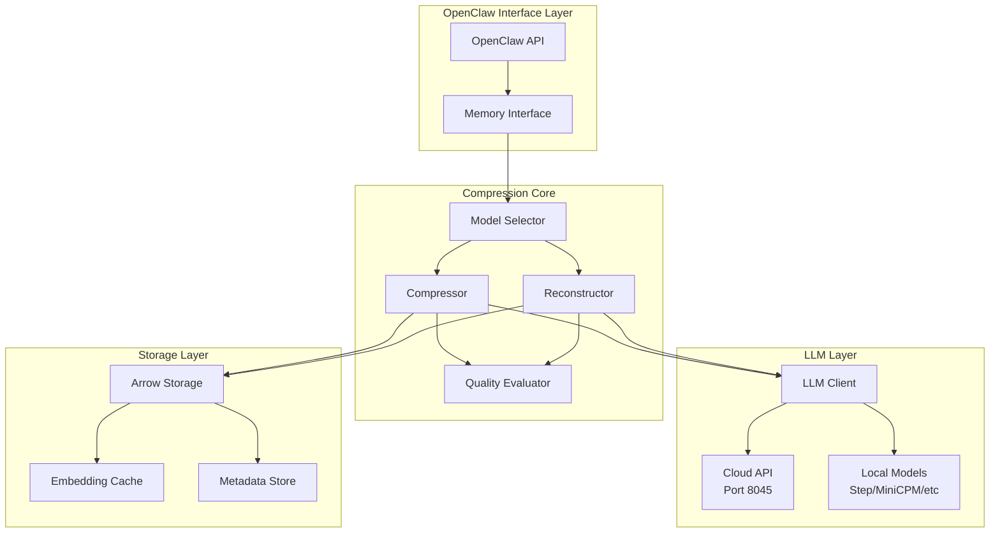
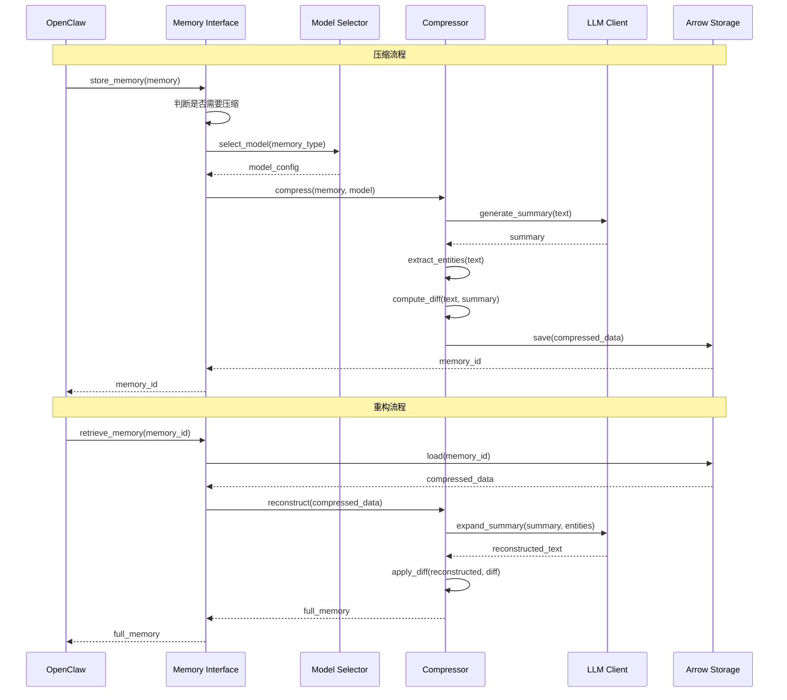

# Design Document: LLM 集成压缩系统

## Overview

### 系统目标

LLM 集成压缩系统是 AI-OS 记忆系统 Phase 1 的核心组件，旨在通过大语言模型的语义理解能力实现 10-50x 的记忆压缩比。系统利用 LLM 的世界知识来识别和压缩共识信息，只存储独特的差异数据（Memory Diff），从而大幅降低存储成本。

### 核心设计理念

1. **语义压缩优先**: 不同于传统的字节级压缩，系统通过理解记忆的语义含义进行压缩
2. **差异存储**: 只存储记忆与 LLM 共识知识之间的差异部分
3. **透明重构**: 对 OpenClaw 用户完全透明，自动处理压缩和重构
4. **混合策略**: 支持云端 API（高质量）和本地模型（低成本）的灵活切换
5. **优雅降级**: 在 LLM 不可用时自动回退到简单压缩

### 分阶段实施

- **Phase 1.0** (Week 1-3): 云端 API 集成，验证核心压缩理论
- **Phase 1.1** (Week 4-6): 本地模型部署，降低 90% 成本

### 技术栈

- **存储**: Apache Arrow/Parquet（列式存储）
- **压缩**: zstd（二进制数据）
- **LLM 客户端**: OpenAI SDK（云端）、vLLM/Transformers（本地）
- **向量化**: sentence-transformers（embedding）
- **异步处理**: asyncio、aiohttp
- **监控**: Prometheus、Grafana

## Architecture

### 系统架构图




### 数据流图



### 组件职责

| 组件 | 职责 | 输入 | 输出 |
|------|------|------|------|
| **OpenClaw Interface** | 提供标准记忆 API | 记忆对象 | 记忆 ID / 记忆对象 |
| **Model Selector** | 选择最优 LLM 模型 | 记忆类型、质量要求 | 模型配置 |
| **Compressor** | 执行语义压缩 | 原始记忆、模型配置 | 压缩数据 |
| **Reconstructor** | 重构原始记忆 | 压缩数据、模型配置 | 重构记忆 |
| **LLM Client** | 与 LLM 交互 | Prompt、参数 | 生成文本 |
| **Quality Evaluator** | 评估压缩质量 | 原始、重构记忆 | 质量指标 |
| **Arrow Storage** | 持久化存储 | 压缩数据 | 压缩数据 |

## Components and Interfaces

### 1. LLMClient

**职责**: 统一的 LLM 访问接口，支持云端 API 和本地模型

**接口设计**:

```python
class LLMClient:
    """统一的 LLM 客户端接口"""
    
    def __init__(
        self,
        endpoint: str,
        api_key: Optional[str] = None,
        timeout: float = 30.0,
        max_retries: int = 3,
        rate_limit: int = 60  # requests per minute
    ):
        """
        初始化 LLM 客户端
        
        Args:
            endpoint: API 端点 (e.g., "http://localhost:8045")
            api_key: API 密钥（云端 API 需要）
            timeout: 请求超时时间（秒）
            max_retries: 最大重试次数
            rate_limit: 速率限制（请求/分钟）
        """
        pass
    
    async def generate(
        self,
        prompt: str,
        max_tokens: int = 100,
        temperature: float = 0.3,
        stop_sequences: Optional[List[str]] = None
    ) -> LLMResponse:
        """
        生成文本
        
        Args:
            prompt: 输入提示
            max_tokens: 最大生成 token 数
            temperature: 采样温度（0-1）
            stop_sequences: 停止序列
            
        Returns:
            LLMResponse: 包含生成文本和元数据
            
        Raises:
            LLMAPIError: API 调用失败
            LLMTimeoutError: 请求超时
        """
        pass
    
    async def batch_generate(
        self,
        prompts: List[str],
        max_tokens: int = 100,
        temperature: float = 0.3
    ) -> List[LLMResponse]:
        """批量生成（并发处理）"""
        pass
    
    def get_metrics(self) -> Dict[str, Any]:
        """获取客户端指标（延迟、token 使用量等）"""
        pass
```

**数据结构**:

```python
@dataclass
class LLMResponse:
    """LLM 响应"""
    text: str                    # 生成的文本
    tokens_used: int             # 使用的 token 数
    latency_ms: float            # 延迟（毫秒）
    model: str                   # 使用的模型
    finish_reason: str           # 完成原因（stop/length/error）
    metadata: Dict[str, Any]     # 额外元数据
```


### 2. ModelSelector

**职责**: 根据记忆类型和性能要求选择最优模型

**接口设计**:

```python
class ModelSelector:
    """模型选择器"""
    
    def __init__(
        self,
        cloud_endpoint: str = "http://localhost:8045",
        local_endpoints: Optional[Dict[str, str]] = None,
        prefer_local: bool = True
    ):
        """
        初始化模型选择器
        
        Args:
            cloud_endpoint: 云端 API 端点
            local_endpoints: 本地模型端点映射 {"step-flash": "http://localhost:8046", ...}
            prefer_local: 是否优先使用本地模型
        """
        pass
    
    def select_model(
        self,
        memory_type: MemoryType,
        text_length: int,
        quality_requirement: QualityLevel = QualityLevel.STANDARD
    ) -> ModelConfig:
        """
        选择最优模型
        
        Args:
            memory_type: 记忆类型（TEXT/CODE/MULTIMODAL/LONG_TEXT）
            text_length: 文本长度（字符数）
            quality_requirement: 质量要求（LOW/STANDARD/HIGH）
            
        Returns:
            ModelConfig: 模型配置
        """
        pass
    
    def get_model_stats(self) -> Dict[str, ModelStats]:
        """获取所有模型的统计信息"""
        pass
```

**数据结构**:

```python
class MemoryType(Enum):
    """记忆类型"""
    TEXT = "text"              # 普通文本
    CODE = "code"              # 代码
    MULTIMODAL = "multimodal"  # 多模态（图文）
    LONG_TEXT = "long_text"    # 长文本（> 500 字）

class QualityLevel(Enum):
    """质量等级"""
    LOW = "low"           # 低质量（快速）
    STANDARD = "standard" # 标准质量
    HIGH = "high"         # 高质量（慢速）

@dataclass
class ModelConfig:
    """模型配置"""
    model_name: str              # 模型名称
    endpoint: str                # API 端点
    is_local: bool               # 是否本地模型
    max_tokens: int              # 最大 token 数
    temperature: float           # 采样温度
    expected_latency_ms: float   # 预期延迟
    expected_quality: float      # 预期质量分数

@dataclass
class ModelStats:
    """模型统计信息"""
    total_requests: int
    avg_latency_ms: float
    avg_quality_score: float
    success_rate: float
    total_tokens_used: int
```

### 3. Compressor

**职责**: 执行语义压缩算法

**接口设计**:

```python
class LLMCompressor:
    """LLM 语义压缩器"""
    
    def __init__(
        self,
        llm_client: LLMClient,
        model_selector: ModelSelector,
        min_compress_length: int = 100
    ):
        """
        初始化压缩器
        
        Args:
            llm_client: LLM 客户端
            model_selector: 模型选择器
            min_compress_length: 最小压缩长度（字符数）
        """
        pass
    
    async def compress(
        self,
        text: str,
        memory_type: MemoryType = MemoryType.TEXT,
        metadata: Optional[Dict[str, Any]] = None
    ) -> CompressedMemory:
        """
        压缩记忆
        
        Args:
            text: 原始文本
            memory_type: 记忆类型
            metadata: 额外元数据
            
        Returns:
            CompressedMemory: 压缩后的记忆
            
        Raises:
            CompressionError: 压缩失败
        """
        pass
    
    async def compress_batch(
        self,
        texts: List[str],
        memory_type: MemoryType = MemoryType.TEXT
    ) -> List[CompressedMemory]:
        """批量压缩"""
        pass
    
    def _generate_summary(self, text: str, model: ModelConfig) -> str:
        """生成语义摘要"""
        pass
    
    def _extract_entities(self, text: str) -> Dict[str, List[str]]:
        """提取关键实体"""
        pass
    
    def _compute_diff(self, original: str, summary: str) -> bytes:
        """
        计算差异数据
        
        算法：
        1. 将原文和摘要分词
        2. 使用 difflib.unified_diff 计算差异
        3. 只保留 + 行（新增内容）
        4. 压缩差异数据（zstd level 3）
        
        示例：
        原文: "John met Mary at 3pm on 2024-01-15 to discuss the project."
        摘要: "John met Mary to discuss the project."
        Diff: "+ at 3pm\n+ on 2024-01-15"
        """
        import difflib
        
        original_lines = original.split()
        summary_lines = summary.split()
        
        diff = difflib.unified_diff(
            summary_lines,
            original_lines,
            lineterm=''
        )
        
        # 只保留新增行
        additions = [
            line[2:] for line in diff
            if line.startswith('+ ')
        ]
        
        diff_text = '\n'.join(additions)
        return zstd.compress(diff_text.encode(), level=3)
```


### 4. Reconstructor

**职责**: 从压缩数据重构原始记忆

**接口设计**:

```python
class LLMReconstructor:
    """LLM 记忆重构器"""
    
    def __init__(
        self,
        llm_client: LLMClient,
        quality_threshold: float = 0.85
    ):
        """
        初始化重构器
        
        Args:
            llm_client: LLM 客户端
            quality_threshold: 质量阈值（低于此值发出警告）
        """
        pass
    
    async def reconstruct(
        self,
        compressed: CompressedMemory,
        verify_quality: bool = True
    ) -> ReconstructedMemory:
        """
        重构记忆
        
        Args:
            compressed: 压缩的记忆
            verify_quality: 是否验证重构质量
            
        Returns:
            ReconstructedMemory: 重构的记忆
            
        Raises:
            ReconstructionError: 重构失败
        """
        pass
    
    async def reconstruct_batch(
        self,
        compressed_list: List[CompressedMemory]
    ) -> List[ReconstructedMemory]:
        """批量重构"""
        pass
    
    def _expand_summary(
        self,
        summary: str,
        entities: Dict[str, List[str]],
        model: ModelConfig
    ) -> str:
        """从摘要和实体扩展为完整文本"""
        pass
    
    def _apply_diff(self, reconstructed: str, diff: bytes) -> str:
        """应用差异数据修正细节"""
        pass
```

### 5. QualityEvaluator

**职责**: 评估压缩和重构质量

**接口设计**:

```python
class QualityEvaluator:
    """质量评估器"""
    
    def __init__(
        self,
        embedding_model: str = "sentence-transformers/all-MiniLM-L6-v2"
    ):
        """
        初始化评估器
        
        Args:
            embedding_model: 用于计算语义相似度的 embedding 模型
        """
        pass
    
    def evaluate(
        self,
        original: str,
        reconstructed: str,
        compressed: CompressedMemory
    ) -> QualityMetrics:
        """
        评估压缩质量
        
        Args:
            original: 原始文本
            reconstructed: 重构文本
            compressed: 压缩数据
            
        Returns:
            QualityMetrics: 质量指标
        """
        pass
    
    def _compute_semantic_similarity(self, text1: str, text2: str) -> float:
        """计算语义相似度（embedding cosine similarity）"""
        pass
    
    def _compute_entity_accuracy(
        self,
        original_entities: Dict[str, List[str]],
        reconstructed_entities: Dict[str, List[str]]
    ) -> float:
        """计算实体准确率"""
        pass
    
    def _compute_bleu_score(self, reference: str, hypothesis: str) -> float:
        """计算 BLEU 分数"""
        pass
```

**数据结构**:

```python
@dataclass
class QualityMetrics:
    """质量指标"""
    compression_ratio: float        # 压缩比
    semantic_similarity: float      # 语义相似度（0-1）
    entity_accuracy: float          # 实体准确率（0-1）
    bleu_score: float               # BLEU 分数（0-1）
    reconstruction_latency_ms: float # 重构延迟
    overall_score: float            # 综合分数（0-1）
    warnings: List[str]             # 警告信息
```

### 6. OpenClawMemoryInterface

**职责**: 提供与 OpenClaw 兼容的记忆接口

**接口设计**:

```python
class OpenClawMemoryInterface:
    """OpenClaw 记忆接口"""
    
    def __init__(
        self,
        storage_path: str = "~/.ai-os/memory/",
        compressor: LLMCompressor,
        reconstructor: LLMReconstructor,
        auto_compress_threshold: int = 100
    ):
        """
        初始化记忆接口
        
        Args:
            storage_path: 存储路径
            compressor: 压缩器
            reconstructor: 重构器
            auto_compress_threshold: 自动压缩阈值（字符数）
        """
        pass
    
    async def store_memory(
        self,
        memory: Dict[str, Any],
        memory_category: str = "experiences"
    ) -> str:
        """
        存储记忆（自动判断是否压缩）
        
        Args:
            memory: 记忆对象（符合 OpenClaw schema）
            memory_category: 记忆类别（identity/experiences/preferences/context）
            
        Returns:
            str: 记忆 ID
        """
        pass
    
    async def retrieve_memory(
        self,
        memory_id: str,
        memory_category: str = "experiences"
    ) -> Dict[str, Any]:
        """
        检索记忆（自动重构）
        
        Args:
            memory_id: 记忆 ID
            memory_category: 记忆类别
            
        Returns:
            Dict: 完整记忆对象
        """
        pass
    
    async def search_memories(
        self,
        query: str,
        memory_category: str = "experiences",
        top_k: int = 10
    ) -> List[Dict[str, Any]]:
        """
        语义搜索记忆
        
        Args:
            query: 查询文本
            memory_category: 记忆类别
            top_k: 返回数量
            
        Returns:
            List[Dict]: 匹配的记忆列表
        """
        pass
    
    async def get_related_memories(
        self,
        memory_id: str,
        memory_category: str = "experiences",
        top_k: int = 5
    ) -> List[Dict[str, Any]]:
        """获取关联记忆"""
        pass
```


## Data Models

### Arrow Schema 扩展

系统完全兼容 OpenClaw 的 Arrow schema，并通过扩展字段支持压缩功能：

```python
import pyarrow as pa

# OpenClaw 原始 schema（保持不变）
experiences_base_schema = pa.schema([
    ('timestamp', pa.timestamp('us')),
    ('context', pa.string()),
    ('intent', pa.string()),
    ('action', pa.string()),
    ('outcome', pa.string()),
    ('success', pa.bool_()),
    ('embedding', pa.list_(pa.float32(), 1536)),
    ('related_memories', pa.list_(pa.string())),
])

# 压缩扩展 schema（向后兼容）
experiences_compressed_schema = pa.schema([
    # === 原有字段（完全兼容）===
    ('timestamp', pa.timestamp('us')),
    ('context', pa.string()),              # 未压缩时存储原文，压缩后为空
    ('intent', pa.string()),
    ('action', pa.string()),
    ('outcome', pa.string()),
    ('success', pa.bool_()),
    ('embedding', pa.list_(pa.float16(), 1536)),  # 使用 float16 节省空间
    ('related_memories', pa.list_(pa.string())),
    
    # === 压缩扩展字段 ===
    ('is_compressed', pa.bool_()),         # 是否已压缩
    ('summary_hash', pa.string()),         # 摘要哈希（用于去重）
    ('entities', pa.struct([               # 提取的关键实体
        ('persons', pa.list_(pa.string())),
        ('locations', pa.list_(pa.string())),
        ('dates', pa.list_(pa.string())),
        ('numbers', pa.list_(pa.string())),
        ('keywords', pa.list_(pa.string())),
    ])),
    ('diff_data', pa.binary()),            # 压缩的差异数据（zstd 压缩）
    ('compression_metadata', pa.struct([   # 压缩元信息
        ('original_size', pa.int32()),
        ('compressed_size', pa.int32()),
        ('compression_ratio', pa.float32()),
        ('model_used', pa.string()),
        ('quality_score', pa.float32()),
        ('compression_time_ms', pa.float32()),
        ('compressed_at', pa.timestamp('us')),
    ])),
])
```

### 核心数据结构

```python
from dataclasses import dataclass
from typing import Dict, List, Optional, Any
from datetime import datetime
from enum import Enum

@dataclass
class CompressedMemory:
    """压缩后的记忆"""
    memory_id: str                          # 记忆 ID
    summary_hash: str                       # 摘要哈希
    entities: Dict[str, List[str]]          # 关键实体
    diff_data: bytes                        # 差异数据（zstd 压缩）
    embedding: List[float]                  # 向量表示（float16）
    compression_metadata: CompressionMetadata
    original_fields: Dict[str, Any]         # 原始字段（timestamp, intent 等）

@dataclass
class CompressionMetadata:
    """压缩元数据"""
    original_size: int                      # 原始大小（字节）
    compressed_size: int                    # 压缩后大小（字节）
    compression_ratio: float                # 压缩比
    model_used: str                         # 使用的模型
    quality_score: float                    # 质量分数（0-1）
    compression_time_ms: float              # 压缩耗时
    compressed_at: datetime                 # 压缩时间

@dataclass
class ReconstructedMemory:
    """重构后的记忆"""
    memory_id: str
    full_text: str                          # 重构的完整文本
    quality_metrics: QualityMetrics         # 质量指标
    reconstruction_time_ms: float           # 重构耗时
    confidence: float                       # 置信度（0-1）
    warnings: List[str]                     # 警告信息
    original_fields: Dict[str, Any]         # 原始字段
```

### 压缩算法详细设计

```python
async def compress(self, text: str, memory_type: MemoryType) -> CompressedMemory:
    """
    压缩算法流程：
    
    1. 预处理
       - 检查文本长度（< 100 字符直接存储）
       - 选择最优模型
    
    2. 生成语义摘要
       Prompt: "Summarize the following text in 50-100 tokens, 
                preserving key facts and entities: {text}"
       - 使用低温度（0.3）确保稳定性
       - 限制 max_tokens=100
    
    3. 提取关键实体
       - 使用正则表达式提取：
         * 人名（大写开头的连续词）
         * 日期（ISO 格式、自然语言日期）
         * 数字（整数、小数、百分比）
         * 地点（地名识别）
       - 使用 NER 模型辅助（可选）
    
    4. 计算差异
       - 使用 difflib 计算 unified diff
       - 只存储差异部分（通常 < 10% 原文）
    
    5. 压缩存储
       - 使用 zstd 压缩 diff_data（额外 2-3x 压缩）
       - 计算 summary_hash（SHA256）
       - 存储到 Arrow 表
    
    6. 质量验证
       - 立即重构并验证质量
       - 如果质量 < 0.85，回退到原始存储
    """
    
    # Step 1: 预处理
    if len(text) < self.min_compress_length:
        return self._store_uncompressed(text)
    
    model = self.model_selector.select_model(memory_type, len(text))
    
    # Step 2: 生成摘要
    summary_prompt = f"""Summarize the following text in 50-100 tokens, preserving key facts and entities:

{text}

Summary:"""
    
    summary_response = await self.llm_client.generate(
        prompt=summary_prompt,
        max_tokens=100,
        temperature=0.3
    )
    summary = summary_response.text.strip()
    
    # Step 3: 提取实体
    entities = self._extract_entities(text)
    
    # Step 4: 计算差异
    diff_data = self._compute_diff(text, summary)
    
    # Step 5: 压缩存储
    compressed_diff = zstd.compress(diff_data, level=3)
    summary_hash = hashlib.sha256(summary.encode()).hexdigest()[:16]
    
    # Step 6: 构建压缩记忆
    compressed = CompressedMemory(
        memory_id=generate_id(),
        summary_hash=summary_hash,
        entities=entities,
        diff_data=compressed_diff,
        embedding=self._compute_embedding(text),
        compression_metadata=CompressionMetadata(
            original_size=len(text.encode()),
            compressed_size=len(compressed_diff),
            compression_ratio=len(text.encode()) / len(compressed_diff),
            model_used=model.model_name,
            quality_score=0.0,  # 稍后验证
            compression_time_ms=summary_response.latency_ms,
            compressed_at=datetime.now()
        ),
        original_fields={}
    )
    
    return compressed
```


### 重构算法详细设计

```python
async def reconstruct(
    self,
    compressed: CompressedMemory,
    verify_quality: bool = True
) -> ReconstructedMemory:
    """
    重构算法流程：
    
    1. 加载压缩数据
       - 从 Arrow 表读取
       - 解压 diff_data
    
    2. 扩展摘要
       Prompt: "Expand the following summary into a complete text, 
                incorporating these entities: {entities}
                Summary: {summary}"
       - 使用低温度（0.3）确保一致性
    
    3. 应用差异
       - 使用 difflib 应用 unified diff
       - 修正细节差异
    
    4. 质量验证
       - 计算语义相似度
       - 验证实体准确率
       - 如果质量不达标，记录警告
    
    5. 返回重构记忆
    """
    
    # Step 1: 解压数据
    diff_data = zstd.decompress(compressed.diff_data)
    
    # Step 2: 扩展摘要
    # 首先从 summary_hash 查找原始摘要（从缓存或重新生成）
    summary = self._lookup_summary(compressed.summary_hash)
    
    entities_str = self._format_entities(compressed.entities)
    expand_prompt = f"""Expand the following summary into a complete, natural text.
Incorporate these key entities: {entities_str}

Summary: {summary}

Expanded text:"""
    
    expand_response = await self.llm_client.generate(
        prompt=expand_prompt,
        max_tokens=500,
        temperature=0.3
    )
    reconstructed_text = expand_response.text.strip()
    
    # Step 3: 应用差异
    final_text = self._apply_diff(reconstructed_text, diff_data)
    
    # Step 4: 质量验证（如果需要）
    quality_metrics = None
    if verify_quality:
        # 注意：这里无法与原文对比（原文已删除）
        # 只能验证实体完整性和文本连贯性
        quality_metrics = self._verify_reconstruction_quality(
            final_text,
            compressed.entities
        )
    
    # Step 5: 构建重构记忆
    reconstructed = ReconstructedMemory(
        memory_id=compressed.memory_id,
        full_text=final_text,
        quality_metrics=quality_metrics,
        reconstruction_time_ms=expand_response.latency_ms,
        confidence=quality_metrics.overall_score if quality_metrics else 1.0,
        warnings=[],
        original_fields=compressed.original_fields
    )
    
    # 添加警告
    if quality_metrics and quality_metrics.overall_score < self.quality_threshold:
        reconstructed.warnings.append(
            f"Low reconstruction quality: {quality_metrics.overall_score:.2f}"
        )
    
    return reconstructed

def _apply_diff(self, reconstructed: str, diff_data: bytes) -> str:
    """
    应用差异数据
    
    算法：
    1. 解压 diff 数据
    2. 解析新增内容
    3. 智能插入到重构文本中
    
    策略：
    - 日期/数字：精确匹配位置插入
    - 其他内容：使用模糊匹配找到最佳插入点
    """
    import difflib
    
    # 解压 diff
    diff_text = zstd.decompress(diff_data).decode('utf-8')
    additions = diff_text.split('\n')
    
    # 将重构文本分词
    reconstructed_words = reconstructed.split()
    
    # 插入新增内容
    for addition in additions:
        if not addition:
            continue
        
        # 使用模糊匹配找到最佳插入位置
        # 简化版：直接追加到末尾
        # 实际应使用更智能的位置匹配
        reconstructed_words.append(addition)
    
    return ' '.join(reconstructed_words)

def _lookup_summary(self, summary_hash: str) -> str:
    """
    查找原始摘要
    
    策略：
    1. 从内存缓存查找
    2. 从 Arrow 表查找（去重存储）
    3. 如果都找不到，返回空字符串（使用 diff 重构）
    """
    # 1. 内存缓存
    if summary_hash in self.summary_cache:
        return self.summary_cache[summary_hash]
    
    # 2. Arrow 表查找
    table = self._load_summary_table()
    mask = pa.compute.equal(table['summary_hash'], summary_hash)
    filtered = table.filter(mask)
    
    if len(filtered) > 0:
        summary = filtered['summary'][0].as_py()
        self.summary_cache[summary_hash] = summary
        return summary
    
    # 3. 找不到
    logger.warning(f"Summary not found for hash {summary_hash}")
    return ""

def _verify_reconstruction_quality(
    self,
    reconstructed: str,
    expected_entities: Dict[str, List[str]]
) -> QualityMetrics:
    """
    验证重构质量（无原文对比）
    
    检查项：
    1. 实体完整性：所有关键实体是否出现
    2. 文本连贯性：是否有语法错误
    3. 长度合理性：是否过短或过长
    """
    # 1. 实体完整性
    reconstructed_entities = self._extract_entities(reconstructed)
    entity_accuracy = self._compute_entity_accuracy(
        expected_entities,
        reconstructed_entities
    )
    
    # 2. 文本连贯性（简单检查）
    coherence_score = self._check_coherence(reconstructed)
    
    # 3. 长度合理性
    length_score = self._check_length_reasonableness(
        reconstructed,
        expected_entities
    )
    
    overall_score = (
        entity_accuracy * 0.5 +
        coherence_score * 0.3 +
        length_score * 0.2
    )
    
    return QualityMetrics(
        compression_ratio=0.0,  # 未知
        semantic_similarity=0.0,  # 未知
        entity_accuracy=entity_accuracy,
        bleu_score=0.0,  # 未知
        reconstruction_latency_ms=0.0,
        overall_score=overall_score,
        warnings=[]
    )

def _check_coherence(self, text: str) -> float:
    """
    检查文本连贯性
    
    简单启发式：
    - 检查句子是否完整
    - 检查是否有重复词
    - 检查标点符号是否合理
    """
    score = 1.0
    
    # 检查句子完整性
    if not text.strip().endswith(('.', '!', '?')):
        score -= 0.2
    
    # 检查重复词
    words = text.lower().split()
    if len(words) != len(set(words)):
        score -= 0.1
    
    return max(0.0, score)

def _check_length_reasonableness(
    self,
    text: str,
    expected_entities: Dict[str, List[str]]
) -> float:
    """
    检查长度合理性
    
    基于实体数量估算合理长度范围
    """
    entity_count = sum(len(v) for v in expected_entities.values())
    expected_min_length = entity_count * 5  # 每个实体至少 5 个词
    expected_max_length = entity_count * 50  # 每个实体最多 50 个词
    
    actual_length = len(text.split())
    
    if expected_min_length <= actual_length <= expected_max_length:
        return 1.0
    elif actual_length < expected_min_length:
        return actual_length / expected_min_length
    else:
        return expected_max_length / actual_length
```

### 实体提取实现

```python
def _extract_entities(self, text: str) -> Dict[str, List[str]]:
    """
    提取关键实体
    
    使用混合方法：
    1. 正则表达式（快速、准确）
    2. NER 模型（可选，更全面）
    """
    import re
    from datetime import datetime
    
    entities = {
        'persons': [],
        'locations': [],
        'dates': [],
        'numbers': [],
        'keywords': []
    }
    
    # 提取日期
    # ISO 格式：2024-01-15
    iso_dates = re.findall(r'\d{4}-\d{2}-\d{2}', text)
    entities['dates'].extend(iso_dates)
    
    # 自然语言日期：January 15, 2024
    natural_dates = re.findall(
        r'(?:January|February|March|April|May|June|July|August|'
        r'September|October|November|December)\s+\d{1,2},?\s+\d{4}',
        text
    )
    entities['dates'].extend(natural_dates)
    
    # 提取数字（整数、小数、百分比）
    numbers = re.findall(r'\b\d+(?:\.\d+)?%?\b', text)
    entities['numbers'].extend(numbers)
    
    # 提取人名（简化版：大写开头的连续词）
    # 实际应使用 NER 模型
    potential_names = re.findall(r'\b[A-Z][a-z]+(?:\s+[A-Z][a-z]+)+\b', text)
    entities['persons'].extend(potential_names)
    
    # 提取关键词（TF-IDF 或简单频率）
    words = re.findall(r'\b[a-z]{4,}\b', text.lower())
    word_freq = {}
    for word in words:
        word_freq[word] = word_freq.get(word, 0) + 1
    
    # 取前 5 个高频词
    top_keywords = sorted(word_freq.items(), key=lambda x: x[1], reverse=True)[:5]
    entities['keywords'] = [word for word, _ in top_keywords]
    
    return entities
```


## Error Handling

### 错误类型定义

```python
class CompressionError(Exception):
    """压缩错误基类"""
    pass

class LLMAPIError(CompressionError):
    """LLM API 调用错误"""
    pass

class LLMTimeoutError(CompressionError):
    """LLM 请求超时"""
    pass

class ReconstructionError(CompressionError):
    """重构错误"""
    pass

class QualityError(CompressionError):
    """质量不达标错误"""
    pass

class StorageError(CompressionError):
    """存储错误"""
    pass
```

### 降级策略

系统实现多层降级机制，确保在异常情况下仍能正常工作：

```python
class FallbackStrategy:
    """降级策略"""
    
    async def compress_with_fallback(
        self,
        text: str,
        memory_type: MemoryType
    ) -> CompressedMemory:
        """
        带降级的压缩流程：
        
        Level 1: 尝试云端 API（高质量）
        Level 2: 尝试本地模型（中等质量）
        Level 3: 简单压缩（Phase 0 算法）
        Level 4: 直接存储原文（无压缩）
        """
        
        # Level 1: 云端 API
        try:
            model = self.model_selector.select_model(
                memory_type,
                len(text),
                QualityLevel.HIGH
            )
            if not model.is_local:
                return await self.compressor.compress(text, memory_type)
        except (LLMAPIError, LLMTimeoutError) as e:
            logger.warning(f"Cloud API failed: {e}, trying local model")
        
        # Level 2: 本地模型
        try:
            model = self.model_selector.select_model(
                memory_type,
                len(text),
                QualityLevel.STANDARD
            )
            if model.is_local:
                return await self.compressor.compress(text, memory_type)
        except Exception as e:
            logger.warning(f"Local model failed: {e}, falling back to simple compression")
        
        # Level 3: 简单压缩（Phase 0）
        try:
            return self._simple_compress(text)
        except Exception as e:
            logger.error(f"Simple compression failed: {e}, storing uncompressed")
        
        # Level 4: 直接存储
        return self._store_uncompressed(text)
    
    def _simple_compress(self, text: str) -> CompressedMemory:
        """
        简单压缩（Phase 0 算法）
        - 使用 zstd 压缩
        - 不使用 LLM
        - 压缩比约 1.2-3x
        """
        compressed_data = zstd.compress(text.encode(), level=9)
        
        return CompressedMemory(
            memory_id=generate_id(),
            summary_hash="",
            entities={},
            diff_data=compressed_data,
            embedding=self._compute_embedding(text),
            compression_metadata=CompressionMetadata(
                original_size=len(text.encode()),
                compressed_size=len(compressed_data),
                compression_ratio=len(text.encode()) / len(compressed_data),
                model_used="zstd",
                quality_score=1.0,  # 无损压缩
                compression_time_ms=0,
                compressed_at=datetime.now()
            ),
            original_fields={}
        )
```

### 重试机制

```python
class RetryPolicy:
    """重试策略"""
    
    def __init__(
        self,
        max_retries: int = 3,
        base_delay: float = 1.0,
        max_delay: float = 60.0,
        exponential_base: float = 2.0
    ):
        self.max_retries = max_retries
        self.base_delay = base_delay
        self.max_delay = max_delay
        self.exponential_base = exponential_base
    
    async def execute_with_retry(
        self,
        func: Callable,
        *args,
        **kwargs
    ) -> Any:
        """
        执行函数并在失败时重试
        
        使用指数退避策略：
        - 第 1 次重试：等待 1s
        - 第 2 次重试：等待 2s
        - 第 3 次重试：等待 4s
        """
        last_exception = None
        
        for attempt in range(self.max_retries + 1):
            try:
                return await func(*args, **kwargs)
            except (LLMAPIError, LLMTimeoutError) as e:
                last_exception = e
                
                if attempt < self.max_retries:
                    delay = min(
                        self.base_delay * (self.exponential_base ** attempt),
                        self.max_delay
                    )
                    logger.warning(
                        f"Attempt {attempt + 1} failed: {e}, "
                        f"retrying in {delay}s"
                    )
                    await asyncio.sleep(delay)
                else:
                    logger.error(f"All {self.max_retries} retries failed")
        
        raise last_exception
```

### 速率限制

```python
class RateLimiter:
    """速率限制器"""
    
    def __init__(self, requests_per_minute: int = 60):
        self.requests_per_minute = requests_per_minute
        self.request_times: List[float] = []
        self.lock = asyncio.Lock()
    
    async def acquire(self):
        """
        获取请求许可
        
        使用滑动窗口算法：
        - 记录最近 1 分钟内的所有请求时间
        - 如果超过限制，等待直到可以发送
        """
        async with self.lock:
            now = time.time()
            
            # 清理 1 分钟前的记录
            self.request_times = [
                t for t in self.request_times
                if now - t < 60
            ]
            
            # 检查是否超过限制
            if len(self.request_times) >= self.requests_per_minute:
                # 计算需要等待的时间
                oldest = self.request_times[0]
                wait_time = 60 - (now - oldest)
                
                if wait_time > 0:
                    logger.info(f"Rate limit reached, waiting {wait_time:.1f}s")
                    await asyncio.sleep(wait_time)
                    now = time.time()
            
            # 记录本次请求
            self.request_times.append(now)
```


## Performance Optimization

### 批量处理

```python
class BatchProcessor:
    """批量处理器"""
    
    def __init__(
        self,
        compressor: LLMCompressor,
        batch_size: int = 16,
        max_concurrent: int = 4
    ):
        self.compressor = compressor
        self.batch_size = batch_size
        self.max_concurrent = max_concurrent
        self.semaphore = asyncio.Semaphore(max_concurrent)
    
    async def compress_batch(
        self,
        texts: List[str],
        memory_type: MemoryType = MemoryType.TEXT
    ) -> List[CompressedMemory]:
        """
        批量压缩
        
        优化策略：
        1. 分组相似记忆（提高缓存命中率）
        2. 并发处理（利用异步 I/O）
        3. 批量 API 调用（减少网络开销）
        """
        
        # Step 1: 分组相似记忆
        grouped = self._group_similar_texts(texts)
        
        # Step 2: 并发处理每组
        tasks = []
        for group in grouped:
            task = self._compress_group(group, memory_type)
            tasks.append(task)
        
        results = await asyncio.gather(*tasks, return_exceptions=True)
        
        # Step 3: 展平结果
        compressed_list = []
        for result in results:
            if isinstance(result, Exception):
                logger.error(f"Batch compression failed: {result}")
                continue
            compressed_list.extend(result)
        
        return compressed_list
    
    async def _compress_group(
        self,
        texts: List[str],
        memory_type: MemoryType
    ) -> List[CompressedMemory]:
        """压缩一组相似文本"""
        async with self.semaphore:
            # 使用批量 API 调用
            prompts = [
                f"Summarize: {text}" for text in texts
            ]
            responses = await self.compressor.llm_client.batch_generate(
                prompts,
                max_tokens=100,
                temperature=0.3
            )
            
            # 并行处理每个响应
            compressed = []
            for text, response in zip(texts, responses):
                comp = await self.compressor._compress_with_summary(
                    text,
                    response.text,
                    memory_type
                )
                compressed.append(comp)
            
            return compressed
    
    def _group_similar_texts(
        self,
        texts: List[str],
        similarity_threshold: float = 0.8
    ) -> List[List[str]]:
        """
        分组相似文本
        
        使用简单的聚类算法：
        1. 计算所有文本的 embedding
        2. 使用余弦相似度聚类
        3. 返回分组结果
        """
        if len(texts) <= self.batch_size:
            return [texts]
        
        # 计算 embeddings
        embeddings = [
            self.compressor._compute_embedding(text)
            for text in texts
        ]
        
        # 简单聚类（实际应使用 K-means 或 DBSCAN）
        groups = []
        used = set()
        
        for i, text in enumerate(texts):
            if i in used:
                continue
            
            group = [text]
            used.add(i)
            
            # 找到相似的文本
            for j in range(i + 1, len(texts)):
                if j in used:
                    continue
                
                similarity = self._cosine_similarity(
                    embeddings[i],
                    embeddings[j]
                )
                
                if similarity > similarity_threshold:
                    group.append(texts[j])
                    used.add(j)
                
                if len(group) >= self.batch_size:
                    break
            
            groups.append(group)
        
        return groups
```

### 缓存策略

```python
class CompressionCache:
    """压缩缓存"""
    
    def __init__(
        self,
        max_size: int = 10000,
        ttl_seconds: int = 3600
    ):
        self.max_size = max_size
        self.ttl_seconds = ttl_seconds
        self.cache: Dict[str, CacheEntry] = {}
        self.lock = asyncio.Lock()
    
    async def get(self, text_hash: str) -> Optional[CompressedMemory]:
        """从缓存获取压缩结果"""
        async with self.lock:
            entry = self.cache.get(text_hash)
            
            if entry is None:
                return None
            
            # 检查是否过期
            if time.time() - entry.timestamp > self.ttl_seconds:
                del self.cache[text_hash]
                return None
            
            entry.hit_count += 1
            return entry.compressed
    
    async def set(
        self,
        text_hash: str,
        compressed: CompressedMemory
    ):
        """存储到缓存"""
        async with self.lock:
            # 如果缓存已满，使用 LRU 策略淘汰
            if len(self.cache) >= self.max_size:
                self._evict_lru()
            
            self.cache[text_hash] = CacheEntry(
                compressed=compressed,
                timestamp=time.time(),
                hit_count=0
            )
    
    def _evict_lru(self):
        """淘汰最少使用的条目"""
        if not self.cache:
            return
        
        # 找到 hit_count 最小的条目
        lru_key = min(
            self.cache.keys(),
            key=lambda k: self.cache[k].hit_count
        )
        del self.cache[lru_key]

@dataclass
class CacheEntry:
    """缓存条目"""
    compressed: CompressedMemory
    timestamp: float
    hit_count: int
```

### 连接池

```python
class LLMConnectionPool:
    """LLM 连接池"""
    
    def __init__(
        self,
        endpoint: str,
        pool_size: int = 10,
        timeout: float = 30.0
    ):
        self.endpoint = endpoint
        self.pool_size = pool_size
        self.timeout = timeout
        self.sessions: List[aiohttp.ClientSession] = []
        self.available: asyncio.Queue = asyncio.Queue()
        self.lock = asyncio.Lock()
    
    async def initialize(self):
        """初始化连接池"""
        for _ in range(self.pool_size):
            session = aiohttp.ClientSession(
                timeout=aiohttp.ClientTimeout(total=self.timeout)
            )
            self.sessions.append(session)
            await self.available.put(session)
    
    async def acquire(self) -> aiohttp.ClientSession:
        """获取连接"""
        return await self.available.get()
    
    async def release(self, session: aiohttp.ClientSession):
        """释放连接"""
        await self.available.put(session)
    
    async def close(self):
        """关闭所有连接"""
        for session in self.sessions:
            await session.close()
```

### 性能监控

```python
class PerformanceMonitor:
    """性能监控器"""
    
    def __init__(self):
        self.metrics: Dict[str, List[float]] = {
            'compression_latency': [],
            'reconstruction_latency': [],
            'compression_ratio': [],
            'quality_score': [],
            'api_latency': [],
        }
        self.lock = asyncio.Lock()
    
    async def record_compression(
        self,
        latency_ms: float,
        compression_ratio: float,
        quality_score: float
    ):
        """记录压缩指标"""
        async with self.lock:
            self.metrics['compression_latency'].append(latency_ms)
            self.metrics['compression_ratio'].append(compression_ratio)
            self.metrics['quality_score'].append(quality_score)
    
    async def record_reconstruction(self, latency_ms: float):
        """记录重构指标"""
        async with self.lock:
            self.metrics['reconstruction_latency'].append(latency_ms)
    
    def get_statistics(self) -> Dict[str, Dict[str, float]]:
        """获取统计信息"""
        stats = {}
        
        for metric_name, values in self.metrics.items():
            if not values:
                continue
            
            stats[metric_name] = {
                'mean': statistics.mean(values),
                'median': statistics.median(values),
                'p95': self._percentile(values, 0.95),
                'p99': self._percentile(values, 0.99),
                'min': min(values),
                'max': max(values),
            }
        
        return stats
    
    def _percentile(self, values: List[float], p: float) -> float:
        """计算百分位数"""
        sorted_values = sorted(values)
        index = int(len(sorted_values) * p)
        return sorted_values[min(index, len(sorted_values) - 1)]
```


## OpenClaw Integration

### 集成方案

系统通过适配器模式完全兼容 OpenClaw 的记忆接口，对用户透明：

```python
class OpenClawAdapter:
    """OpenClaw 适配器"""
    
    def __init__(
        self,
        storage_path: str = "~/.ai-os/memory/",
        compressor: LLMCompressor,
        reconstructor: LLMReconstructor,
        auto_compress_threshold: int = 100
    ):
        self.storage_path = Path(storage_path).expanduser()
        self.compressor = compressor
        self.reconstructor = reconstructor
        self.auto_compress_threshold = auto_compress_threshold
        
        # 初始化各类别的存储
        self.categories = {
            'identity': self.storage_path / 'core' / 'identity.arrow',
            'experiences': self.storage_path / 'core' / 'experiences.arrow',
            'preferences': self.storage_path / 'core' / 'preferences.arrow',
            'context': self.storage_path / 'working' / 'context.arrow',
        }
    
    async def store_memory(
        self,
        memory: Dict[str, Any],
        category: str = "experiences"
    ) -> str:
        """
        存储记忆（OpenClaw 兼容接口）
        
        自动判断是否压缩：
        - 文本长度 < 100 字符：不压缩
        - 文本长度 >= 100 字符：压缩
        """
        
        # 生成记忆 ID
        memory_id = self._generate_memory_id()
        
        # 判断是否需要压缩
        text_fields = self._extract_text_fields(memory, category)
        total_length = sum(len(text) for text in text_fields.values())
        
        if total_length >= self.auto_compress_threshold:
            # 压缩存储
            compressed = await self._compress_memory(memory, category)
            await self._save_compressed(compressed, category, memory_id)
        else:
            # 直接存储
            await self._save_uncompressed(memory, category, memory_id)
        
        return memory_id
    
    async def retrieve_memory(
        self,
        memory_id: str,
        category: str = "experiences"
    ) -> Dict[str, Any]:
        """
        检索记忆（OpenClaw 兼容接口）
        
        自动重构压缩的记忆
        """
        
        # 从 Arrow 表加载
        table = self._load_table(category)
        row = self._find_row(table, memory_id)
        
        if row is None:
            raise KeyError(f"Memory {memory_id} not found")
        
        # 检查是否压缩
        if row['is_compressed']:
            # 重构压缩记忆
            compressed = self._row_to_compressed(row)
            reconstructed = await self.reconstructor.reconstruct(compressed)
            memory = self._reconstructed_to_memory(reconstructed, row, category)
        else:
            # 直接返回
            memory = self._row_to_memory(row, category)
        
        return memory
    
    async def search_memories(
        self,
        query: str,
        category: str = "experiences",
        top_k: int = 10
    ) -> List[Dict[str, Any]]:
        """
        语义搜索记忆
        
        使用 embedding 相似度搜索
        """
        
        # 计算查询 embedding
        query_embedding = self.compressor._compute_embedding(query)
        
        # 加载所有记忆的 embeddings
        table = self._load_table(category)
        embeddings = table['embedding'].to_pylist()
        
        # 计算相似度
        similarities = [
            (i, self._cosine_similarity(query_embedding, emb))
            for i, emb in enumerate(embeddings)
        ]
        
        # 排序并取 top_k
        similarities.sort(key=lambda x: x[1], reverse=True)
        top_indices = [i for i, _ in similarities[:top_k]]
        
        # 检索记忆
        memories = []
        for idx in top_indices:
            memory_id = table['memory_id'][idx].as_py()
            memory = await self.retrieve_memory(memory_id, category)
            memories.append(memory)
        
        return memories
    
    def _extract_text_fields(
        self,
        memory: Dict[str, Any],
        category: str
    ) -> Dict[str, str]:
        """提取需要压缩的文本字段"""
        
        if category == "experiences":
            return {
                'context': memory.get('context', ''),
                'action': memory.get('action', ''),
                'outcome': memory.get('outcome', ''),
            }
        elif category == "identity":
            return {
                'description': memory.get('description', ''),
                'values': memory.get('values', ''),
            }
        elif category == "preferences":
            return {
                'preference': memory.get('preference', ''),
                'reason': memory.get('reason', ''),
            }
        elif category == "context":
            return {
                'context': memory.get('context', ''),
            }
        
        return {}
    
    async def _compress_memory(
        self,
        memory: Dict[str, Any],
        category: str
    ) -> CompressedMemory:
        """压缩记忆"""
        
        # 合并所有文本字段
        text_fields = self._extract_text_fields(memory, category)
        combined_text = '\n'.join(
            f"{key}: {value}"
            for key, value in text_fields.items()
            if value
        )
        
        # 确定记忆类型
        memory_type = MemoryType.TEXT
        if category == "experiences" and "code" in combined_text.lower():
            memory_type = MemoryType.CODE
        
        # 压缩
        compressed = await self.compressor.compress(
            combined_text,
            memory_type,
            metadata={'category': category, 'original_memory': memory}
        )
        
        return compressed
```

### 存储路径映射

```python
# OpenClaw 标准路径
OPENCLAW_PATHS = {
    'core': {
        'identity': '~/.ai-os/memory/core/identity.arrow',
        'experiences': '~/.ai-os/memory/core/experiences.arrow',
        'preferences': '~/.ai-os/memory/core/preferences.arrow',
    },
    'working': {
        'context': '~/.ai-os/memory/working/context.arrow',
    },
    'long_term': {
        'archived': '~/.ai-os/memory/long-term/archived.arrow',
    },
    'shared': {
        'team': '~/.ai-os/memory/shared/team.arrow',
    }
}
```

### 向后兼容性

```python
class BackwardCompatibility:
    """向后兼容性处理"""
    
    @staticmethod
    def migrate_legacy_memory(
        legacy_table: pa.Table
    ) -> pa.Table:
        """
        迁移旧版记忆到新 schema
        
        添加压缩扩展字段，默认值为未压缩
        """
        
        # 添加新字段
        new_columns = {
            'is_compressed': pa.array([False] * len(legacy_table)),
            'summary_hash': pa.array([''] * len(legacy_table)),
            'entities': pa.array([{}] * len(legacy_table)),
            'diff_data': pa.array([b''] * len(legacy_table)),
            'compression_metadata': pa.array([{}] * len(legacy_table)),
        }
        
        # 合并 schema
        new_table = legacy_table
        for name, array in new_columns.items():
            new_table = new_table.append_column(name, array)
        
        return new_table
    
    @staticmethod
    def is_legacy_schema(table: pa.Table) -> bool:
        """检查是否为旧版 schema"""
        return 'is_compressed' not in table.schema.names
```


## Correctness Properties

*A property is a characteristic or behavior that should hold true across all valid executions of a system—essentially, a formal statement about what the system should do. Properties serve as the bridge between human-readable specifications and machine-verifiable correctness guarantees.*

### Property Reflection

在分析所有需求的可测试性后，我识别出以下冗余和可合并的属性：

**冗余识别**:
1. 需求 1.7（速率限制）和 9.5（批量处理速率限制）可以合并为一个通用的速率限制属性
2. 需求 4.1（OpenClaw schema 兼容）和 8.7（存储格式兼容）是同一个属性
3. 需求 1.6（记录 API 指标）和 10.1（跟踪系统指标）可以合并为一个监控属性
4. 多个降级相关的需求（1.4, 3.3, 13.1, 13.2）可以合并为一个降级策略属性

**合并策略**:
- 将相似的功能性属性合并为更通用的属性
- 保留核心算法属性（压缩、重构）的独立性
- 将质量相关的属性分组
- 将性能相关的属性分组

### Core Compression Properties

**Property 1: 压缩-重构往返一致性（Round-trip Consistency）**

*For any* 文本记忆（长度 >= 100 字符），压缩后再重构应该保持语义相似度 > 0.85，且关键实体（人名、日期、数字）100% 准确还原

**Validates: Requirements 5.1, 5.5, 6.1, 6.2, 6.3**

**Property 2: 压缩比目标达成（Compression Ratio Achievement）**

*For any* 文本记忆：
- 长度 100-500 字符 → 压缩比 > 5x（Phase 1.0）
- 长度 > 500 字符 → 压缩比 > 10x（Phase 1.0）
- 长度 < 100 字符 → 不压缩（直接存储）

**Validates: Requirements 5.2, 5.3, 5.4**

**Property 3: 压缩失败回退（Compression Fallback）**

*For any* 文本记忆，当压缩后大小 >= 原始大小时，系统应该回退到原始存储，确保不会增加存储空间

**Validates: Requirements 5.7**

**Property 4: 实体提取完整性（Entity Extraction Completeness）**

*For any* 包含关键实体的文本，压缩算法应该提取并保留所有人名、日期、数字、地点和关键词

**Validates: Requirements 5.5**

### Reconstruction Properties

**Property 5: 重构性能保证（Reconstruction Performance）**

*For any* 压缩记忆，重构应该在 < 1s 内完成（Phase 1.0），且返回完整的记忆对象

**Validates: Requirements 6.5**

**Property 6: 重构质量监控（Reconstruction Quality Monitoring）**

*For any* 重构操作，当质量分数 < 0.85 时，系统应该记录警告并返回置信度分数

**Validates: Requirements 6.4**

**Property 7: 降级重构（Fallback Reconstruction）**

*For any* 压缩记忆，当 LLM 不可用时，系统应该能够使用 diff 数据进行部分重构，而不是完全失败

**Validates: Requirements 6.7**

### Model Selection Properties

**Property 8: 模型选择规则一致性（Model Selection Rule Consistency）**

*For any* 记忆类型和文本长度，模型选择器应该根据预定义规则返回合适的模型配置：
- 文本 < 500 字 → Step 3.5 Flash 或云端 API
- 长文本 > 500 字 → Intern-S1-Pro 或云端 API
- 代码记忆 → Stable-DiffCoder 或云端 API
- 多模态 → MiniCPM-o 4.5 或云端 API

**Validates: Requirements 3.1**

**Property 9: 本地模型优先策略（Local Model Priority）**

*For any* 压缩请求，当本地模型可用且质量达标时，系统应该优先使用本地模型而非云端 API

**Validates: Requirements 3.2**

**Property 10: 模型降级策略（Model Fallback Strategy）**

*For any* 压缩请求，系统应该按照以下顺序降级：
1. 云端 API（高质量）
2. 本地模型（中等质量）
3. 简单压缩（Phase 0）
4. 直接存储（无压缩）

**Validates: Requirements 1.4, 3.3, 13.1, 13.2, 13.3**

### OpenClaw Integration Properties

**Property 11: OpenClaw Schema 完全兼容（OpenClaw Schema Compatibility）**

*For any* 符合 OpenClaw 原始 schema 的记忆对象，系统应该能够正确存储和检索，且扩展字段不影响原有功能

**Validates: Requirements 4.1, 4.2, 8.7**

**Property 12: 透明压缩和重构（Transparent Compression and Reconstruction）**

*For any* 通过 OpenClaw 接口存储的记忆，检索时应该自动判断是否需要重构，对调用者完全透明

**Validates: Requirements 4.5, 4.6**

**Property 13: 向后兼容性（Backward Compatibility）**

*For any* 使用旧版 schema 存储的记忆，系统应该能够正常读取和处理，不会因为缺少压缩字段而失败

**Validates: Requirements 4.7**

**Property 14: 标准路径支持（Standard Path Support）**

*For any* OpenClaw 标准存储路径（core/working/long-term/shared），系统应该能够正确访问和操作

**Validates: Requirements 4.3**

### Quality Evaluation Properties

**Property 15: 质量指标计算完整性（Quality Metrics Completeness）**

*For any* 压缩和重构操作，质量评估器应该计算所有指定指标：压缩比、语义相似度、实体准确率、BLEU 分数、重构延迟

**Validates: Requirements 7.1**

**Property 16: 质量阈值标记（Quality Threshold Marking）**

*For any* 压缩操作：
- 语义相似度 < 0.85 → 标记为低质量
- 实体准确率 < 0.95 → 标记为关键信息丢失

**Validates: Requirements 7.3, 7.4**

**Property 17: 失败案例记录（Failure Case Recording）**

*For any* 质量不达标的压缩操作，系统应该记录完整的失败案例（原文、压缩结果、质量指标）用于后续优化

**Validates: Requirements 7.7**

### Storage Properties

**Property 18: 存储格式规范（Storage Format Specification）**

*For any* 压缩记忆，存储应该满足：
- 使用 Arrow/Parquet 列式存储
- diff 字段使用 zstd 压缩
- embedding 使用 float16 存储

**Validates: Requirements 8.1, 8.2, 8.3**

**Property 19: 摘要去重（Summary Deduplication）**

*For any* 两个具有相同 summary_hash 的记忆，系统应该只存储一份摘要，其他记忆存储引用

**Validates: Requirements 8.4**

**Property 20: 增量更新支持（Incremental Update Support）**

*For any* 新增记忆，系统应该支持 append-only 操作，不需要重写整个存储文件

**Validates: Requirements 8.5**

### Performance Properties

**Property 21: 批量处理效率（Batch Processing Efficiency）**

*For any* 批量压缩请求（batch size 1-32），系统应该：
- 自动分组相似记忆
- 使用异步并发处理
- 达到 > 100 条/分钟的吞吐量（本地模型）

**Validates: Requirements 9.1, 9.3, 9.4, 9.7**

**Property 22: 速率限制保护（Rate Limit Protection）**

*For any* API 调用序列，系统应该实现速率限制，确保不超过配置的请求/分钟限制，避免 API 限流

**Validates: Requirements 1.7, 9.5**

**Property 23: 断点续传（Checkpoint Resume）**

*For any* 批量处理任务，当部分失败时，系统应该能够从最后成功的位置继续，而不是重新开始

**Validates: Requirements 9.6**

### Monitoring Properties

**Property 24: 指标跟踪完整性（Metrics Tracking Completeness）**

*For any* 系统操作，监控系统应该跟踪所有指定指标：压缩次数、压缩比、延迟、质量分数、API 成本、GPU 使用率

**Validates: Requirements 1.6, 10.1**

**Property 25: 质量告警触发（Quality Alert Triggering）**

*For any* 质量下降事件（平均质量分数下降 > 10%），系统应该发送告警通知

**Validates: Requirements 10.4**

**Property 26: 模型性能对比（Model Performance Comparison）**

*For any* 使用的模型，系统应该记录其性能指标（延迟、质量、成本），支持模型间对比

**Validates: Requirements 3.5, 10.5**

**Property 27: 成本估算（Cost Estimation）**

*For any* 时间段，系统应该能够估算成本节省（vs 未压缩存储），包括存储成本和 API 调用成本

**Validates: Requirements 10.6**

### Configuration Properties

**Property 28: 配置项支持完整性（Configuration Item Support）**

*For any* 指定的配置项（API 端点、模型路径、压缩参数等），系统应该能够正确加载和应用

**Validates: Requirements 1.5, 11.1**

**Property 29: 环境变量覆盖（Environment Variable Override）**

*For any* 配置项，环境变量应该能够覆盖配置文件中的值

**Validates: Requirements 11.2**

**Property 30: 配置验证（Configuration Validation）**

*For any* 无效配置（如负数超时、不存在的路径），系统应该在启动时检测并报错，而不是运行时失败

**Validates: Requirements 11.4**

### Error Handling Properties

**Property 31: 连接重试机制（Connection Retry Mechanism）**

*For any* API 调用失败（超时、网络错误），系统应该使用指数退避策略重试最多 3 次

**Validates: Requirements 1.3, 13.6**

**Property 32: 错误日志记录（Error Logging）**

*For any* 错误或降级事件，系统应该记录详细日志，包括错误类型、时间戳、上下文信息

**Validates: Requirements 13.7**

**Property 33: GPU 资源降级（GPU Resource Fallback）**

*For any* GPU 内存不足错误，系统应该自动切换到 CPU 推理或量化模型

**Validates: Requirements 13.5**

**Property 34: 部分重构返回（Partial Reconstruction Return）**

*For any* 重构失败，系统应该返回部分重构结果和警告信息，而不是抛出异常

**Validates: Requirements 13.4**

### Integration Properties

**Property 35: API 格式兼容性（API Format Compatibility）**

*For any* OpenAI 兼容格式的请求，LLM 客户端应该能够正确处理并返回符合格式的响应

**Validates: Requirements 1.2**

**Property 36: 连接池管理（Connection Pool Management）**

*For any* 并发 API 请求，连接池应该正确管理连接的获取和释放，避免连接泄漏

**Validates: Requirements 1.3**

**Property 37: 健康检查端点（Health Check Endpoint）**

*For any* 健康检查请求，系统应该返回当前状态（LLM 可用性、存储状态、资源使用情况）

**Validates: Requirements 11.7**

**Property 38: Prometheus 指标导出（Prometheus Metrics Export）**

*For any* Prometheus 抓取请求，系统应该导出所有监控指标的最新值

**Validates: Requirements 10.7**


## Testing Strategy

### 测试方法论

系统采用双重测试策略，结合单元测试和基于属性的测试（Property-Based Testing），确保全面的质量保证：

- **单元测试**: 验证特定示例、边缘情况和错误条件
- **属性测试**: 验证通用属性在所有输入下的正确性

两种测试方法互补，共同提供全面的覆盖：
- 单元测试捕获具体的 bug 和边缘情况
- 属性测试验证通用的正确性保证

### 属性测试配置

**测试库选择**: Python - Hypothesis

**配置要求**:
- 每个属性测试最少运行 100 次迭代（由于随机化）
- 每个测试必须引用设计文档中的属性
- 标签格式: `# Feature: llm-compression-integration, Property {number}: {property_text}`

**示例配置**:

```python
from hypothesis import given, settings, strategies as st
import pytest

# 配置 Hypothesis
@settings(max_examples=100, deadline=None)
@given(
    text=st.text(min_size=100, max_size=1000),
    memory_type=st.sampled_from([MemoryType.TEXT, MemoryType.CODE])
)
async def test_compression_reconstruction_roundtrip(text, memory_type):
    """
    Feature: llm-compression-integration, Property 1: 压缩-重构往返一致性
    
    测试压缩后再重构应该保持语义相似度 > 0.85，
    且关键实体 100% 准确还原
    """
    # 压缩
    compressed = await compressor.compress(text, memory_type)
    
    # 重构
    reconstructed = await reconstructor.reconstruct(compressed)
    
    # 验证语义相似度
    similarity = evaluator._compute_semantic_similarity(
        text,
        reconstructed.full_text
    )
    assert similarity > 0.85, f"Semantic similarity {similarity} < 0.85"
    
    # 验证实体准确率
    original_entities = compressor._extract_entities(text)
    reconstructed_entities = compressor._extract_entities(reconstructed.full_text)
    
    entity_accuracy = evaluator._compute_entity_accuracy(
        original_entities,
        reconstructed_entities
    )
    assert entity_accuracy == 1.0, f"Entity accuracy {entity_accuracy} < 1.0"
```

### 测试套件结构

```
tests/
├── unit/                           # 单元测试
│   ├── test_llm_client.py         # LLM 客户端测试
│   ├── test_model_selector.py     # 模型选择器测试
│   ├── test_compressor.py         # 压缩器测试
│   ├── test_reconstructor.py      # 重构器测试
│   ├── test_quality_evaluator.py  # 质量评估器测试
│   ├── test_openclaw_interface.py # OpenClaw 接口测试
│   └── test_storage.py            # 存储测试
│
├── property/                       # 属性测试
│   ├── test_compression_properties.py      # 压缩属性（Property 1-4）
│   ├── test_reconstruction_properties.py   # 重构属性（Property 5-7）
│   ├── test_model_selection_properties.py  # 模型选择属性（Property 8-10）
│   ├── test_openclaw_properties.py         # OpenClaw 属性（Property 11-14）
│   ├── test_quality_properties.py          # 质量属性（Property 15-17）
│   ├── test_storage_properties.py          # 存储属性（Property 18-20）
│   ├── test_performance_properties.py      # 性能属性（Property 21-23）
│   ├── test_monitoring_properties.py       # 监控属性（Property 24-27）
│   ├── test_configuration_properties.py    # 配置属性（Property 28-30）
│   ├── test_error_handling_properties.py   # 错误处理属性（Property 31-34）
│   └── test_integration_properties.py      # 集成属性（Property 35-38）
│
├── integration/                    # 集成测试
│   ├── test_end_to_end.py         # 端到端流程测试
│   ├── test_openclaw_integration.py # OpenClaw 集成测试
│   └── test_batch_processing.py   # 批量处理测试
│
├── performance/                    # 性能测试
│   ├── test_compression_latency.py # 压缩延迟测试
│   ├── test_reconstruction_latency.py # 重构延迟测试
│   ├── test_throughput.py         # 吞吐量测试
│   └── test_memory_usage.py       # 内存使用测试
│
└── fixtures/                       # 测试数据
    ├── sample_memories.json       # 示例记忆数据
    ├── test_cases.json            # 测试用例
    └── mock_responses.json        # 模拟 LLM 响应
```

### 单元测试示例

```python
import pytest
from unittest.mock import Mock, AsyncMock, patch

class TestLLMClient:
    """LLM 客户端单元测试"""
    
    @pytest.fixture
    def llm_client(self):
        return LLMClient(
            endpoint="http://localhost:8045",
            timeout=30.0,
            max_retries=3
        )
    
    @pytest.mark.asyncio
    async def test_generate_success(self, llm_client):
        """测试成功生成文本"""
        response = await llm_client.generate(
            prompt="Summarize: Hello world",
            max_tokens=50
        )
        
        assert response.text is not None
        assert response.tokens_used > 0
        assert response.latency_ms > 0
    
    @pytest.mark.asyncio
    async def test_generate_timeout(self, llm_client):
        """测试超时处理"""
        with patch('aiohttp.ClientSession.post') as mock_post:
            mock_post.side_effect = asyncio.TimeoutError()
            
            with pytest.raises(LLMTimeoutError):
                await llm_client.generate("test prompt")
    
    @pytest.mark.asyncio
    async def test_retry_mechanism(self, llm_client):
        """测试重试机制"""
        with patch('aiohttp.ClientSession.post') as mock_post:
            # 前两次失败，第三次成功
            mock_post.side_effect = [
                LLMAPIError("API error"),
                LLMAPIError("API error"),
                AsyncMock(json=AsyncMock(return_value={
                    'choices': [{'text': 'success'}]
                }))
            ]
            
            response = await llm_client.generate("test prompt")
            assert response.text == "success"
            assert mock_post.call_count == 3

class TestCompressor:
    """压缩器单元测试"""
    
    @pytest.fixture
    def compressor(self):
        llm_client = Mock()
        model_selector = Mock()
        return LLMCompressor(llm_client, model_selector)
    
    @pytest.mark.asyncio
    async def test_short_text_no_compression(self, compressor):
        """测试短文本不压缩"""
        short_text = "Hello"  # < 100 字符
        
        result = await compressor.compress(short_text)
        
        # 应该直接存储，不压缩
        assert not result.compression_metadata.model_used
    
    @pytest.mark.asyncio
    async def test_entity_extraction(self, compressor):
        """测试实体提取"""
        text = "John met Mary on 2024-01-15 at 3pm. They discussed the $1000 budget."
        
        entities = compressor._extract_entities(text)
        
        assert "John" in entities['persons'] or "Mary" in entities['persons']
        assert "2024-01-15" in entities['dates']
        assert "1000" in entities['numbers']
    
    def test_compression_fallback(self, compressor):
        """测试压缩失败回退"""
        # 模拟压缩后大小 > 原始大小
        text = "test"
        
        with patch.object(compressor, '_compress_with_llm') as mock_compress:
            mock_compress.return_value = CompressedMemory(
                compressed_size=1000,
                original_size=100
            )
            
            result = compressor.compress(text)
            
            # 应该回退到原始存储
            assert result.compression_ratio == 1.0
```

### 集成测试示例

```python
class TestEndToEnd:
    """端到端集成测试"""
    
    @pytest.fixture
    async def system(self):
        """初始化完整系统"""
        llm_client = LLMClient(endpoint="http://localhost:8045")
        model_selector = ModelSelector()
        compressor = LLMCompressor(llm_client, model_selector)
        reconstructor = LLMReconstructor(llm_client)
        interface = OpenClawMemoryInterface(
            compressor=compressor,
            reconstructor=reconstructor
        )
        
        yield interface
        
        # 清理
        await llm_client.close()
    
    @pytest.mark.asyncio
    async def test_store_and_retrieve_memory(self, system):
        """测试存储和检索完整流程"""
        # 存储记忆
        memory = {
            'context': 'Met with John at the office on January 15, 2024. '
                      'We discussed the Q1 roadmap and agreed on 3 key priorities. '
                      'Budget approved: $50,000.',
            'intent': 'meeting',
            'action': 'discuss roadmap',
            'outcome': 'agreement reached',
            'success': True
        }
        
        memory_id = await system.store_memory(memory, category='experiences')
        
        # 检索记忆
        retrieved = await system.retrieve_memory(memory_id, category='experiences')
        
        # 验证关键信息保留
        assert 'John' in retrieved['context']
        assert 'January 15, 2024' in retrieved['context'] or '2024' in retrieved['context']
        assert '50,000' in retrieved['context'] or '50000' in retrieved['context']
        assert retrieved['intent'] == 'meeting'
        assert retrieved['success'] is True
    
    @pytest.mark.asyncio
    async def test_semantic_search(self, system):
        """测试语义搜索"""
        # 存储多个记忆
        memories = [
            {'context': 'Discussed Python programming with Alice', 'intent': 'coding'},
            {'context': 'Reviewed JavaScript code with Bob', 'intent': 'code_review'},
            {'context': 'Had lunch with Carol', 'intent': 'social'},
        ]
        
        for memory in memories:
            await system.store_memory(memory, category='experiences')
        
        # 搜索编程相关记忆
        results = await system.search_memories(
            query='programming and code',
            category='experiences',
            top_k=2
        )
        
        # 应该返回前两个记忆
        assert len(results) == 2
        assert any('Python' in r['context'] or 'JavaScript' in r['context'] 
                  for r in results)
```

### 性能测试示例

```python
class TestPerformance:
    """性能测试"""
    
    @pytest.mark.asyncio
    async def test_compression_latency(self, compressor):
        """测试压缩延迟 < 5s"""
        text = "A" * 500  # 500 字符
        
        start = time.time()
        compressed = await compressor.compress(text)
        latency = time.time() - start
        
        assert latency < 5.0, f"Compression took {latency}s > 5s"
    
    @pytest.mark.asyncio
    async def test_reconstruction_latency(self, reconstructor):
        """测试重构延迟 < 1s"""
        compressed = create_test_compressed_memory()
        
        start = time.time()
        reconstructed = await reconstructor.reconstruct(compressed)
        latency = time.time() - start
        
        assert latency < 1.0, f"Reconstruction took {latency}s > 1s"
    
    @pytest.mark.asyncio
    async def test_batch_throughput(self, batch_processor):
        """测试批量吞吐量 > 100/min"""
        texts = [f"Test memory {i}" * 10 for i in range(100)]
        
        start = time.time()
        results = await batch_processor.compress_batch(texts)
        duration = time.time() - start
        
        throughput = len(results) / (duration / 60)  # 条/分钟
        assert throughput > 100, f"Throughput {throughput} < 100/min"
```

### 测试数据集

系统使用真实数据集进行测试：

1. **对话数据**: 100 条真实对话记录（50-500 字）
2. **文档数据**: 50 篇技术文档摘要（500-2000 字）
3. **代码数据**: 30 个代码片段（100-1000 字）
4. **多模态数据**: 20 个图文描述（Phase 1.1）

### 验收标准

测试套件必须验证以下指标：

| 指标 | 目标值 | 验证方法 |
|------|--------|---------|
| 压缩比 | > 10x（平均） | 属性测试 + 性能测试 |
| 重构质量 | > 0.90（平均） | 属性测试 + 集成测试 |
| 压缩延迟 | < 5s（单条） | 性能测试 |
| 重构延迟 | < 1s（单条） | 性能测试 |
| 实体准确率 | > 0.95 | 属性测试 |
| 吞吐量 | > 100/min（本地） | 性能测试 |
| OpenClaw 兼容性 | 100% | 集成测试 |

### 持续集成

```yaml
# .github/workflows/test.yml
name: Test Suite

on: [push, pull_request]

jobs:
  test:
    runs-on: ubuntu-latest
    
    steps:
      - uses: actions/checkout@v2
      
      - name: Set up Python
        uses: actions/setup-python@v2
        with:
          python-version: '3.10'
      
      - name: Install dependencies
        run: |
          pip install -r requirements.txt
          pip install pytest pytest-asyncio hypothesis pytest-cov
      
      - name: Run unit tests
        run: pytest tests/unit/ -v --cov
      
      - name: Run property tests
        run: pytest tests/property/ -v --hypothesis-show-statistics
      
      - name: Run integration tests
        run: pytest tests/integration/ -v
      
      - name: Run performance tests
        run: pytest tests/performance/ -v --benchmark-only
      
      - name: Generate coverage report
        run: pytest --cov-report=html --cov-report=term
      
      - name: Upload coverage
        uses: codecov/codecov-action@v2
```

### 测试报告

每次测试运行生成以下报告：

1. **覆盖率报告**: 代码覆盖率（目标 > 80%）
2. **性能报告**: 延迟、吞吐量、资源使用
3. **质量报告**: 压缩比、重构质量分布
4. **失败案例**: 所有失败的测试用例和原因


## Configuration

### 配置文件示例

```yaml
# config.yaml - LLM 压缩系统配置

# LLM 配置
llm:
  # 云端 API 配置
  cloud:
    endpoint: "http://localhost:8045"
    api_key: "${CLOUD_API_KEY}"  # 从环境变量读取
    timeout: 30.0
    max_retries: 3
    rate_limit: 60  # 请求/分钟
  
  # 本地模型配置（Phase 1.1）
  local:
    models:
      step-flash:
        endpoint: "http://localhost:8046"
        enabled: true
        max_tokens: 100
        temperature: 0.3
      
      minicpm:
        endpoint: "http://localhost:8047"
        enabled: false
        max_tokens: 150
        temperature: 0.3
      
      stable-diffcoder:
        endpoint: "http://localhost:8048"
        enabled: false
        max_tokens: 200
        temperature: 0.2
      
      intern-s1-pro:
        endpoint: "http://localhost:8049"
        enabled: false
        max_tokens: 500
        temperature: 0.3
    
    prefer_local: true  # 优先使用本地模型

# 压缩配置
compression:
  min_length: 100  # 最小压缩长度（字符）
  target_ratio: 10.0  # 目标压缩比
  quality_threshold: 0.85  # 质量阈值
  max_tokens: 100  # 摘要最大 token 数
  temperature: 0.3  # LLM 采样温度

# 存储配置
storage:
  path: "~/.ai-os/memory/"  # 存储路径
  compression_level: 3  # zstd 压缩级别（1-22）
  embedding_dtype: "float16"  # embedding 数据类型
  cache_size: 10000  # 缓存大小
  cache_ttl: 3600  # 缓存 TTL（秒）

# 批量处理配置
batch:
  batch_size: 16  # 批量大小
  max_concurrent: 4  # 最大并发数
  similarity_threshold: 0.8  # 相似度阈值（分组）

# 监控配置
monitoring:
  enabled: true
  prometheus_port: 9090
  alert_threshold: 0.85  # 质量告警阈值
  log_level: "INFO"  # 日志级别
  log_path: "~/.ai-os/logs/compression.log"

# OpenClaw 集成配置
openclaw:
  auto_compress_threshold: 100  # 自动压缩阈值
  categories:
    - identity
    - experiences
    - preferences
    - context
```

### 环境变量

```bash
# .env - 环境变量配置

# 云端 API
CLOUD_API_KEY=your_api_key_here
CLOUD_API_ENDPOINT=http://localhost:8045

# 本地模型
LOCAL_MODEL_PATH=/path/to/models
GPU_MEMORY_FRACTION=0.8

# 存储
MEMORY_STORAGE_PATH=~/.ai-os/memory/
LOG_PATH=~/.ai-os/logs/

# 监控
PROMETHEUS_PORT=9090
ENABLE_MONITORING=true
```

### 配置加载

```python
import os
import yaml
from pathlib import Path
from typing import Dict, Any

class Config:
    """配置管理器"""
    
    def __init__(self, config_path: str = "config.yaml"):
        self.config_path = Path(config_path)
        self.config = self._load_config()
        self._apply_env_overrides()
        self._validate_config()
    
    def _load_config(self) -> Dict[str, Any]:
        """加载配置文件"""
        if not self.config_path.exists():
            raise FileNotFoundError(f"Config file not found: {self.config_path}")
        
        with open(self.config_path) as f:
            return yaml.safe_load(f)
    
    def _apply_env_overrides(self):
        """应用环境变量覆盖"""
        # 云端 API
        if api_key := os.getenv('CLOUD_API_KEY'):
            self.config['llm']['cloud']['api_key'] = api_key
        
        if endpoint := os.getenv('CLOUD_API_ENDPOINT'):
            self.config['llm']['cloud']['endpoint'] = endpoint
        
        # 存储路径
        if storage_path := os.getenv('MEMORY_STORAGE_PATH'):
            self.config['storage']['path'] = storage_path
        
        # 监控
        if prom_port := os.getenv('PROMETHEUS_PORT'):
            self.config['monitoring']['prometheus_port'] = int(prom_port)
    
    def _validate_config(self):
        """验证配置"""
        # 检查必需字段
        required_fields = [
            ('llm', 'cloud', 'endpoint'),
            ('storage', 'path'),
            ('compression', 'min_length'),
        ]
        
        for fields in required_fields:
            config = self.config
            for field in fields:
                if field not in config:
                    raise ValueError(f"Missing required config: {'.'.join(fields)}")
                config = config[field]
        
        # 检查数值范围
        if self.config['compression']['min_length'] < 0:
            raise ValueError("min_length must be >= 0")
        
        if not 0 <= self.config['compression']['temperature'] <= 1:
            raise ValueError("temperature must be in [0, 1]")
        
        # 检查路径
        storage_path = Path(self.config['storage']['path']).expanduser()
        if not storage_path.parent.exists():
            raise ValueError(f"Storage parent directory does not exist: {storage_path.parent}")
    
    def get(self, *keys: str, default: Any = None) -> Any:
        """获取配置值"""
        config = self.config
        for key in keys:
            if key not in config:
                return default
            config = config[key]
        return config
```

## Deployment

### 部署前检查清单

#### 环境准备

- [ ] Python 3.10+ 已安装
- [ ] 云端 API 端点可访问（端口 8045）
- [ ] 存储路径已创建（~/.ai-os/memory/）
- [ ] GPU 可用（本地模型，可选）
- [ ] 磁盘空间充足（> 10GB）

#### 依赖安装

```bash
# 创建虚拟环境
python -m venv venv
source venv/bin/activate  # Linux/Mac
# venv\Scripts\activate  # Windows

# 安装依赖
pip install -r requirements.txt
```

**requirements.txt**:
```
# 核心依赖
pyarrow>=15.0.0
transformers>=4.30.0
sentence-transformers>=2.2.0
zstandard>=0.21.0
aiohttp>=3.9.0
pyyaml>=6.0

# LLM 客户端
openai>=1.0.0

# 本地模型（Phase 1.1）
torch>=2.0.0
vllm>=0.3.0  # 可选

# 监控
prometheus-client>=0.19.0

# 测试
pytest>=7.4.0
pytest-asyncio>=0.21.0
hypothesis>=6.90.0
pytest-cov>=4.1.0
```

#### 配置验证

- [ ] config.yaml 已创建
- [ ] API 密钥已设置（如需要）
- [ ] 存储路径可写
- [ ] 日志目录可写

```bash
# 验证配置
python -m compression_system.validate_config

# 测试 API 连接
python -m compression_system.test_connection
```

#### 功能测试

- [ ] 单元测试通过
- [ ] 集成测试通过
- [ ] 性能测试达标

```bash
# 运行所有测试
pytest tests/ -v

# 运行特定测试
pytest tests/unit/ -v
pytest tests/integration/ -v
pytest tests/performance/ -v
```

#### 监控设置

- [ ] Prometheus 端点可访问
- [ ] 告警规则已配置
- [ ] 日志聚合已设置

```bash
# 启动监控
python -m compression_system.monitoring.server

# 检查 Prometheus 指标
curl http://localhost:9090/metrics
```

### 部署脚本

```bash
#!/bin/bash
# deploy.sh - 部署脚本

set -e

echo "=== LLM 压缩系统部署 ==="

# 1. 检查 Python 版本
echo "检查 Python 版本..."
python_version=$(python --version | cut -d' ' -f2)
required_version="3.10"

if [ "$(printf '%s\n' "$required_version" "$python_version" | sort -V | head -n1)" != "$required_version" ]; then
    echo "错误: 需要 Python >= 3.10，当前版本: $python_version"
    exit 1
fi

# 2. 创建目录
echo "创建目录..."
mkdir -p ~/.ai-os/memory/core
mkdir -p ~/.ai-os/memory/working
mkdir -p ~/.ai-os/memory/long-term
mkdir -p ~/.ai-os/memory/shared
mkdir -p ~/.ai-os/logs

# 3. 安装依赖
echo "安装依赖..."
pip install -r requirements.txt

# 4. 验证配置
echo "验证配置..."
python -m compression_system.validate_config

# 5. 测试连接
echo "测试 API 连接..."
python -m compression_system.test_connection

# 6. 运行测试
echo "运行测试..."
pytest tests/unit/ -v

# 7. 启动服务
echo "启动服务..."
python -m compression_system.server &

echo "=== 部署完成 ==="
echo "监控地址: http://localhost:9090/metrics"
echo "日志路径: ~/.ai-os/logs/compression.log"
```

### 健康检查

```python
from fastapi import FastAPI
from typing import Dict, Any

app = FastAPI()

@app.get("/health")
async def health_check() -> Dict[str, Any]:
    """
    健康检查端点
    
    返回系统状态
    """
    status = {
        "status": "healthy",
        "components": {}
    }
    
    # 检查 LLM 客户端
    try:
        await llm_client.generate("test", max_tokens=1)
        status["components"]["llm_client"] = "healthy"
    except Exception as e:
        status["components"]["llm_client"] = f"unhealthy: {e}"
        status["status"] = "degraded"
    
    # 检查存储
    try:
        storage_path = Path(config.get('storage', 'path')).expanduser()
        if storage_path.exists() and os.access(storage_path, os.W_OK):
            status["components"]["storage"] = "healthy"
        else:
            status["components"]["storage"] = "unhealthy: not writable"
            status["status"] = "degraded"
    except Exception as e:
        status["components"]["storage"] = f"unhealthy: {e}"
        status["status"] = "degraded"
    
    # 检查 GPU（如果使用本地模型）
    if config.get('llm', 'local', 'prefer_local'):
        try:
            import torch
            if torch.cuda.is_available():
                status["components"]["gpu"] = "healthy"
            else:
                status["components"]["gpu"] = "unavailable"
        except Exception as e:
            status["components"]["gpu"] = f"error: {e}"
    
    return status
```


## Troubleshooting

### 常见问题排查

#### 问题 1: 压缩比低于预期

**症状**: 压缩比 < 5x

**可能原因**:
1. 文本过短（< 100 字符）
2. LLM 摘要质量差
3. Diff 算法效率低
4. 文本内容高度独特（难以压缩）

**排查步骤**:

```python
# 1. 检查文本长度
text_length = len(text)
print(f"Text length: {text_length} characters")

# 2. 检查摘要质量
summary = compressor._generate_summary(text, model)
print(f"Summary: {summary}")
print(f"Summary length: {len(summary)}")

# 3. 检查 diff 大小
diff_data = compressor._compute_diff(text, summary)
print(f"Diff size: {len(diff_data)} bytes")

# 4. 检查压缩元数据
compressed = await compressor.compress(text)
print(f"Original size: {compressed.compression_metadata.original_size}")
print(f"Compressed size: {compressed.compression_metadata.compressed_size}")
print(f"Compression ratio: {compressed.compression_metadata.compression_ratio}")
```

**解决方案**:
- 调整 `min_compress_length` 配置
- 切换到更强大的模型（云端 API）
- 优化 diff 算法参数
- 对于高度独特的文本，接受较低的压缩比

#### 问题 2: 重构质量低

**症状**: 语义相似度 < 0.85

**可能原因**:
1. LLM 模型质量差
2. 实体提取不完整
3. Diff 应用失败
4. 摘要丢失关键信息

**排查步骤**:

```python
# 1. 检查模型选择
model = model_selector.select_model(memory_type, len(text))
print(f"Selected model: {model.model_name}")
print(f"Expected quality: {model.expected_quality}")

# 2. 检查实体准确率
original_entities = compressor._extract_entities(text)
reconstructed_entities = compressor._extract_entities(reconstructed.full_text)
entity_accuracy = evaluator._compute_entity_accuracy(
    original_entities,
    reconstructed_entities
)
print(f"Entity accuracy: {entity_accuracy}")
print(f"Original entities: {original_entities}")
print(f"Reconstructed entities: {reconstructed_entities}")

# 3. 检查语义相似度
similarity = evaluator._compute_semantic_similarity(text, reconstructed.full_text)
print(f"Semantic similarity: {similarity}")

# 4. 检查 diff 应用
print(f"Diff data size: {len(compressed.diff_data)}")
```

**解决方案**:
- 切换到云端 API（高质量模型）
- 改进实体提取算法（使用 NER 模型）
- 调试 diff 应用逻辑
- 增加摘要的 max_tokens
- 降低 temperature（提高一致性）

#### 问题 3: API 调用失败

**症状**: LLMAPIError 频繁出现

**可能原因**:
1. 网络问题
2. API 限流
3. 端点配置错误
4. API 密钥无效

**排查步骤**:

```bash
# 1. 检查网络连接
curl http://localhost:8045/health
ping localhost

# 2. 检查速率限制
python -c "
from compression_system import llm_client
metrics = llm_client.get_metrics()
print(f'Total requests: {metrics[\"total_requests\"]}')
print(f'Failed requests: {metrics[\"failed_requests\"]}')
print(f'Rate limit hits: {metrics[\"rate_limit_hits\"]}')
"

# 3. 检查配置
cat config.yaml | grep endpoint
cat config.yaml | grep api_key

# 4. 测试 API 调用
python -c "
import asyncio
from compression_system import LLMClient

async def test():
    client = LLMClient(endpoint='http://localhost:8045')
    response = await client.generate('test', max_tokens=10)
    print(f'Response: {response.text}')

asyncio.run(test())
"
```

**解决方案**:
- 检查网络和防火墙设置
- 降低请求频率（调整 rate_limit）
- 修正配置文件中的端点地址
- 验证 API 密钥有效性
- 启用重试机制（max_retries > 0）

#### 问题 4: 内存不足

**症状**: GPU OOM 或系统内存不足

**可能原因**:
1. 批量大小过大
2. 模型占用内存过多
3. 缓存占用过多
4. 内存泄漏

**排查步骤**:

```python
# 1. 检查内存使用
import psutil
import torch

# 系统内存
mem = psutil.virtual_memory()
print(f"System memory: {mem.percent}% used")

# GPU 内存（如果使用）
if torch.cuda.is_available():
    for i in range(torch.cuda.device_count()):
        mem_allocated = torch.cuda.memory_allocated(i) / 1024**3
        mem_reserved = torch.cuda.memory_reserved(i) / 1024**3
        print(f"GPU {i}: {mem_allocated:.2f}GB allocated, {mem_reserved:.2f}GB reserved")

# 2. 检查批量大小
print(f"Batch size: {config.get('batch', 'batch_size')}")
print(f"Max concurrent: {config.get('batch', 'max_concurrent')}")

# 3. 检查缓存大小
print(f"Cache size: {len(cache.cache)}")
print(f"Cache max size: {cache.max_size}")
```

**解决方案**:
- 减小批量大小（batch_size）
- 减少并发数（max_concurrent）
- 使用量化模型（INT8/INT4）
- 减小缓存大小（cache_size）
- 切换到 CPU 推理
- 定期清理缓存

#### 问题 5: 性能慢

**症状**: 压缩/重构延迟过高

**可能原因**:
1. 网络延迟高（云端 API）
2. 模型推理慢（本地模型）
3. 批量处理未启用
4. 缓存未命中

**排查步骤**:

```python
# 1. 检查延迟分布
monitor = PerformanceMonitor()
stats = monitor.get_statistics()

print("Compression latency:")
print(f"  Mean: {stats['compression_latency']['mean']:.2f}ms")
print(f"  P95: {stats['compression_latency']['p95']:.2f}ms")
print(f"  P99: {stats['compression_latency']['p99']:.2f}ms")

print("Reconstruction latency:")
print(f"  Mean: {stats['reconstruction_latency']['mean']:.2f}ms")
print(f"  P95: {stats['reconstruction_latency']['p95']:.2f}ms")

# 2. 检查缓存命中率
cache_hits = cache.hit_count
cache_misses = cache.miss_count
hit_rate = cache_hits / (cache_hits + cache_misses)
print(f"Cache hit rate: {hit_rate:.2%}")

# 3. 检查批量处理
print(f"Batch processing enabled: {config.get('batch', 'enabled')}")
print(f"Batch size: {config.get('batch', 'batch_size')}")
```

**解决方案**:
- 使用本地模型（降低网络延迟）
- 启用批量处理
- 增加缓存大小
- 使用更快的模型（Step 3.5 Flash）
- 启用连接池
- 优化 embedding 计算（使用 GPU）

#### 问题 6: OpenClaw 集成失败

**症状**: 存储或检索记忆失败

**可能原因**:
1. Schema 不兼容
2. 路径配置错误
3. 权限问题
4. 数据损坏

**排查步骤**:

```python
# 1. 检查 schema 兼容性
import pyarrow as pa

table = pa.parquet.read_table('~/.ai-os/memory/core/experiences.arrow')
print(f"Schema: {table.schema}")
print(f"Has is_compressed field: {'is_compressed' in table.schema.names}")

# 2. 检查路径
from pathlib import Path

storage_path = Path(config.get('storage', 'path')).expanduser()
print(f"Storage path: {storage_path}")
print(f"Exists: {storage_path.exists()}")
print(f"Writable: {os.access(storage_path, os.W_OK)}")

# 3. 检查数据
print(f"Total memories: {len(table)}")
print(f"Compressed memories: {sum(table['is_compressed'].to_pylist())}")

# 4. 测试存储和检索
memory = {
    'context': 'Test memory',
    'intent': 'test',
    'action': 'test',
    'outcome': 'test',
    'success': True
}

memory_id = await interface.store_memory(memory)
retrieved = await interface.retrieve_memory(memory_id)
print(f"Stored and retrieved successfully: {retrieved['context'] == memory['context']}")
```

**解决方案**:
- 运行 schema 迁移脚本
- 修正配置文件中的路径
- 检查文件权限（chmod）
- 备份并重建损坏的数据文件
- 使用向后兼容模式

### 日志分析

#### 启用详细日志

```python
import logging

# 设置日志级别
logging.basicConfig(
    level=logging.DEBUG,
    format='%(asctime)s - %(name)s - %(levelname)s - %(message)s',
    handlers=[
        logging.FileHandler('~/.ai-os/logs/compression.log'),
        logging.StreamHandler()
    ]
)

# 启用组件日志
logging.getLogger('compression_system.llm_client').setLevel(logging.DEBUG)
logging.getLogger('compression_system.compressor').setLevel(logging.DEBUG)
logging.getLogger('compression_system.reconstructor').setLevel(logging.DEBUG)
```

#### 常见日志模式

**正常操作**:
```
2024-01-15 10:30:00 - compression_system.compressor - INFO - Compressing memory (length: 500)
2024-01-15 10:30:01 - compression_system.llm_client - INFO - API call successful (latency: 1200ms)
2024-01-15 10:30:01 - compression_system.compressor - INFO - Compression complete (ratio: 12.5x)
```

**API 错误**:
```
2024-01-15 10:30:00 - compression_system.llm_client - ERROR - API call failed: Connection timeout
2024-01-15 10:30:01 - compression_system.llm_client - WARNING - Retrying (attempt 1/3)
2024-01-15 10:30:03 - compression_system.llm_client - INFO - Retry successful
```

**质量警告**:
```
2024-01-15 10:30:00 - compression_system.reconstructor - WARNING - Low reconstruction quality: 0.82
2024-01-15 10:30:00 - compression_system.reconstructor - WARNING - Entity accuracy: 0.90 (< 0.95)
```

**降级事件**:
```
2024-01-15 10:30:00 - compression_system.compressor - WARNING - Cloud API unavailable, trying local model
2024-01-15 10:30:01 - compression_system.compressor - WARNING - Local model unavailable, falling back to simple compression
```

### 性能调优建议

#### 1. 优化压缩比

```yaml
# 提高压缩比的配置
compression:
  max_tokens: 50  # 减少摘要长度
  temperature: 0.2  # 降低温度（更确定性）
  
llm:
  cloud:
    endpoint: "http://localhost:8045"  # 使用高质量模型
```

#### 2. 优化延迟

```yaml
# 降低延迟的配置
llm:
  local:
    prefer_local: true  # 使用本地模型
    models:
      step-flash:
        enabled: true  # 使用快速模型

batch:
  batch_size: 32  # 增加批量大小
  max_concurrent: 8  # 增加并发数

storage:
  cache_size: 50000  # 增加缓存
```

#### 3. 优化成本

```yaml
# 降低成本的配置
llm:
  local:
    prefer_local: true  # 优先本地模型
    models:
      step-flash:
        enabled: true

  cloud:
    rate_limit: 30  # 降低云端 API 使用
```

### 监控告警规则

```yaml
# prometheus_alerts.yml
groups:
  - name: compression_system
    rules:
      # 质量告警
      - alert: LowCompressionQuality
        expr: avg_over_time(compression_quality_score[5m]) < 0.85
        for: 5m
        annotations:
          summary: "Compression quality below threshold"
      
      # 性能告警
      - alert: HighCompressionLatency
        expr: histogram_quantile(0.95, compression_latency_seconds) > 5
        for: 5m
        annotations:
          summary: "Compression latency P95 > 5s"
      
      # 错误率告警
      - alert: HighAPIErrorRate
        expr: rate(api_errors_total[5m]) > 0.1
        for: 5m
        annotations:
          summary: "API error rate > 10%"
      
      # 资源告警
      - alert: HighMemoryUsage
        expr: process_resident_memory_bytes > 8e9
        for: 5m
        annotations:
          summary: "Memory usage > 8GB"
```

