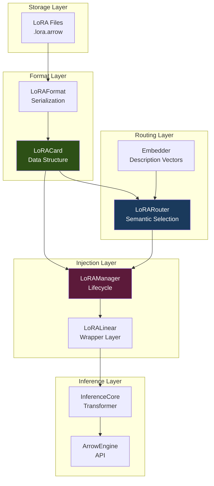

# Design Document: LoRA Infrastructure

## Overview

The LoRA Infrastructure implements parameter-efficient model adaptation for ArrowEngine using Low-Rank Adaptation (LoRA) technique. The system stores adapters in Arrow IPC format for zero-copy loading, injects them dynamically into InferenceCore layers, and provides semantic routing for automatic adapter selection.

### Core Design Principles

1. **Zero-copy loading**: Use memory-mapped Arrow IPC files for instant adapter loading
2. **Minimal overhead**: LoRA adds <10% inference latency with rank 8-16
3. **Dynamic injection**: Apply and remove adapters at runtime without model reloading
4. **Semantic routing**: Automatically select relevant adapters based on user intent
5. **Reuse InferenceCore**: Inject into existing Transformer layers without modification

### Target Performance

| Metric | Target | Rationale |
|--------|--------|-----------|
| Adapter loading | < 100ms | Memory-mapped Arrow IPC |
| Adapter injection | < 500ms | In-place layer replacement |
| Forward pass overhead | < 10% | Low-rank matrix multiplication |
| Memory per adapter | < 50MB | Rank 16, 12 layers, 768-dim |
| Adapter removal | < 100ms | Restore original layers |

## Architecture

### System Overview



### Component Hierarchy

**Tier 1: Storage and Format**
- LoRACard: Data structure for adapter weights and metadata
- LoRAFormat: Arrow IPC serialization/deserialization

**Tier 2: Injection and Lifecycle**
- LoRALinear: Wrapper layer for LoRA computation
- LoRAManager: Adapter lifecycle management

**Tier 3: Routing and Selection**
- LoRARouter: Semantic adapter selection
- Embedder: Description embedding computation

**Tier 4: Integration**
- InferenceCore: Transformer implementation (existing)
- ArrowEngine: High-level API (existing)

## Components and Interfaces

### 1. LoRACard - Data Structure

```python
from dataclasses import dataclass, field
from typing import Dict, List
import numpy as np

@dataclass
class LoRACard:
    """
    Represents a LoRA adapter card.
    
    Attributes:
        name: Unique identifier for the adapter
        rank: Rank of low-rank decomposition (typically 4-64)
        alpha: Scaling factor (typically equals rank)
        target_modules: List of module names to inject into
        weights_A: Dict mapping module names to A matrices (in_dim, rank)
        weights_B: Dict mapping module names to B matrices (rank, out_dim)
        metadata: Additional metadata (version, author, description)
    """
    name: str
    rank: int
    alpha: float
    target_modules: List[str]
    weights_A: Dict[str, np.ndarray]
    weights_B: Dict[str, np.ndarray]
    metadata: Dict[str, str] = field(default_factory=dict)
    
    def __post_init__(self):
        """Validate LoRACard after initialization."""
        assert self.rank > 0, "Rank must be positive"
        assert self.alpha > 0, "Alpha must be positive"
        assert len(self.weights_A) == len(self.weights_B), "A and B must have same keys"
        
        # Validate shapes
        for key in self.weights_A:
            assert key in self.weights_B, f"Missing B weight for {key}"
            a_shape = self.weights_A[key].shape
            b_shape = self.weights_B[key].shape
            assert a_shape[1] == self.rank, f"A matrix rank mismatch: {a_shape[1]} != {self.rank}"
            assert b_shape[0] == self.rank, f"B matrix rank mismatch: {b_shape[0]} != {self.rank}"
```

### 2. LoRAFormat - Serialization

```python
import pyarrow as pa
import pyarrow.ipc as ipc

class LoRAFormat:
    """
    Handles serialization/deserialization of LoRA cards to/from Arrow format.
    
    Arrow Schema:
        - module: string (module name)
        - weight_a: binary (serialized numpy array)
        - weight_b: binary (serialized numpy array)
        - shape_a: list<int32> (shape of A matrix)
        - shape_b: list<int32> (shape of B matrix)
        - dtype: string (numpy dtype)
    
    Metadata (stored in schema metadata):
        - lora_name: adapter name
        - lora_rank: rank value
        - lora_alpha: alpha value
        - target_modules: comma-separated module names
        - Additional metadata from LoRACard.metadata
    """
    
    @staticmethod
    def save(card: LoRACard, path: str):
        """
        Save LoRACard to Arrow IPC file.
        
        Args:
            card: LoRACard to save
            path: Output file path (.lora.arrow)
        """
        # Prepare metadata
        custom_meta = {
            "lora_name": card.name,
            "lora_rank": str(card.rank),
            "lora_alpha": str(card.alpha),
            "target_modules": ",".join(card.target_modules)
        }
        # Add extra metadata
        for k, v in card.metadata.items():
            custom_meta[str(k)] = str(v)
        
        # Prepare data arrays
        modules = []
        w_a_list = []
        w_b_list = []
        s_a_list = []
        s_b_list = []
        dtype_list = []
        
        for key in sorted(card.weights_A.keys()):
            wa = card.weights_A[key]
            wb = card.weights_B[key]
            
            modules.append(key)
            w_a_list.append(wa.tobytes())
            w_b_list.append(wb.tobytes())
            s_a_list.append(list(wa.shape))
            s_b_list.append(list(wb.shape))
            dtype_list.append(str(wa.dtype))
        
        # Create schema with metadata
        schema = pa.schema([
            ("module", pa.string()),
            ("weight_a", pa.binary()),
            ("weight_b", pa.binary()),
            ("shape_a", pa.list_(pa.int32())),
            ("shape_b", pa.list_(pa.int32())),
            ("dtype", pa.string())
        ], metadata=custom_meta)
        
        # Create record batch
        batch = pa.RecordBatch.from_arrays([
            pa.array(modules),
            pa.array(w_a_list),
            pa.array(w_b_list),
            pa.array(s_a_list),
            pa.array(s_b_list),
            pa.array(dtype_list)
        ], schema=schema)
        
        # Write to file
        with pa.OSFile(path, 'wb') as sink:
            with ipc.new_file(sink, schema) as writer:
                writer.write(batch)
    
    @staticmethod
    def load(path: str) -> LoRACard:
        """
        Load LoRACard from Arrow IPC file (zero-copy).
        
        Args:
            path: Input file path (.lora.arrow)
            
        Returns:
            Loaded LoRACard
        """
        # Memory-map file for zero-copy loading
        with pa.memory_map(path, 'r') as source:
            reader = ipc.open_file(source)
            table = reader.read_all()
            
            # Read metadata
            meta = table.schema.metadata
            name = meta.get(b'lora_name', b'unknown').decode('utf-8')
            rank = int(meta.get(b'lora_rank', b'0').decode('utf-8'))
            alpha = float(meta.get(b'lora_alpha', b'1.0').decode('utf-8'))
            targets = meta.get(b'target_modules', b'').decode('utf-8').split(',')
            
            # Reconstruct weights (zero-copy from Arrow buffers)
            modules = table.column("module").to_pylist()
            w_a_bins = table.column("weight_a")
            w_b_bins = table.column("weight_b")
            s_a_lists = table.column("shape_a").to_pylist()
            s_b_lists = table.column("shape_b").to_pylist()
            dtypes = table.column("dtype").to_pylist()
            
            weights_A = {}
            weights_B = {}
            
            for i, mod_key in enumerate(modules):
                dtype = np.dtype(dtypes[i])
                
                # Zero-copy view from Arrow buffer
                buf_a = w_a_bins[i].as_buffer()
                buf_b = w_b_bins[i].as_buffer()
                
                arr_a = np.frombuffer(buf_a, dtype=dtype).reshape(s_a_lists[i])
                arr_b = np.frombuffer(buf_b, dtype=dtype).reshape(s_b_lists[i])
                
                weights_A[mod_key] = arr_a
                weights_B[mod_key] = arr_b
            
            # Extract generic metadata
            generic_meta = {}
            for k, v in meta.items():
                k_str = k.decode('utf-8')
                if k_str not in ["lora_name", "lora_rank", "lora_alpha", "target_modules"]:
                    generic_meta[k_str] = v.decode('utf-8')
            
            return LoRACard(
                name=name,
                rank=rank,
                alpha=alpha,
                target_modules=targets,
                weights_A=weights_A,
                weights_B=weights_B,
                metadata=generic_meta
            )
```

### 3. LoRALinear - Injection Layer

```python
import torch
import torch.nn as nn

class LoRALinear(nn.Module):
    """
    LoRA wrapper for nn.Linear layer.
    
    Forward pass: output = base_layer(x) + (x @ A @ B) * (alpha / rank)
    
    Attributes:
        original_layer: Original nn.Linear layer (frozen)
        rank: Rank of low-rank decomposition
        alpha: Scaling factor
        lora_A: Low-rank matrix A (in_features, rank)
        lora_B: Low-rank matrix B (rank, out_features)
    """
    
    def __init__(
        self,
        original_layer: nn.Linear,
        rank: int,
        alpha: float
    ):
        super().__init__()
        self.original_layer = original_layer
        self.rank = rank
        self.alpha = alpha
        self.scaling = alpha / rank
        
        # Freeze original layer
        for param in self.original_layer.parameters():
            param.requires_grad = False
        
        # Initialize LoRA matrices
        in_features = original_layer.in_features
        out_features = original_layer.out_features
        
        self.lora_A = nn.Parameter(torch.zeros(in_features, rank))
        self.lora_B = nn.Parameter(torch.zeros(rank, out_features))
        
        # Initialize A with Kaiming uniform, B with zeros
        nn.init.kaiming_uniform_(self.lora_A, a=5**0.5)
        nn.init.zeros_(self.lora_B)
    
    def load_weights(self, weight_a: np.ndarray, weight_b: np.ndarray):
        """
        Load pre-trained LoRA weights.
        
        Args:
            weight_a: A matrix (in_features, rank)
            weight_b: B matrix (rank, out_features)
        """
        self.lora_A.data = torch.from_numpy(weight_a).to(self.lora_A.device)
        self.lora_B.data = torch.from_numpy(weight_b).to(self.lora_B.device)
    
    def forward(self, x: torch.Tensor) -> torch.Tensor:
        """
        Forward pass with LoRA adaptation.
        
        Args:
            x: Input tensor (..., in_features)
            
        Returns:
            Output tensor (..., out_features)
        """
        # Base layer output
        base_output = self.original_layer(x)
        
        # LoRA contribution: x @ A @ B * scaling
        lora_output = (x @ self.lora_A) @ self.lora_B * self.scaling
        
        return base_output + lora_output
```

### 4. LoRAManager - Lifecycle Management

```python
from typing import Dict, List, Optional
import logging

logger = logging.getLogger(__name__)

class LoRAManager:
    """
    Manages LoRA adapter lifecycle.
    
    Responsibilities:
    - Load LoRACard from disk
    - Inject LoRA into InferenceCore layers
    - Track active adapters
    - Remove adapters and restore original layers
    """
    
    def __init__(self, model: nn.Module):
        """
        Initialize LoRAManager.
        
        Args:
            model: InferenceCore or ArrowEngine instance
        """
        self.model = model
        self.active_cards: Dict[str, LoRACard] = {}
        self.injected_layers: Dict[str, LoRALinear] = {}
    
    def load_card(self, path: str) -> LoRACard:
        """
        Load LoRA card from disk.
        
        Args:
            path: Path to .lora.arrow file
            
        Returns:
            Loaded LoRACard
        """
        try:
            card = LoRAFormat.load(path)
            logger.info(f"Loaded LoRA Card: {card.name} (Rank={card.rank})")
            return card
        except Exception as e:
            logger.error(f"Failed to load LoRA card from {path}: {e}")
            raise
    
    def apply_card(self, card: LoRACard):
        """
        Inject LoRA card into model.
        
        Args:
            card: LoRACard to apply
        """
        if card.name in self.active_cards:
            logger.warning(f"LoRA {card.name} already applied.")
            return
        
        injected_count = 0
        
        # Iterate through model modules
        for name, module in self.model.named_modules():
            # Check if module matches target
            matched = False
            for target in card.target_modules:
                if name.endswith(target):
                    matched = True
                    break
            
            if matched and isinstance(module, nn.Linear):
                # Skip if already wrapped
                if isinstance(module, LoRALinear):
                    logger.warning(f"Layer {name} already has LoRA.")
                    continue
                
                # Find weight key in card
                weight_key = self._find_weight_key(name, card)
                if not weight_key:
                    continue
                
                # Create LoRA wrapper
                lora_layer = LoRALinear(
                    module,
                    rank=card.rank,
                    alpha=card.alpha
                )
                
                # Load weights
                lora_layer.load_weights(
                    card.weights_A[weight_key],
                    card.weights_B[weight_key]
                )
                
                # Replace in parent
                self._replace_module(name, lora_layer)
                
                # Track
                self.injected_layers[name] = lora_layer
                injected_count += 1
        
        self.active_cards[card.name] = card
        logger.info(f"Applied LoRA {card.name}: Injected into {injected_count} layers.")
    
    def remove_card(self, card_name: str):
        """
        Remove LoRA and restore original layers.
        
        Args:
            card_name: Name of LoRACard to remove
        """
        if card_name not in self.active_cards:
            return
        
        # Restore original modules
        for name, lora_layer in list(self.injected_layers.items()):
            original = lora_layer.original_layer
            self._replace_module(name, original)
            del self.injected_layers[name]
        
        del self.active_cards[card_name]
        logger.info(f"Removed LoRA {card_name}.")
    
    def list_cards(self) -> List[str]:
        """List active LoRA cards."""
        return list(self.active_cards.keys())
    
    def _find_weight_key(self, module_name: str, card: LoRACard) -> Optional[str]:
        """Find matching weight key in card for module name."""
        # Try exact match
        if module_name in card.weights_A:
            return module_name
        
        # Try suffix match
        for key in card.weights_A.keys():
            if key.endswith(module_name) or module_name.endswith(key):
                return key
        
        return None
    
    def _replace_module(self, name: str, new_module: nn.Module):
        """Replace module in model hierarchy."""
        if '.' in name:
            parent_name, child_name = name.rsplit('.', 1)
            parent = self.model.get_submodule(parent_name)
        else:
            parent = self.model
            child_name = name
        
        setattr(parent, child_name, new_module)
```

### 5. LoRARouter - Semantic Selection

```python
class LoRARouter:
    """
    Semantic LoRA adapter selection.
    
    Uses embedding similarity to select relevant adapters
    based on user query intent.
    """
    
    def __init__(
        self,
        manager: LoRAManager,
        embedder_func: Callable[[str], np.ndarray]
    ):
        """
        Initialize LoRARouter.
        
        Args:
            manager: LoRAManager instance
            embedder_func: Function that embeds text to vectors
        """
        self.manager = manager
        self.embedder = embedder_func
        self.index: Dict[str, np.ndarray] = {}
    
    def register_card(self, card: LoRACard):
        """
        Register card and compute semantic vector.
        
        Args:
            card: LoRACard to register
        """
        description = card.metadata.get("description", card.name)
        text = f"{card.name}: {description}"
        vector = self.embedder(text)
        self.index[card.name] = vector
        logger.info(f"Registered LoRA {card.name} to Router index.")
    
    def register_virtual_candidate(self, name: str, description: str):
        """
        Register virtual candidate without loading weights.
        
        Args:
            name: Adapter name
            description: Adapter description
        """
        text = f"{name}: {description}"
        vector = self.embedder(text)
        self.index[name] = vector
        logger.info(f"Registered virtual LoRA {name} to Router index.")
    
    def select(
        self,
        query: str,
        threshold: float = 0.6,
        top_k: int = 1
    ) -> List[str]:
        """
        Select top-k relevant LoRAs for query.
        
        Args:
            query: User query text
            threshold: Minimum similarity threshold
            top_k: Number of adapters to select
            
        Returns:
            List of selected adapter names
        """
        if not self.index:
            return []
        
        query_vec = self.embedder(query)
        
        # Compute cosine similarities
        scores = []
        for name, doc_vec in self.index.items():
            norm_q = np.linalg.norm(query_vec)
            norm_d = np.linalg.norm(doc_vec)
            
            if norm_q == 0 or norm_d == 0:
                sim = 0.0
            else:
                sim = np.dot(query_vec, doc_vec) / (norm_q * norm_d)
            
            scores.append((name, sim))
        
        # Sort and filter
        scores.sort(key=lambda x: x[1], reverse=True)
        
        selected = []
        for name, score in scores[:top_k]:
            if score >= threshold:
                selected.append(name)
                logger.debug(f"LoRA Router selected {name} (score={score:.4f})")
            else:
                logger.debug(f"LoRA Router rejected {name} (score={score:.4f} < {threshold})")
        
        return selected
```

## Correctness Properties

### Property 1: LoRA Format Round-Trip

*For any* valid LoRACard, serializing to Arrow IPC and deserializing should produce an equivalent LoRACard with identical weights (within floating-point precision).

**Validates: Requirements 1.4, 1.5**

### Property 2: LoRA Forward Pass Correctness

*For any* input tensor and LoRA weights, the LoRALinear forward pass should compute: output = base(x) + (x @ A @ B) * (alpha / rank), matching the mathematical definition.

**Validates: Requirements 2.2, 2.6**

### Property 3: LoRA Injection Idempotence

*For any* LoRACard, applying it twice should result in the same state as applying it once (second application should be skipped with warning).

**Validates: Requirements 3.4, 7.4**

### Property 4: LoRA Removal Restoration

*For any* LoRACard, applying and then removing it should restore the model to its original state with identical forward pass behavior.

**Validates: Requirements 3.7**

### Property 5: Semantic Routing Consistency

*For any* query and adapter set, the LoRARouter should return adapters in descending order of similarity score, with all returned adapters above the threshold.

**Validates: Requirements 4.4, 4.6**

## Integration with ArrowEngine

```python
class ArrowEngine:
    """Extended ArrowEngine with LoRA support."""
    
    def __init__(self, model_path: str, device: Optional[str] = None):
        # Existing initialization
        self.inference_core = InferenceCore(...)
        
        # LoRA support
        self.lora_manager = LoRAManager(self.inference_core)
        self.lora_router = None  # Optional, initialized when needed
    
    def load_lora(self, lora_path: str):
        """Load and apply LoRA adapter."""
        card = self.lora_manager.load_card(lora_path)
        self.lora_manager.apply_card(card)
    
    def remove_lora(self, lora_name: str):
        """Remove LoRA adapter."""
        self.lora_manager.remove_card(lora_name)
    
    def encode_with_lora(
        self,
        texts: List[str],
        lora_path: Optional[str] = None
    ) -> np.ndarray:
        """
        Encode texts with optional LoRA adapter.
        
        Args:
            texts: Input texts
            lora_path: Optional path to LoRA adapter
            
        Returns:
            Embeddings with LoRA adaptation
        """
        if lora_path:
            self.load_lora(lora_path)
        
        embeddings = self.encode(texts)
        
        if lora_path:
            # Remove after encoding (optional)
            card_name = self.lora_manager.list_cards()[0]
            self.remove_lora(card_name)
        
        return embeddings
```

## Performance Characteristics

### Memory Usage

For a typical LoRA adapter (rank=16, 12 layers, 768-dim):
- A matrices: 12 × 768 × 16 × 4 bytes = 589 KB
- B matrices: 12 × 16 × 768 × 4 bytes = 589 KB
- Total: ~1.2 MB per adapter

### Inference Overhead

LoRA adds two matrix multiplications per layer:
- Base: x @ W (768 × 768)
- LoRA: (x @ A) @ B (768 × 16 × 768)
- Overhead: ~5-10% for rank 16

### Loading Performance

- Arrow IPC loading: <100ms (memory-mapped)
- Injection: <500ms (12 layers)
- Removal: <100ms (restore pointers)

## Testing Strategy

1. **Unit Tests**: Test individual components (LoRAFormat, LoRALinear, LoRAManager)
2. **Integration Tests**: Test end-to-end workflows (load → inject → encode → remove)
3. **Property Tests**: Validate mathematical correctness and invariants
4. **Performance Tests**: Verify latency and memory targets

## Future Enhancements

1. **Multi-LoRA Support**: Stack multiple adapters on same layer
2. **LoRA Merging**: Merge LoRA weights into base model
3. **Dynamic Rank**: Support variable rank per layer
4. **Quantization**: Support INT8/INT4 LoRA weights
5. **Distributed LoRA**: Share adapters across federation nodes
