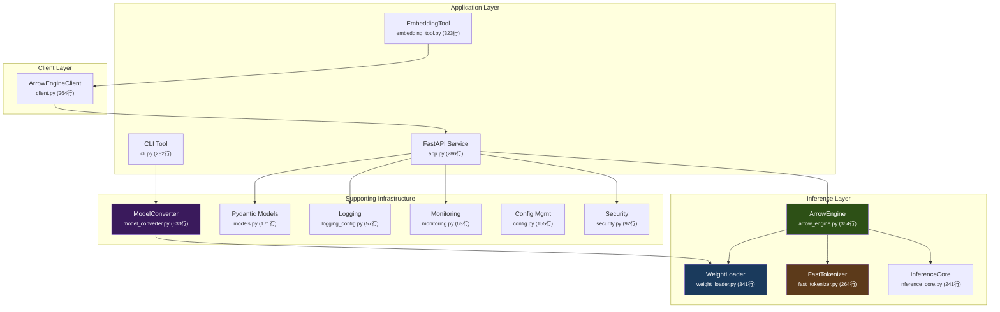
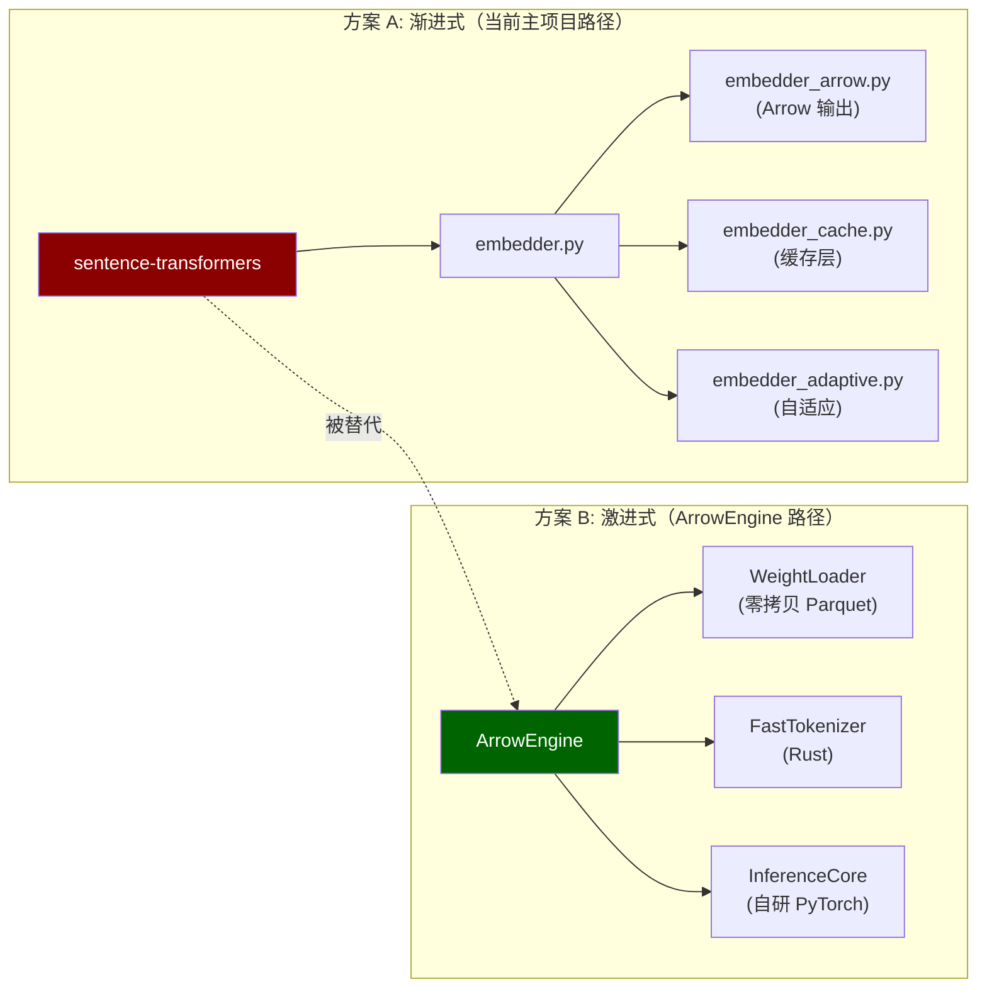
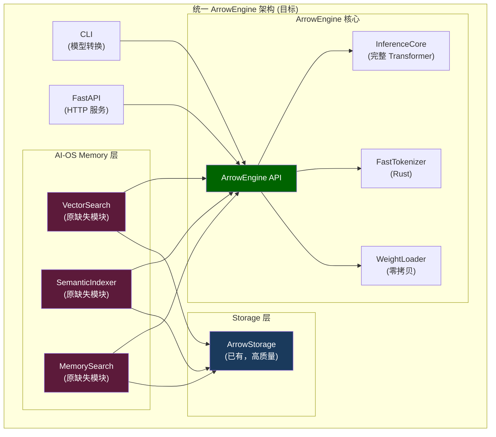

# ArrowEngine 子项目深度审查报告

## 概述

在 `llm_compression/` 目录中发现了一个 **独立的、完整的嵌入推理引擎项目** —— **ArrowEngine**。该项目是在 Phase 2.0 后期临时启动的，旨在用 Arrow 零拷贝架构彻底替代 `sentence-transformers`，构建从模型存储到推理到 API 服务的全链路高性能嵌入系统。

> [!IMPORTANT]
> ArrowEngine 是一个**战略级子项目**，绝非简单的代码扩展。它包含 4 个子模块、3,800+ 行代码、完整的架构设计文档、6 周任务计划，以及测试和部署体系。其定位是**整个 AI-OS 记忆系统的嵌入基础设施**。

---

## 项目架构

---

## 各模块详细分析

### 1. 推理引擎层 ([inference/](file:///m:/Documents/ai-os-memory/llm_compression/inference/arrow_engine.py#165-182))

| 模块 | 文件 | 行数 | 核心职责 | 评分 |
|------|------|------|---------|------|
| ArrowEngine | [arrow_engine.py](file:///m:/Documents/ai-os-memory/llm_compression/inference/arrow_engine.py) | 354 | 主 API 类，整合所有组件 | ⭐⭐⭐⭐ |
| WeightLoader | [weight_loader.py](file:///m:/Documents/ai-os-memory/llm_compression/inference/weight_loader.py) | 341 | 零拷贝权重加载（memory-mapped Parquet） | ⭐⭐⭐⭐⭐ |
| FastTokenizer | [fast_tokenizer.py](file:///m:/Documents/ai-os-memory/llm_compression/inference/fast_tokenizer.py) | 264 | Rust tokenizers 集成（10-20x 加速） | ⭐⭐⭐⭐ |
| InferenceCore | [inference_core.py](file:///m:/Documents/ai-os-memory/llm_compression/inference/inference_core.py) | 241 | PyTorch BERT 前向传播 + Mean Pooling | ⭐⭐⭐ |

**亮点**:
- [WeightLoader](file:///m:/Documents/ai-os-memory/llm_compression/inference/weight_loader.py#31-341) 是技术含量最高的模块，实现了从 Parquet → Arrow Table → NumPy → PyTorch Tensor 的零拷贝转换路径
- [FastTokenizer](file:///m:/Documents/ai-os-memory/llm_compression/inference/fast_tokenizer.py#28-264) 直接调用 Rust `tokenizers` 库，比 Python tokenizer 快 10-20 倍

**隐患**:
- `InferenceCore._forward_embeddings()` 目前是**简化实现**（仅使用 embedding 层，未实现完整 Transformer 层），注释明确说明 "For production use with real models, this would need the full BERT architecture implementation"
- 这意味着当前 ArrowEngine 的推理精度**可能远低于** sentence-transformers 原生实现

---

### 2. API 服务层 (`server/`)

| 模块 | 文件 | 行数 | 核心职责 |
|------|------|------|---------|
| FastAPI App | [app.py](file:///m:/Documents/ai-os-memory/llm_compression/server/app.py) | 286 | HTTP 端点 (/embed, /similarity, /health, /info) |
| Pydantic Models | [models.py](file:///m:/Documents/ai-os-memory/llm_compression/server/models.py) | 171 | 请求/响应数据模型 |
| Security | [security.py](file:///m:/Documents/ai-os-memory/llm_compression/server/security.py) | 92 | API Key 鉴权 + Token Bucket 限流 |
| Monitoring | [monitoring.py](file:///m:/Documents/ai-os-memory/llm_compression/server/monitoring.py) | 63 | Prometheus 指标 (请求计数、推理延迟、吞吐量) |
| Logging | [logging_config.py](file:///m:/Documents/ai-os-memory/llm_compression/server/logging_config.py) | 57 | 结构化 JSON 日志 + Request ID 关联 |

**亮点**:
- 生产级质量：API Key 鉴权、Token Bucket 限流、Prometheus 可观测性、结构化日志
- Pydantic v2 `field_validator` + [model_post_init](file:///m:/Documents/ai-os-memory/llm_compression/server/models.py#90-113) 用于复杂请求校验
- 请求中间件整合了 Request ID 分配、Prometheus 指标、速率限制和访问日志

---

### 3. 客户端层 (`client/`)

| 模块 | 文件 | 行数 | 核心职责 |
|------|------|------|---------|
| HTTP Client | [client.py](file:///m:/Documents/ai-os-memory/llm_compression/client/client.py) | 264 | ArrowEngine 服务的 HTTP 客户端 |

- 支持 [with](file:///m:/Documents/ai-os-memory/llm_compression/tools/embedding_tool.py#243-285) 上下文管理器、自动重试、超时控制
- 数据类型定义完整：[EmbedResult](file:///m:/Documents/ai-os-memory/llm_compression/client/client.py#26-32), [SimilarityResult](file:///m:/Documents/ai-os-memory/llm_compression/client/client.py#34-39), [HealthResult](file:///m:/Documents/ai-os-memory/llm_compression/client/client.py#41-47), [InfoResult](file:///m:/Documents/ai-os-memory/llm_compression/client/client.py#49-57)

---

### 4. 工具层 (`tools/`)

| 模块 | 文件 | 行数 | 核心职责 |
|------|------|------|---------|
| ModelConverter | [model_converter.py](file:///m:/Documents/ai-os-memory/llm_compression/tools/model_converter.py) | 533 | HuggingFace → Arrow/Parquet 模型转换 |
| EmbeddingTool | [embedding_tool.py](file:///m:/Documents/ai-os-memory/llm_compression/tools/embedding_tool.py) | 323 | AI-OS 集成工具（含 LRU 缓存） |
| Config | [config.py](file:///m:/Documents/ai-os-memory/llm_compression/tools/config.py) | 155 | YAML 配置管理 |
| CLI | [cli.py](file:///m:/Documents/ai-os-memory/llm_compression/tools/cli.py) | 282 | 命令行转换工具 |

**亮点**: [ModelConverter](file:///m:/Documents/ai-os-memory/llm_compression/tools/model_converter.py#81-533) 是整个 ArrowEngine 的入口，负责将 HuggingFace 模型权重提取 → float16 优化 → Arrow/Parquet 序列化 → Rust tokenizer 导出 → 转换验证的完整流程

---

## 与主项目的重叠与冲突

### 嵌入功能的 5 套实现

这是一个**严重的架构问题**。当前存在 **5 套并行的**嵌入/向量化实现：

| # | 实现 | 技术栈 | 定位 |
|---|------|--------|------|
| 1 | [embedder.py](file:///m:/Documents/ai-os-memory/llm_compression/embedder.py) (338行) | sentence-transformers | 主项目基础嵌入器，直接调用 ST 模型 |
| 2 | [embedder_arrow.py](file:///m:/Documents/ai-os-memory/llm_compression/embedder_arrow.py) (448行) | ST + Arrow 扩展 | 为 [LocalEmbedder](file:///m:/Documents/ai-os-memory/llm_compression/embedder.py#31-306) 添加 Arrow 零拷贝输出 |
| 3 | [embedder_adaptive.py](file:///m:/Documents/ai-os-memory/llm_compression/embedder_adaptive.py) | ST + 自适应策略 | 根据上下文选择模型/精度 |
| 4 | [embedder_cache.py](file:///m:/Documents/ai-os-memory/llm_compression/embedder_cache.py) | ST + 缓存层 | 增加 embedding 缓存 |
| 5 | **ArrowEngine** (inference/ 子包, 1200行) | PyTorch + Arrow + Rust tokenizer | **完全替代 ST** 的独立推理引擎 |

> [!WARNING]
> **关键区别**: 1-4 都是基于 `sentence-transformers` 的封装/扩展（底层仍然调用 ST 的 `model.encode()`），而 **ArrowEngine 是从底层替代 ST**——直接加载 Parquet 权重、用 Rust tokenizer 分词、自己实现 PyTorch 前向传播。

### 冲突分析

---

## ArrowEngine 项目生态系统

### 文档体系

| 文档 | 路径 | 内容 |
|------|------|------|
| 架构设计 | [ARROWENGINE_DESIGN.md](file:///m:/Documents/ai-os-memory/docs/arrow-optimization/ARROWENGINE_DESIGN.md) | 503行，含完整架构图、类设计、优化策略、性能基准 |
| 任务分解 | [TASKS.md](file:///m:/Documents/ai-os-memory/docs/arrow-optimization/TASKS.md) | 352行，4 阶段 6 周 228 小时计划 |
| 快速开始 | [QUICKSTART_EMBEDDING_TOOL.md](file:///m:/Documents/ai-os-memory/docs/QUICKSTART_EMBEDDING_TOOL.md) | EmbeddingTool 使用指南 |
| 生产部署 | [PRODUCTION_DEPLOYMENT.md](file:///m:/Documents/ai-os-memory/docs/PRODUCTION_DEPLOYMENT.md) | 部署说明 |

### 测试覆盖

| 测试类型 | 路径 | 覆盖范围 |
|----------|------|---------|
| 单元测试 | [test_model_converter.py](file:///m:/Documents/ai-os-memory/tests/unit/tools/test_model_converter.py) (15KB) | ModelConverter 完整测试 |
| API 集成 | [test_api.py](file:///m:/Documents/ai-os-memory/tests/integration/server/test_api.py) (6KB) | FastAPI 端点测试 |
| E2E 集成 | [test_embedding_tool_e2e.py](file:///m:/Documents/ai-os-memory/tests/integration/tools/test_embedding_tool_e2e.py) | EmbeddingTool 端到端 |
| 性能测试 | [test_api_performance.py](file:///m:/Documents/ai-os-memory/tests/performance/test_api_performance.py) | API 延迟/吞吐量基准 |
| 负载测试 | [locustfile.py](file:///m:/Documents/ai-os-memory/tests/load/locustfile.py) | Locust 压力测试 |
| 验证脚本 | [verify_arrowengine.py](file:///m:/Documents/ai-os-memory/verify_arrowengine.py) | 模块导入 + API 验证 |
| ⚠️ 推理单元 | `tests/unit/inference/` | **空目录** — 核心推理引擎无单元测试 |

---

## 当前完成状态评估

### ArrowEngine TASKS.md 进度 vs 实际

| 阶段 | 计划 | 代码存在 | 完成度 |
|------|------|---------|-------|
| Phase 1: ModelConverter | T1.1–T1.8 (38h) | ✅ 代码完整 | **~90%** (缺少测试覆盖完整性验证) |
| Phase 1: ArrowEngine | T2.1–T2.7 (42h) | ✅ 代码完整 | **~70%** (InferenceCore 是简化版) |
| Phase 2: API Service | T3.1–T3.9 (40h) | ✅ 代码完整 | **~85%** (缺 Docker 配置) |
| Phase 3: AI-OS Integration | T4.1–T4.8 (40h) | ⚠️ 部分完成 | **~60%** (缺 tool registry, LLM call interface) |
| Phase 4: Production | T5.1–T5.12 (68h) | ⚠️ 基础已有 | **~40%** (有 Prometheus，缺 CI/CD, k8s) |
| **整体** | **228h** | | **~70%** |

### 关键缺口

1. **InferenceCore 精度问题** — 核心推理未实现完整 Transformer 层，仅有 Embedding + Mean Pooling
2. **推理引擎无单元测试** — `tests/unit/inference/` 是空目录
3. **缺少 Docker/K8s** — 设计文档提到但未实现
4. **Tool Registry 缺失** — TASKS.md T4.4 计划的 `tools/registry.py` 不存在
5. **`models/optimized/` 只有 README** — 没有实际的预转换模型

---

## 战略建议：两条路径何去何从

### 推荐方案：**ArrowEngine 统一路径**

ArrowEngine 代表了更优的长期架构方向，建议将其作为主线，逐步替代零散的 embedder 实现：

| 优先级 | 任务 | 预估 | 说明 |
|--------|------|------|------|
| **P0** | 完善 InferenceCore Transformer 实现 | 12-16h | 当前简化版无法达到生产精度 |
| **P0** | 补充推理引擎单元测试 | 6-8h | 当前 `tests/unit/inference/` 为空 |
| **P1** | 合并 embedder_cache + embedder_adaptive 到 EmbeddingTool | 4-6h | EmbeddingTool 已有 LRU 缓存，适合整合自适应策略 |
| **P1** | 合并 embedder_arrow 功能到 ArrowEngine | 4h | 零拷贝 Arrow 输出是 ArrowEngine 的原生能力 |
| **P2** | 废弃 4 个旧 embedder 文件 | 2h | 标记为 deprecated，引导到 ArrowEngine |
| **P2** | 用 ArrowEngine 替代主项目中 5 个缺失的语义索引模块 | 8-12h | `vector_search`、`semantic_indexer` 等可直接基于 ArrowEngine 构建 |
| **P3** | Docker/K8s 部署配置 | 4-6h | 按 TASKS.md T3.7 和 T5.6 |

### 核心整合架构

> [!TIP]
> 这个架构最大的优势在于：**ArrowEngine + ArrowStorage 共享同一套 Arrow/Parquet 数据格式**。模型权重、嵌入向量、记忆数据全部存储在 Arrow/Parquet 中，实现了从推理到存储的端到端零拷贝。这正是用户提到的"充分发挥 Arrow 内存零拷贝架构优势"的最佳路径。

---

## 代码质量评分

| 维度 | ArrowEngine 子项目 | 主项目 embedders | 说明 |
|------|-------------------|-----------------|------|
| 架构设计 | ⭐⭐⭐⭐⭐ | ⭐⭐⭐ | ArrowEngine 有完整分层架构设计文档 |
| 代码质量 | ⭐⭐⭐⭐ | ⭐⭐⭐⭐ | 两者都有好的类型标注和文档字符串 |
| 测试覆盖 | ⭐⭐⭐ | ⭐⭐ | ArrowEngine 有 API/E2E/性能/负载测试但缺推理单元测试 |
| 生产就绪 | ⭐⭐⭐⭐ | ⭐⭐ | ArrowEngine 有安全/监控/日志/限流 |
| 实际可用性 | ⭐⭐ | ⭐⭐⭐⭐ | InferenceCore 简化版限制了 ArrowEngine 实际精度 |
| **综合** | **3.6/5** | **3.0/5** | ArrowEngine 架构更优但需要补完 InferenceCore |

---

## 总结

ArrowEngine 是一个**架构设计精良但实现尚未完成**的关键子项目。它的核心价值在于：

1. **端到端 Arrow 零拷贝** — 从 Parquet 模型权重到推理到存储，全链路零拷贝
2. **去除 sentence-transformers 依赖** — 自研轻量推理引擎，启动时间从 2-5s 降至 <100ms
3. **生产级服务架构** — API 鉴权、限流、监控、结构化日志一应俱全
4. **AI-OS 原生集成** — EmbeddingTool 直接为 AI-OS 记忆系统设计

**最大风险**: `InferenceCore` 的简化实现（仅 Embedding + Mean Pooling，未实现完整 Transformer）可能导致推理精度远低于 sentence-transformers。这是决定 ArrowEngine 能否真正替代现有 embedder 体系的关键阻塞点。
