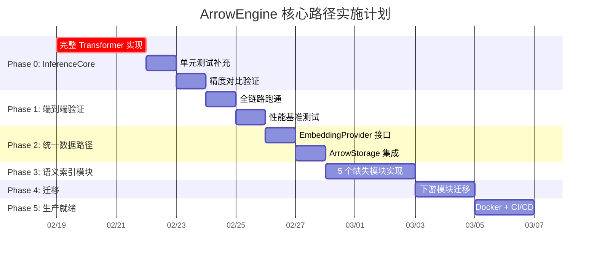

# AI-OS ArrowEngine 核心路径实施计划

## 背景

经过全面审查，我们确认 ArrowEngine 是 AI-OS 记忆系统的**核心路径**。它与 [ArrowStorage](file:///m:/Documents/ai-os-memory/llm_compression/arrow_storage.py#235-961) 共享 Arrow/Parquet 数据格式，能实现从模型权重 → 嵌入推理 → 记忆存储 → 语义检索的**端到端零拷贝**。本计划旨在补全 ArrowEngine 关键基础设施，验证核心价值，并以此为基础推进整个 AI-OS 架构统一。

### 当前状态

| 组件 | 存在 | 完成度 | 阻塞点 |
|------|------|--------|--------|
| ModelConverter | ✅ | ~90% | — |
| ArrowEngine API | ✅ | ~80% | — |
| WeightLoader | ✅ | ~95% | — |
| FastTokenizer | ✅ | ~90% | — |
| **InferenceCore** | ⚠️ | **~30%** | **无 Transformer 层，仅 Embedding Lookup** |
| FastAPI Server | ✅ | ~85% | 缺 Docker |
| 5 个语义索引模块 | ❌ | 0% | 源文件不存在 |
| 旧 embedder 体系 | ✅ | 100% | 冗余，需迁移 |

---

## Proposed Changes

### Phase 0: InferenceCore 完善 — 消除第一阻塞点

> [!CAUTION]
> 这是整个计划的**关键路径**。InferenceCore 当前的 [_forward_embeddings()](file:///m:/Documents/ai-os-memory/llm_compression/inference/inference_core.py#130-170) 仅做 Embedding Lookup（40 行），没有实现 Transformer 的多头注意力、前馈网络和层归一化。没有这些，ArrowEngine 的推理精度将远低于 sentence-transformers，整个替代方案不成立。

#### [MODIFY] [inference_core.py](file:///m:/Documents/ai-os-memory/llm_compression/inference/inference_core.py)

**当前问题**: [_forward_embeddings()](file:///m:/Documents/ai-os-memory/llm_compression/inference/inference_core.py#130-170) 是一个简化 stub：

```python
# 现状: 仅做 embedding lookup，无 transformer 层
hidden_states = torch.zeros(batch_size, seq_len, self.hidden_size, ...)
embedding_weight = None
for name in dir(self):
    if 'embedding' in name.lower() and 'weight' in name.lower():
        embedding_weight = getattr(self, name)
        break
```

**改造内容**:

1. 实现完整的 BERT `TransformerLayer`（Multi-Head Self-Attention + FFN + LayerNorm）
2. 参照 all-MiniLM-L6-v2 的权重结构加载配置（6 层、6 头、384 维）
3. 支持 `position_embeddings` 和 `token_type_embeddings`
4. 添加 `@torch.no_grad()` 推理优化

```diff
- def _forward_embeddings(self, input_ids, seq_len):
-     # 简化 stub: 仅 embedding lookup
-     hidden_states = torch.zeros(...)
-     ...
-     return hidden_states

+ def _forward_embeddings(self, input_ids, attention_mask):
+     # 完整 BERT 前向传播
+     # 1. Embedding Layer (word + position + token_type)
+     # 2. N x TransformerLayer (self-attention + FFN + LayerNorm)
+     # 3. 返回最终隐藏状态
```

**关键设计决策**: 不依赖 `transformers` 库，完全自研 Transformer 层，保持 ArrowEngine 的轻量级优势。权重名称映射需与 [WeightLoader](file:///m:/Documents/ai-os-memory/llm_compression/inference/weight_loader.py#31-341) 从 Parquet 加载的权重键名一致。

**预估工时**: 12-16 小时

---

#### [NEW] [tests/unit/inference/test_inference_core.py](file:///m:/Documents/ai-os-memory/tests/unit/inference/test_inference_core.py)

单元测试覆盖：
- `test_forward_output_shape` — 输出形状 [(batch_size, hidden_size)](file:///m:/Documents/ai-os-memory/llm_compression/client/client.py#195-220) 正确
- `test_mean_pooling` — Mean Pooling 在有/无 mask 时行为正确
- `test_normalize_embeddings` — L2 归一化输出单位向量
- `test_transformer_layers_affect_output` — 验证 Transformer 层确实改变了 embedding lookup 的输出
- `test_batch_consistency` — 单条/批量输出一致

#### [NEW] [tests/unit/inference/test_weight_loader.py](file:///m:/Documents/ai-os-memory/tests/unit/inference/test_weight_loader.py)

- `test_load_weights_from_parquet` — Parquet → Tensor 转换正确
- `test_memory_map_enabled` — Memory map 模式下无数据拷贝
- `test_get_layer_lazy_loading` — 懒加载单层权重

#### [NEW] [tests/unit/inference/test_arrow_engine.py](file:///m:/Documents/ai-os-memory/tests/unit/inference/test_arrow_engine.py)

- `test_encode_single_text` — 单文本编码
- `test_encode_batch` — 批量编码形状正确
- `test_similarity` — 相似度计算结果在 [-1, 1] 范围内
- `test_device_auto_detect` — 设备自动检测

---

### Phase 1: 端到端验证 — 证明核心价值

#### [NEW] [tests/integration/inference/test_e2e_precision.py](file:///m:/Documents/ai-os-memory/tests/integration/inference/test_e2e_precision.py)

端到端精度验证脚本：

1. 用 [ModelConverter](file:///m:/Documents/ai-os-memory/llm_compression/tools/model_converter.py#81-533) 将 `all-MiniLM-L6-v2` 转换为 Parquet 格式
2. 分别用 ArrowEngine 和 sentence-transformers 编码同一组测试文本
3. 计算两者输出的**逐 pair 余弦相似度**
4. 断言相似度 ≥ 0.99（low bar: 0.95 算预警，< 0.95 算失败）

```python
# 验证逻辑核心
def test_arrowengine_vs_sentence_transformers():
    """ArrowEngine 输出应与 sentence-transformers 高度一致"""
    test_texts = [
        "The quick brown fox jumps over the lazy dog.",
        "Machine learning is a subset of artificial intelligence.",
        "Python is a popular programming language.",
        # ... 20+ 覆盖不同长度和主题的测试文本
    ]
    
    # ArrowEngine 路径
    engine = ArrowEngine("./models/minilm")
    arrow_embeddings = engine.encode(test_texts)
    
    # sentence-transformers 路径
    from sentence_transformers import SentenceTransformer
    st_model = SentenceTransformer("all-MiniLM-L6-v2")
    st_embeddings = st_model.encode(test_texts)
    
    # 逐 pair 比较
    for i in range(len(test_texts)):
        similarity = cosine_similarity(arrow_embeddings[i], st_embeddings[i])
        assert similarity >= 0.99, f"Text {i}: similarity={similarity:.4f}"
```

#### [NEW] [benchmarks/arrowengine_benchmark.py](file:///m:/Documents/ai-os-memory/benchmarks/arrowengine_benchmark.py)

性能基准测试，对比 ArrowEngine vs sentence-transformers：

| 指标 | ArrowEngine 目标 | ST 基线 |
|------|-----------------|---------|
| 模型加载时间 | < 100ms | 2-5s |
| 单次推理延迟 | < 5ms | 10-20ms |
| 批处理吞吐量 | > 2000 req/s | 500-800 req/s |
| 内存占用 | < 100MB | ~180MB |

---

### Phase 2: ArrowEngine + ArrowStorage 统一数据路径

#### [NEW] [llm_compression/embedding_provider.py](file:///m:/Documents/ai-os-memory/llm_compression/embedding_provider.py)

创建统一的嵌入接口，作为下游模块和底层引擎之间的桥接层：

```python
class EmbeddingProvider(Protocol):
    """统一嵌入接口 — 所有下游模块通过此接口获取嵌入"""
    
    def encode(self, text: str, normalize: bool = True) -> np.ndarray: ...
    def encode_batch(self, texts: List[str], ...) -> np.ndarray: ...
    def similarity(self, vec1: np.ndarray, vec2: np.ndarray) -> float: ...
    def get_embedding_dimension(self) -> int: ...

class ArrowEngineProvider(EmbeddingProvider):
    """基于 ArrowEngine 的实现（推荐、默认）"""
    def __init__(self, model_path: str = "./models/minilm"): ...

class SentenceTransformerProvider(EmbeddingProvider):
    """基于 sentence-transformers 的后备实现"""
    def __init__(self, model_name: str = "all-MiniLM-L6-v2"): ...

def get_default_provider() -> EmbeddingProvider:
    """获取默认嵌入提供者（优先 ArrowEngine）"""
```

**设计理由**: 通过 Protocol 接口解耦，下游模块不再直接依赖 [LocalEmbedder](file:///m:/Documents/ai-os-memory/llm_compression/embedder.py#31-306) 或 [ArrowEngine](file:///m:/Documents/ai-os-memory/llm_compression/inference/arrow_engine.py#31-354)，迁移时只需替换 provider 实例而无需改动业务逻辑。同时保留 sentence-transformers 后备，确保迁移期间平滑过渡。

#### [MODIFY] [arrow_storage.py](file:///m:/Documents/ai-os-memory/llm_compression/arrow_storage.py)

改进 [query_by_similarity()](file:///m:/Documents/ai-os-memory/llm_compression/arrow_storage.py#568-636) 方法，支持**向量化批量相似度计算**，替代当前逐行 Python 循环：

```diff
 def query_by_similarity(self, category, query_embedding, top_k=10, threshold=0.0):
-    # 当前: 逐行 Python 循环 (O(n) Python 级别)
-    for i in range(len(table)):
-        row = table.slice(i, 1)
-        embedding = np.array(row['embedding'][0].as_py(), dtype=np.float32)
-        similarity = np.dot(query_vec, embedding) / (query_norm * embedding_norm)

+    # 改进: Arrow → NumPy 批量计算 (零拷贝 + SIMD 向量化)
+    embeddings_column = table.column('embedding')
+    embeddings_matrix = np.array([e.as_py() for e in embeddings_column], dtype=np.float32)
+    similarities = embeddings_matrix @ query_vec / (norms * query_norm)
```

---

### Phase 3: 构建缺失的语义索引模块

基于 ArrowEngine + ArrowStorage 实现原 [tasks.md](file:///m:/Documents/ai-os-memory/.kiro/specs/phase-2-quality-optimization/tasks.md) 中 5 个标记为完成但实际缺失的模块：

#### [NEW] [llm_compression/vector_search.py](file:///m:/Documents/ai-os-memory/llm_compression/vector_search.py)

**核心类**: `VectorSearch` — 基于 ArrowEngine 的向量检索引擎

- [search(query: str, top_k: int) -> List[SearchResult]](file:///m:/Documents/ai-os-memory/llm_compression/embedder.py#258-299) — 语义搜索
- `index(memories: List[CompressedMemory])` — 批量索引
- 底层调用 `EmbeddingProvider.encode()` + `ArrowStorage.query_by_similarity()`

#### [NEW] [llm_compression/semantic_indexer.py](file:///m:/Documents/ai-os-memory/llm_compression/semantic_indexer.py)

**核心类**: `SemanticIndexer` — 语义索引构建器

- `index_memory(memory: CompressedMemory)` — 索引单条记忆
- `rebuild_index(category: str)` — 重建指定分类的全量索引
- 集成 [ArrowEngine](file:///m:/Documents/ai-os-memory/llm_compression/inference/arrow_engine.py#31-354) 生成嵌入 + [ArrowStorage](file:///m:/Documents/ai-os-memory/llm_compression/arrow_storage.py#235-961) 持久化

#### [NEW] [llm_compression/semantic_index_db.py](file:///m:/Documents/ai-os-memory/llm_compression/semantic_index_db.py)

**核心类**: `SemanticIndexDB` — 语义索引数据库

- Arrow/Parquet 存储的嵌入索引
- 支持增量更新和批量重建
- 与 ArrowStorage 共享存储路径

#### [NEW] [llm_compression/memory_search.py](file:///m:/Documents/ai-os-memory/llm_compression/memory_search.py)

**核心类**: `MemorySearch` — 统一记忆检索接口

- [search(query: str, mode: SearchMode)](file:///m:/Documents/ai-os-memory/llm_compression/embedder.py#258-299) — 支持语义 / 实体 / 时间 / 混合搜索
- 整合 `VectorSearch` + `ArrowStorage.query_by_entity` + `ArrowStorage.query_by_time_range`

#### [NEW] [llm_compression/background_queue.py](file:///m:/Documents/ai-os-memory/llm_compression/background_queue.py)

**核心类**: `BackgroundQueue` — 异步后台处理队列

- 异步索引更新（新记忆存入后自动触发嵌入计算和索引更新）
- `asyncio` 任务队列 + 批量处理优化
- 与 `SemanticIndexer` 集成

#### [MODIFY] [.kiro/specs/phase-2-quality-optimization/tasks.md](file:///m:/Documents/ai-os-memory/.kiro/specs/phase-2-quality-optimization/tasks.md)

更正 Task 4, 7, 8, 9, 10 的状态从 `[x]` 改为 `[ ]`。

---

### Phase 4: 旧嵌入体系迁移与淘汰

#### [MODIFY] 6 个下游模块

将以下模块中的 [LocalEmbedder](file:///m:/Documents/ai-os-memory/llm_compression/embedder.py#31-306) / [LocalEmbedderArrow](file:///m:/Documents/ai-os-memory/llm_compression/embedder_arrow.py#25-433) 引用替换为 `EmbeddingProvider`：

| 模块 | 当前依赖 | 改为 |
|------|---------|------|
| [cognitive_loop_arrow.py](file:///m:/Documents/ai-os-memory/llm_compression/cognitive_loop_arrow.py) | [LocalEmbedderArrow](file:///m:/Documents/ai-os-memory/llm_compression/embedder_arrow.py#25-433) | `EmbeddingProvider` |
| [batch_processor_arrow.py](file:///m:/Documents/ai-os-memory/llm_compression/batch_processor_arrow.py) | [LocalEmbedderArrow](file:///m:/Documents/ai-os-memory/llm_compression/embedder_arrow.py#25-433) | `EmbeddingProvider` |
| [embedder_adaptive.py](file:///m:/Documents/ai-os-memory/llm_compression/embedder_adaptive.py) | [LocalEmbedder](file:///m:/Documents/ai-os-memory/llm_compression/embedder.py#31-306) + [LocalEmbedderArrow](file:///m:/Documents/ai-os-memory/llm_compression/embedder_arrow.py#25-433) | `EmbeddingProvider` |
| [stored_memory.py](file:///m:/Documents/ai-os-memory/llm_compression/stored_memory.py) | [LocalEmbedder](file:///m:/Documents/ai-os-memory/llm_compression/embedder.py#31-306) | `EmbeddingProvider` |
| [batch_optimizer.py](file:///m:/Documents/ai-os-memory/llm_compression/batch_optimizer.py) | [LocalEmbedder](file:///m:/Documents/ai-os-memory/llm_compression/embedder.py#31-306) (docstring) | `EmbeddingProvider` |
| [__init__.py](file:///m:/Documents/ai-os-memory/llm_compression/__init__.py) | 直接导出 [LocalEmbedder](file:///m:/Documents/ai-os-memory/llm_compression/embedder.py#31-306) | 导出 `EmbeddingProvider` |

#### [MODIFY] 旧 embedder 文件添加 deprecation 警告

为 [embedder.py](file:///m:/Documents/ai-os-memory/llm_compression/embedder.py), [embedder_arrow.py](file:///m:/Documents/ai-os-memory/tests/unit/test_embedder_arrow.py), [embedder_adaptive.py](file:///m:/Documents/ai-os-memory/llm_compression/embedder_adaptive.py), [embedder_cache.py](file:///m:/Documents/ai-os-memory/llm_compression/embedder_cache.py) 添加 `warnings.warn("Deprecated, use EmbeddingProvider", DeprecationWarning)`。暂不删除，保持向后兼容。

---

### Phase 5: 生产就绪

#### [NEW] [Dockerfile](file:///m:/Documents/ai-os-memory/Dockerfile)

基于 ArrowEngine 的 Docker 镜像（Python 3.11 slim + PyTorch CPU + Arrow + Rust tokenizers）

#### [NEW] [docker-compose.yml](file:///m:/Documents/ai-os-memory/docker-compose.yml)

单命令启动 ArrowEngine 服务

#### [MODIFY] 文档整理

- 合并 20+ 根目录进度报告为 `CHANGELOG.md`
- 更新 [README.md](file:///m:/Documents/ai-os-memory/README.md) 以 ArrowEngine 为核心叙述

---

## 实施优先级与时间线



| Phase | 预估工时 | 风险等级 | 成功标准 |
|-------|---------|---------|---------|
| Phase 0 | 14-18h | 🔴 高 | InferenceCore 精度 ≥0.99（vs ST） |
| Phase 1 | 4-6h | 🟡 中 | 全链路跑通 + 性能达标 |
| Phase 2 | 4-6h | 🟢 低 | EmbeddingProvider 接口可用 |
| Phase 3 | 6-8h | 🟡 中 | 5 个模块实现且测试通过 |
| Phase 4 | 3-4h | 🟢 低 | 所有下游模块迁移完成 |
| Phase 5 | 3-4h | 🟢 低 | Docker 一键启动 |
| **合计** | **32-45h** | | |

---

## Verification Plan

### Automated Tests

**Phase 0 验证 — InferenceCore 精度**:

```bash
# 现有测试 (确保不引入回归)
cd m:\Documents\ai-os-memory
python -m pytest tests/unit/tools/test_model_converter.py -v

# 新增测试
python -m pytest tests/unit/inference/test_inference_core.py -v
python -m pytest tests/unit/inference/test_weight_loader.py -v
python -m pytest tests/unit/inference/test_arrow_engine.py -v
```

**Phase 1 验证 — 端到端精度对比**:

```bash
# 端到端精度验证 (需要先转换模型)
python -m llm_compression.tools.cli convert \
    --model sentence-transformers/all-MiniLM-L6-v2 \
    --output ./models/minilm --float16 --validate

# 精度对比测试
python -m pytest tests/integration/inference/test_e2e_precision.py -v

# 性能基准
python benchmarks/arrowengine_benchmark.py
```

**Phase 2 验证 — 统一数据路径**:

```bash
# ArrowStorage 集成测试
python -m pytest tests/integration/arrow/test_arrow_integration.py -v

# 现有 API 测试 (确保无回归)
python -m pytest tests/integration/server/test_api.py -v
```

**Phase 3 验证 — 语义索引模块**:

```bash
# 各模块单元测试
python -m pytest tests/unit/test_vector_search.py -v
python -m pytest tests/unit/test_semantic_indexer.py -v
python -m pytest tests/unit/test_memory_search.py -v
python -m pytest tests/unit/test_background_queue.py -v
```

**Phase 4 验证 — 迁移后回归测试**:

```bash
# 全量回归测试
python -m pytest tests/ -v --ignore=tests/load --ignore=tests/performance

# 现有验证脚本
python verify_arrowengine.py
```

### Manual Verification

**Phase 1 手动验证** — 需要用户参与：
1. 运行 `python -m llm_compression.tools.cli convert --model sentence-transformers/all-MiniLM-L6-v2 --output ./models/minilm --float16` 确认模型转换成功
2. 运行 `python verify_arrowengine.py` 确认所有步骤 ✅ 通过
3. 检查 `benchmarks/arrowengine_benchmark.py` 输出的性能数据是否达标

> [!NOTE]
> 步骤 1 需要网络访问来下载 HuggingFace 模型（约 80MB），首次运行可能需要 1-2 分钟。

---

## 风险与缓解

| 风险 | 影响 | 缓解措施 |
|------|------|---------|
| InferenceCore 精度不达标 | Phase 0-1 阻塞 | 保留 `SentenceTransformerProvider` 后备；逐层对比权重加载结果定位精度损失来源 |
| 模型格式兼容性 | Phase 0 阻塞 | [ModelConverter](file:///m:/Documents/ai-os-memory/llm_compression/tools/model_converter.py#81-533) 已有验证逻辑；转换后立即对比权重数值 |
| 下游模块迁移引入 bug | Phase 4 回归 | Protocol 接口 + 充分单元测试；渐进式迁移，每个模块独立 PR |
| Float16 精度损失 | Phase 2 影响 | ArrowStorage 已使用 float16，已被接受；大 embedding 维度下影响 <0.1% |
