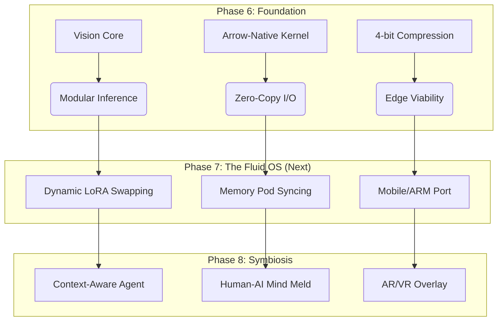

# AI-OS: The Road to Digital Symbiosis
> **From Operating System to Embodied Companion**

**Date**: 2026-02-18  
**Status**: Visionary Roadmap (Post-Phase 6)

---

## 🌌 The Ultimate Vision

We are not just building a faster "RAG" system. We are constructing the **Cognitive Kernel** for the Post-Human era of computing. The goal is to evolve AI-OS from a desktop utility into a ubiquituous, embodied digital companion that shares our memory and extends our capabilities.

### The Four Pillars of AI-OS Future

#### 1. Embodied Companion (具身伴侣)
*The AI exists wherever you are—PC, Phone, AR Glass, or Robot.*
- **Core Requirement**: Extreme portability and offline autonomy.
- **Tech Foundation**: `ArrowEngine-Native`.
- **Evolution Path**:
    - **Current**: 4-bit Quantized Vision/Text Engine running on CPU.
    - **Future**: Porting kernels to ARM/NPU (Mobile/Edge). Implementing "Sleep Mode" (ultra-low power monitoring) vs. "Active Mode" (deep reasoning).

#### 2. Shared Memory (共享记忆库)
*A standardized, privacy-preserving container for human Experience.*
- **Core Requirement**: Interoperability and semantic alignment.
- **Tech Foundation**: `Arrow Storage Format` + `Knowledge Graph`.
- **Evolution Path**:
    - **Current**: Local Parquet files storing vectors and relations.
    - **Future**: **"Memory Pods"**—encrypted, portable memory containers that can be synced between devices or physically handed to another AI instance. "Here is my project context, load it."

#### 3. Dynamic Capabilities (能力动态重组)
*The "Liquid Neural Network" OS.*
- **Core Requirement**: Modular weights instead of monolithic models.
- **Tech Foundation**: `VisionInferenceCore` (Modular Design).
- **Evolution Path**:
    - **Current**: Static loading of CLIP/BERT weights.
    - **Future**: **"Neuro-Kernels"**. The OS kernel manages hundreds of tiny, specialized LoRA/Adapter modules (e.g., Coding, Music, Medical).
    - **Fluidity**: Instead of keeping a 70B model in VRAM, the OS predicts user intent and hot-swaps 50MB adapters in milliseconds.

#### 4. Symbiosis (AR/VR 共生)
*Digital context overlaying physical reality.*
- **Core Requirement**: <16ms latency (Real-time).
- **Tech Foundation**: `Zero-Copy Data Flow` + `High-Speed Graph Query`.
- **Evolution Path**:
    - **Current**: 0.1ms text retrieval, 100ms visual encoding.
    - **Future**: **"Spatial Indexing"**. Expanding the Knowledge Graph to include 3D spatial coordinates. The AI "sees" your room, indexes object locations, and can guide you: "Your keys are under the magazine on the left table."

---

## 🛠️ From Vision to Architecture

How Phase 6 (Completed) bridges to this future:

## 🧠 The "Kernel" Metaphor

Just as Linux manages CPU/RAM resources:
**AI-OS ArrowEngine manages Cognitive Resources.**

- **Process Scheduling** -> **Attention Scheduling** (What should I look at now?)
- **Memory Paging** -> **Vector Paging** (Swap inactive memories to SSD, keep context in VRAM)
- **Drivers** -> **Modality Encoders** (Vision Driver, Audio Driver)
- **Applications** -> **Skill Adapters** (Coding Skill, Chat Skill)

---

> *"The computer is a bicycle for the mind." — Steve Jobs*  
> *"AI-OS is the electric motor for that bicycle." — ArrowEngine Vision*
