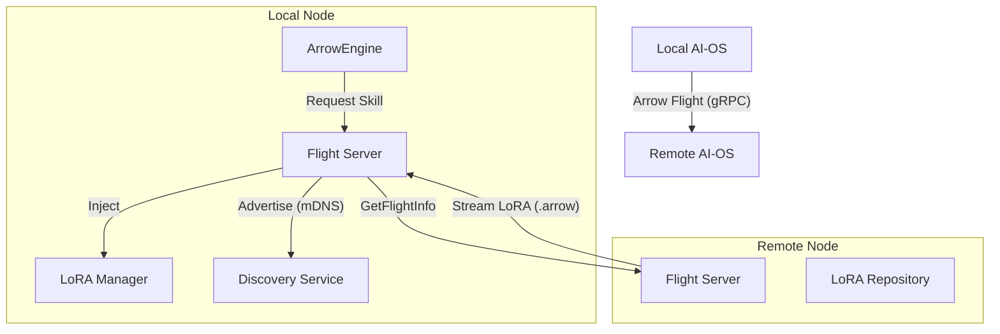

# AI-OS Phase 8: Arrow Flight Federation Implementation Plan

**Objective**: Extend the Arrow-Native architecture to support distributed, peer-to-peer capability sharing (LoRA Skills) and memory synchronization using Apache Arrow Flight.

**Rationale**: 
The isolation of local AI models limits their potential. By connecting local AI-OS instances via a high-performance, zero-copy protocol (Arrow Flight), we create a "Federated Mind" where knowledge and skills can be instantaneously shared across devices (e.g., PC ↔ Mobile ↔ IoT).

## Architecture

## Work Packages

### WP1: Flight Server Foundation
- **Goal**: Create a standard `ArrowFlightServer` that exposes local Arrow resources.
- **Tasks**:
    1. Implement basic `FlightServer` subclass.
    2. Implement `list_flights`: Enumerate available LoRA skills.
    3. Implement `do_get`: Stream `.lora.arrow` files with Zero-Copy.
    4. Implement `get_flight_info`: Return metadata (rank, alpha, description).

### WP2: Flight Client Integration
- **Goal**: Enable ArrowEngine to consume remote resources.
- **Tasks**:
    1. Implement `FlightClient` wrapper.
    2. Add `fetch_skill(peer_uri, skill_name)` functionality.
    3. Integrate with `LoRAManager`: `manager.load_from_remote(uri)`.

### WP3: Local Discovery (Zeroconf)
- **Goal**: Auto-discovery of AI-OS nodes on the local network.
- **Tasks**:
    1. Use `zeroconf` to advertise `_ai-os._tcp.local.`.
    2. Implement Service Browser to maintain list of peers.
    3. Resolve logic: Peer Name -> Flight URI (IP:Port).

### WP4: Federated Router
- **Goal**: Extend Semantic Router to search networked skills.
- **Tasks**:
    1. During idle time, sync `FlightInfo` (metadata + embeddings) from peers.
    2. Update `LoRARouter` to include remote skills in index.
    3. If remote skill selected -> Auto-download -> Inject.

## Implementation Steps

### Step 1: Flight Server Prototype
Create `llm_compression/federation/server.py`.
- Define a `LoRAFlightServer` that serves files from `local_skills/` directory.

### Step 2: Client & Downloader
Create `llm_compression/federation/client.py`.
- `download_lora(uri, save_path)`: Streams Arrow batches to disk.

### Step 3: Discovery Service
Create `llm_compression/federation/discovery.py`.
- `AdvertisingService`: Registers service.
- `PeerRegistry`: Listens and updates peer list.

### Step 4: Integration
Update `ArrowEngine`:
- Initialize `FederationManager`.
- Add `federated_router`.

## Acceptance Criteria
- [ ] Two separate Python processes can act as Node A and Node B.
- [ ] Node A can list LoRAs on Node B.
- [ ] Node A can download a LoRA from Node B (< 100ms for 50MB on LAN).
- [ ] Node A can load and use the downloaded LoRA.
