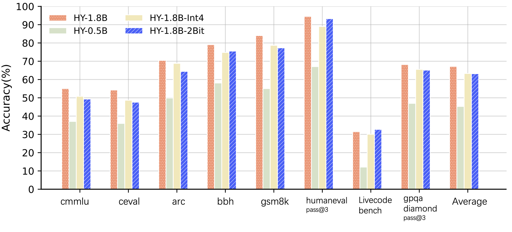

---
tags:
- hy
- quant
- 2bit
---

<p align="center">
  <picture>
    <source media="(prefers-color-scheme: dark)" srcset="https://github.com/Tencent/AngelSlim/blob/main/docs/source/assets/logos/angelslim_logo_light.png?raw=true">
    
  </picture>
</p>

<h3 align="center">
Dedicated to building a more intuitive, comprehensive, and efficient LLMs compression toolkit.
</h3>

<p align="center">
          📣 <a href="https://huggingface.co/AngelSlim/HY-1.8B-2Bit-GGUF">GGUF</a>&nbsp&nbsp | &nbsp&nbsp 📖 <a href="https://angelslim.readthedocs.io/">Documentation</a>&nbsp&nbsp | &nbsp&nbsp🤗 <a href="https://huggingface.co/AngelSlim">Hugging Face</a>&nbsp&nbsp | &nbsp&nbsp🤖 <a href="https://modelscope.cn/organization/AngelSlim">ModelScope</a>&nbsp&nbsp | &nbsp&nbsp💬 <a href="./docs/source/assets/angel_slim_wechat.png">WeChat</a>
<br>
</p>



## 📣Latest News
- [26/02/09] We have released HY-1.8B-2Bit, 2bit on-device large language model.
- [26/01/13] We have released v0.3. We support the training and deployment of Eagle3 for all-scale LLMs/VLMs/Audio models, as detailed in the [guidance documentation](https://angelslim.readthedocs.io/zh-cn/latest/features/speculative_decoding/eagle/index.html). And We released **Sherry**, the hardware-efficient 1.25 bit quantization algorithm [Paper Comming soon] | [[Code]](https://github.com/Tencent/AngelSlim/tree/sherry/Sherry)🔥🔥🔥

For more detailed information, please refer to[[AngelSlim]](https://github.com/Tencent/AngelSlim)

## 🌟HY-1.8B-2Bit Key Features

- **Superior Model Capability** HY-1.8B-2Bit is developed via Quantization-Aware Training (QAT) based on the Hunyuan-1.8B-Instruct backbone. By aggressively compressing the model to a 2-bit weight precision, we achieve a performance profile that remains highly competitive with PTQ-INT4 benchmarks. Across a multi-dimensional evaluation suite—encompassing mathematics, humanities, and programming—HY-1.8B-2Bit exhibits a marginal performance degradation of only 4\% compared to its full-precision counterpart, demonstrating exceptional information retention despite the radical reduction in bit-width. 

- **Unmatched Scale-to-Performance Efficiency** When compared to dense models of equivalent size (e.g., 0.5B parameters), HY-1.8B-2Bit demonstrates a substantial competitive advantage, outperforming benchmarks by an average of 16\% across core competencies. As a state-of-the-art (SOTA) solution for its parameter class, HY-1.8B-2Bit provides an extensible and highly efficient alternative for edge computing, delivering high-tier reasoning capabilities within a compact footprint. 

- **Comprehensive Reasoning Proficiency** HY-1.8B-2Bit inherits the complete "full-thinking" capabilities of the Hunyuan-1.8B-Instruct model, marking it as the industry's most compact model to support sophisticated reasoning pathways. By integrating a Dual Chain-of-Thought (Dual-CoT) strategy, the model empowers users to navigate the trade-off between latency and depth: utilizing concise short-CoT for intuitive queries and detailed long-CoT for computationally intensive tasks. This flexibility ensures that HY-1.8B-2Bit can be seamlessly deployed in real-time, resource-constrained environments that demand both rapid response and high-fidelity logical synthesis.


## 📈 Benchmark

Benchmark results for HY-1.8B-2Bit equivalent weights on vLLM across **cmmlu**,**ceval**,**arc**,**bbh**,**gsm8k**,**humaneval**,**livecodebench** and **gpqa_diamond**.

The empirical results reveal that HY-1.8B-2Bit maintains high-tier performance despite the extreme reduction in bit-width, incurring a marginal average degradation of only 3.97\% compared to its full-precision 1.8B teacher. Remarkably, HY-1.8B-2Bit performs nearly on par with the INT4 variant,with a negligible accuracy gap of only 0.13\%, while utilizing only half the weight precision. When compared to the dense HY-0.5B model, which occupies a comparable model size, the superiority of the 2-bit QAT approach becomes evident.  While the 0.5B dense model suffers a catastrophic 21.87\% drop in average accuracy, HY-1.8B-2Bit remains robust, outperforming the smaller dense counterpart by 22.29\% in GSM8K and 20.62\% in LiveCodeBench. 

| Model            | cmmlu  | ceval  | arc    | bbh    | gsm8k  | humaneval<br/>(pass@3) | livecodebench | gpqa_diamond<br/>(pass@3) |
|------------------|--------|--------|--------|--------|--------|-------------------|---------------|----------------------|
| HY-1.8B          | 55.07% | 54.27% | 70.50% | 79.08% | 84.08% | 94.51%            | 31.50%        | 68.18%               |
| HY-0.5B          | 37.08% | 35.98% | 49.89% | 58.10% | 55.04% | 67.07%            | 12.11%        | 46.97%               |
| HY-1.8B-int4gptq | 50.80% | 48.67% | 68.83% | 74.80% | 78.70% | 89.02%            | 30.08%        | 65.56%               |
| **HY-1.8B-2Bit**      | 49.32% | 47.60% | 64.45% | 75.54% | 77.33% | 93.29%            | 32.73%        | 65.15%               |


## 💻Deployment 
This setup ONLY works on SME2-capable devices (for example, Apple M4, vivo x300 and Arm CPUs with SME2 support). Neon kernel will follow up.

### Running Hunyuan model on MacBook M4

We have provided the converted GGUF file, [[LINK]](https://huggingface.co/AngelSlim/HY-1.8B-2Bit-GGUF)


 Clone llama.cpp

```bash
git clone https://github.com/ggml-org/llama.cpp.git
```

Enter the llama.cpp folder

```bash
cd llama.cpp
```

Fetch and check out the PR branch
```bash
git fetch origin pull/19357/head:pr-19357-sme2-int2
git checkout pr-19357-sme2-int2
```

Build llama.cpp with KleidiAI enabled

```bash
mkdir build && cd build

cmake -DGGML_CPU_KLEIDIAI=ON -DGGML_METAL=OFF -DGGML_BLAS=OFF ..

make -j8
```

Quantize the Hunyuan fp16 model to int2 per-channel (q2_0c)

```bash
./bin/llama-quantize hunyuan-fp16-qdq.gguf hunyuan-q2_0.gguf q2_0c
```

#### Run the CLI llama.cpp example


```bash
export GGML_KLEIDIAI_SME=1

# thinking 
./bin/llama-cli -m hunyuan-q2_0.gguf -p "写一副春联" -t 1 --seed 4568 -n 32
# no thinking 
./bin/llama-cli -m hunyuan-q2_0.gguf -p "/no_think写一副春联" -t 1 --seed 4568 -n 32
```


#### Run the llama.cpp benchmark

The general command is:

```bash
./bin/llama-bench -m hunyuan-q2_0.gguf -p <prompt-length> -t <number-of-threads> -n <gen-length>
```


## 📝 License

The code for this project is open-sourced under the [License for AngelSlim](LICENSE).

## 🔗 Citation

```
@software{AngelSlim2025,
    title={{AngelSlim}},
    author={Tencent AngelSlim Project Contributors},
    year={2025},
    month={6},
    url={https://github.com/Tencent/AngelSlim},
}
```

## 💬 Technical Discussion

* AngelSlim is continuously iterating and new features will be released soon. If you have any questions or suggestions, please open an issue on [GitHub Issues](https://github.com/Tencent/AngelSlim/issues) or join our [WeChat discussion group](https://github.com/Tencent/AngelSlim/blob/main/docs/source/assets/angel_slim_wechat.png?raw=true).