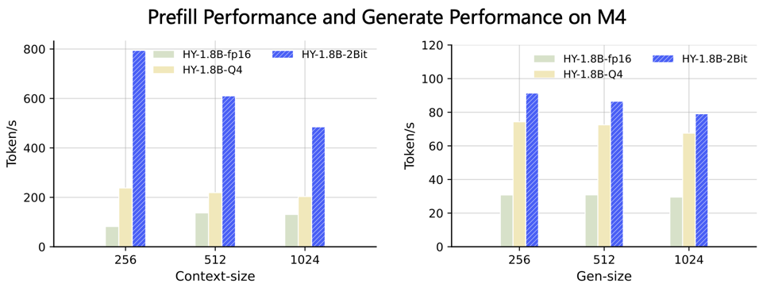

---
tags:
- hy
- quant
- 2bit
---

<p align="center">
  <picture>
    <source media="(prefers-color-scheme: dark)" srcset="https://github.com/Tencent/AngelSlim/blob/main/docs/source/assets/logos/angelslim_logo_light.png?raw=true">
    
  </picture>
</p>

<h3 align="center">
Dedicated to building a more intuitive, comprehensive, and efficient LLMs compression toolkit.
</h3>

<p align="center">
          📖 <a href="https://angelslim.readthedocs.io/">Documentation</a>&nbsp&nbsp | &nbsp&nbsp🤗 <a href="https://huggingface.co/AngelSlim">Hugging Face</a>&nbsp&nbsp | &nbsp&nbsp🤖 <a href="https://modelscope.cn/organization/AngelSlim">ModelScope</a>&nbsp&nbsp | &nbsp&nbsp💬 <a href="./docs/source/assets/angel_slim_wechat.png">WeChat</a>
<br>
</p>


## 📣Latest News
- [26/02/09] We have released HY-1.8B-2Bit, 2bit on-device large language model.
- [26/01/13] We have released v0.3. We support the training and deployment of Eagle3 for all-scale LLMs/VLMs/Audio models, as detailed in the [guidance documentation](https://angelslim.readthedocs.io/zh-cn/latest/features/speculative_decoding/eagle/index.html). And We released **Sherry**, the hardware-efficient 1.25 bit quantization algorithm [Paper Comming soon] | [[Code]](https://github.com/Tencent/AngelSlim/tree/sherry/Sherry)🔥🔥🔥

For more detailed information, please refer to[[AngelSlim]](https://github.com/Tencent/AngelSlim)

## 🌟Convert hf to gguf-fp16

**Step1**: Clone llama.cpp

```bash
git clone https://github.com/ggml-org/llama.cpp.git
cd llama.cpp
```

**Step2**: use `convert_hf_to_gguf.py` in llama.cpp, Export the model to GGUF FP16 format (Make sure to run pip install -r requirements.txt in llama.cpp).

```bash
python convert_hf_to_gguf.py ../qdq_model_path/ --outfile ./model-fp16.gguf --outtype f16
```

## 💻Deployment 
This setup ONLY works on SME2-capable devices (for example, Apple M4, vivo x300 and Arm CPUs with SME2 support). Neon kernel will follow up.

### Running Hunyuan model on MacBook M4

 Clone llama.cpp

```bash
git clone https://github.com/ggml-org/llama.cpp.git
```

Enter the llama.cpp folder

```bash
cd llama.cpp
```

Fetch and check out the PR branch
```bash
git fetch origin pull/19357/head:pr-19357-sme2-int2
git checkout pr-19357-sme2-int2
```

Build llama.cpp with KleidiAI enabled

```bash
mkdir build && cd build

cmake -DGGML_CPU_KLEIDIAI=ON -DGGML_METAL=OFF -DGGML_BLAS=OFF ..

make -j8
```

Quantize the Hunyuan fp16 model to int2 per-channel (q2_0c)

```bash
./bin/llama-quantize hunyuan-fp16-qdq.gguf hunyuan-q2_0.gguf q2_0c
```

#### Run the CLI llama.cpp example


```bash
export GGML_KLEIDIAI_SME=1

# thinking 
./bin/llama-cli -m hunyuan-q2_0.gguf -p "写一副春联" -t 1 --seed 4568 -n 32
# no thinking 
./bin/llama-cli -m hunyuan-q2_0.gguf -p "/no_think写一副春联" -t 1 --seed 4568 -n 32
```


#### Run the llama.cpp benchmark

The general command is:

```bash
./bin/llama-bench -m hunyuan-q2_0.gguf -p <prompt-length> -t <number-of-threads> -n <gen-length>
```




## 📝 License

The code for this project is open-sourced under the [License for AngelSlim](LICENSE).

## 🔗 Citation

```
@software{AngelSlim2025,
    title={{AngelSlim}},
    author={Tencent AngelSlim Project Contributors},
    year={2025},
    month={6},
    url={https://github.com/Tencent/AngelSlim},
}
```

## 💬 Technical Discussion

* AngelSlim is continuously iterating and new features will be released soon. If you have any questions or suggestions, please open an issue on [GitHub Issues](https://github.com/Tencent/AngelSlim/issues) or join our [WeChat discussion group](https://github.com/Tencent/AngelSlim/blob/main/docs/source/assets/angel_slim_wechat.png?raw=true).